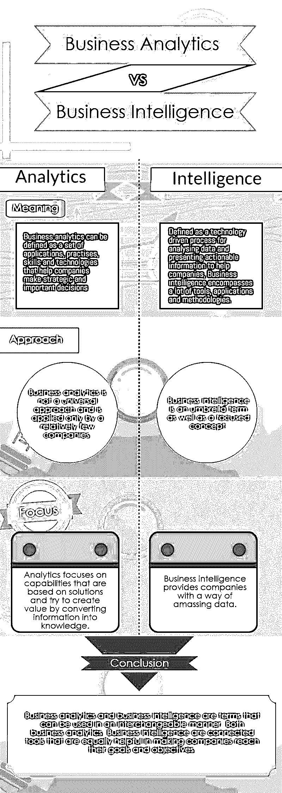
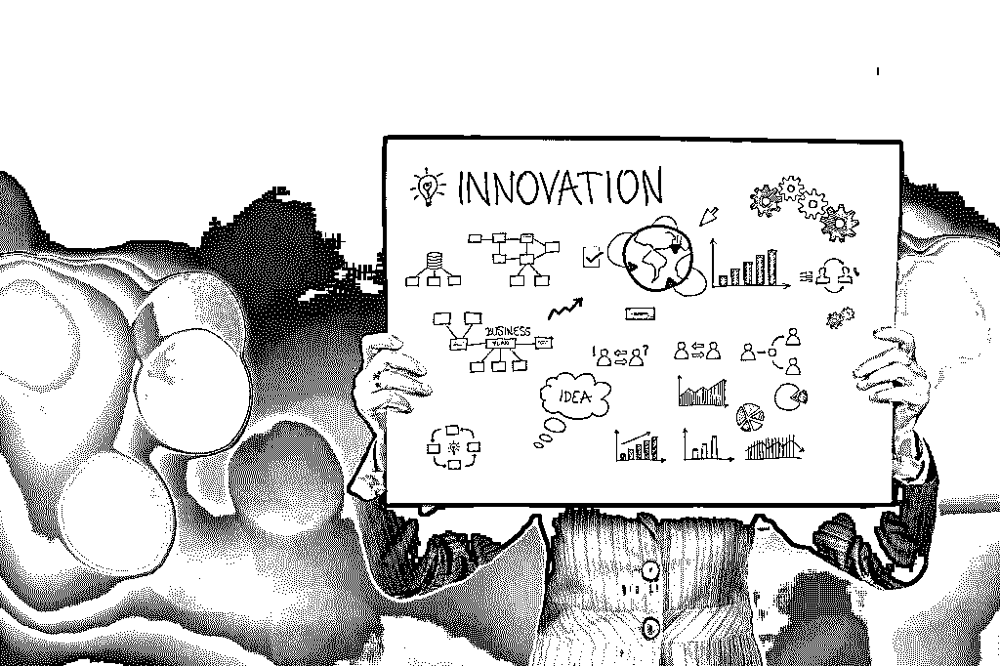

# 商业分析与商业智能

> 原文：<https://www.educba.com/business-analytics-vs-business-intelligence/>

## 商业分析与商业智能

[商业智能](https://www.educba.com/course/business-intelligence/)是数据分析最重要的方面之一，也是现代公司不可或缺的一部分。商业分析技术的定义相当模糊，并且随着公司动态的变化而不断变化。简而言之，[商业分析](https://www.educba.com/what-is-business-analytics/)可以定义为一套应用、实践、技能和[技术](https://www.educba.com/course/internet-business-ideas/ "Internet Business Ideas")，帮助公司做出战略性的重要决策，从而帮助公司实现目标和抱负。

**让我们更详细地研究一下商业分析和商业智能:**

<small>Hadoop、数据科学、统计学&其他</small>

在了解到[数据分析](https://www.educba.com/8-data-analytics-trends-that-will-dominate-2019/ "8 Data Analytics Trends That Will Dominate 2016")的重要性和巨大潜力后，许多品牌和组织已经开始在这方面投入大量资源。然而，这种数据分析大多局限于仪表板和报告，而数据分析领域很大，有更多可能的机会。虽然流行的数据分析形式极其重要，但必须理解，有许多形式的数据分析可以结合在一起，帮助品牌在决策和选择中变得更强大。与此同时，重要的是要记住，公司正变得越来越独立，并热衷于通过使用技术来扩展他们的视野，这就是为什么他们必须在所有可能的阶段识别数据及其交互的价值。打破概念并正确理解数据功能如何有效帮助公司自行构建和管理应用程序的能力。同时，这种洞察力可以[帮助公司获取知识](https://www.educba.com/course/quantitative-dimensions-in-technical-analysis/ "Quantitative Dimensions - Company Analysis")，一方面了解公司各个部门如何协同工作，另一方面了解 IT 部门开发产品和服务的需求，从而实现有效的沟通和目标。

关于商业分析与商业智能搜索的文章结构如下

*   [商业分析 vs 商业智能信息图表](#vs)
*   [为什么理解数据对公司如此重要？](#companies)
*   [什么是商业智能？](#business)
*   [商业分析 vs 商业智能——未来](#Future)
*   [结论–商业分析与商业智能](#Conclusion)

### 商业分析与商业智能信息图

下面是商业分析和商业智能的信息图，揭示了两者之间的主要区别。

 

### 为什么理解数据对公司如此重要？

虽然很容易理解为什么数据是现代[公司和品牌](https://www.educba.com/course/how-to-name-your-brand/ "How to Name Your Brand")的一个重要方面，但也有一些与它相关的陷阱。第一个也是最重要的[是安全性](https://www.educba.com/cyber-security-tools/ "32 Most Important Cyber security Tools")，而另外两个包括完整性和准确性，它们同样重要，如果不是更重要的话。一旦保证了这三点，剩下的唯一重要的事情就是通过数据分析来确定有效的结果。每个公司都知道数据是用来提供有价值的见解的。当品牌拥有这些洞察力时，它们就能够做出改善整体运作和管理的决策。然而，数据很少以原始状态使用；它们必须以某种方式进行处理和展示，以便能够在[以战略性和综合性的方式应用](https://www.educba.com/course/strategic-management-an-introduction/ "Strategic Management - An Introduction")。

[最新的分析工具](https://www.educba.com/data-analysis-tools-for-research/ "10 Cool Data Analytic Tools for Business")使公司更容易获得这些见解，但总是需要一个过程来使这些数据变得可用和有用。在所有阶段保持数据的准确性是极其重要的，因为数据的不准确性会导致错误的见解，如果实施这些错误的见解，会对公司的整体运作产生负面影响。这就是为什么数据样本的质量比数据的数量重要得多；许多公司不关注质量，而是关注收集大量数据，而不考虑这些数据是否正确。除此之外，完整性在数据分析中扮演着非常[重要的角色](https://www.educba.com/what-is-the-role-of-a-business-analyst/ "What is The Role of A Business Analyst?")。

 

公司可以在众多平台上获得大量数据和信息，例如积分卡、智能手机、客户关系管理系统、社交媒体网站、GPS 定位数据和市场研究工具等等。随着物联网(IoT)等创新理念的发展，这一资源池也在快速增长，物联网使机器能够以战略性和相对简单的方式收集数据。此外，企业和公司现在正着眼于看似无生命的物体，如桌子、冰箱和汽车，以收集顾客和客户的信息。在这种情况下，数据治理非常重要，商业分析技术和 BI 等工具可以帮助品牌和公司利用正确的数据来实现他们的目标。在继续之前，重要的是要更清楚、更深入地了解[商业分析](https://www.educba.com/business-analytics-training-online/)与商业智能

### 什么是商业智能技能？

有多种方法可以分析和调查企业绩效，以便可以以某种方式对其进行重组，从而获得利润和解决方案。许多顶级分析咨询公司认为，商业智能技能和商业分析技术的世界将在未来几年发生巨大变化并被更多人采用。事实上，许多分析认为，公司现在将从信息技术报告转向商业智能工具的开发，这些工具能够提供关于公司增长战略和发展的明智选择。这将导致四个重要的变化，即更快的处理能力、移动应用、社交决策模式和对解决方案提供商的更多投资。

### 商业分析技术有能力以更快的速度处理数据

公司中可用的数据量几乎是无穷无尽的。为了理解这些数据，需要以系统和快速的方式处理这些大量的数据。如今，BI 分析已经成为主流，甚至小公司和新公司都在考虑使用这种技术来利用市场中存在的巨大潜力。此外，许多公司需要这种技术来开拓进取，探索新的机遇和挑战。这就是为什么分析营销人员正在寻找全新的方法来制造商业分析工具，这些工具可以快速处理数据，同时被各个行业的公司采用。借助可以在 [IT 团队](https://www.educba.com/course/group-dynamics-teams-team-works/ "Group Dynamics - Teams & Team Works")中使用的工具，这些业务分析工具正在重新定义公司运作和开展业务的方式。

### 商业分析工具正处于下一个发展阶段，即移动应用

移动智能手机正在全球范围内迅速获得认可。根据一份新的报告，到今年年底，全球将有近 200 万人拥有智能手机。这意味着商业营销人员将不得不寻找新的方法来将智能手机整合到商业分析技术中。此外，许多营销人员和公司专业人员依靠手机来了解公司运作的最新情况，尤其是当他们在旅行或离开办公室时。这意味着商业分析公司正在寻求投资移动商务智能功能，而 T2 的软件设计师将很快着眼于制造针对手机用户而不是桌面用户的产品。随着许多公司和品牌已经走向移动化，[智能手机上的商业分析技术](https://www.educba.com/mobile-app-programming-language/ "8 Best Mobile App Programming Language")已经有了现成的受众。

### 商业分析工具应该使公司能够在社交平台上做出决策

社交媒体平台非常受欢迎，几乎遍布全球所有国家。今天，几乎所有的公司都出现在社交媒体平台上，这就是为什么集成社交网络功能和决策功能的商业分析工具是当今的需求。虽然这可能有点困难和复杂，但在未来几年，将商业分析技能与社交网络相结合可能不再是一种选择，而是一种要求。

### 增加商业分析技术咨询的支出

由于市场上有如此多复杂而有用的应用程序，专家们认为，毫无疑问，商业分析技术咨询将会增加，尤其是在未来几年。商业分析公司有责任帮助公司用更快更好的工具实现他们的商业分析目标。

### 商业分析与商业智能，它们有什么不同？

这就是商业分析技术如何帮助公司的。现在来到 BI。BI 被定义为一种技术驱动的流程，用于分析数据并提供可操作的信息来帮助公司，它包含大量的商业智能工具、应用程序和方法。因此，BI 是一个总括术语，也是一个重点概念。[商业分析技术](https://www.educba.com/career-in-business-analytics/)和商业智能技能都是相关的术语，通常是可以帮助研发、客户服务、信贷和库存管理等部门的公司的战略和决策。这两者都有助于公司应对业务挑战，并利用行业内出现的新机遇。

也就是说，商业分析技术和商业智能都是相互关联的工具，同样有助于公司实现其目标。商业智能为企业提供了一种收集数据的方式。可以通过多种方法收集数据，如问题、报告和在线分析流程。另一方面，业务分析使用统计和定量数据进行解释和预测建模。分析侧重于基于解决方案的能力，通过这种技术，公司试图通过将信息转化为知识来创造价值。

商业分析技术和商业智能可以对不同类别的品牌和公司的运作产生深远的影响。他们可以帮助影响的一些领域包括关键产品分析、改进的客户服务、追加销售机会、简化的库存管理和有竞争力的价格洞察。通过帮助公司实时了解顾客和客户的需求，他们可以帮助以有效的方式最大限度地利用资源，并最大限度地减少损失。

### 商业分析与商业智能——未来

商业分析技术和 BI 领域都在快速发展。全球各地的公司都在使用这两个领域，以更好、更强大的方式理解数据。公司正在使用这些技术来理解甚至像录像带、音频文件和电子邮件这样的非结构化数据。BI 工具领域的一个主要挑战是它们不够灵活，不容易接受变化。但是许多商业智能销售者继续制造在社交媒体等替代数据来源上不太好用的工具。但随着时间的推移，这将成为一种必然，因为社交媒体是一个不断增长的平台，任何公司都不能忽视，今天不会，未来几年也不会。这就是为什么许多公司现在都在寻找 BI 计划，不仅可以帮助他们提升决策能力，还可以降低运营成本，并帮助他们利用现有的机会。

商业分析和商业智能是可以互换使用的术语。这就是为什么公司希望投资于数据仓库之上的高级分析，以便能够弥合 BI 与组织当前业务需求之间的差距。这意味着，根据您的要求，企业和品牌可以使用这些工具以系统和适当的方式分析数据，而不必等待互联网来管理复杂的报告。数据解释和操作方法的选择根据市场的要求不断变化。这就是为什么公司清楚他们用来达到最终目标的工具和技术是很重要的。当公司理解了经济和业务的灵活性，他们就更容易通过工具来处理这些变化，即使是在充满挑战的情况下。

### 结论–商业分析与商业智能

总之，商业分析和商业智能都有巨大的潜力，并且在这两个领域都存在许多挑战，尤其是在技术和社交网络领域。公司必须记住，商业分析技术不同于商业智能。一个领域的要求是不同的，因此每个领域的好处也是不同的。也就是说，只有投资技术的公司能够以适当和系统的方式使用它，技术才会有效。通过与最终用户合作，顾问可以帮助公司使用正确的工具，以便他们可以使用数据来做出决策，这将增强品牌的实力，并使他们达到下一个增长和发展水平。

### 推荐**篇文章**

这是商业分析和商业智能的指南——它们是如何不同的。它们都可以帮助品牌和公司利用正确的数据来达到他们的目标。以下是与商业分析和商业智能相关的外部链接，请浏览这些链接以了解更多详细信息。

1.  [网络安全的类型](https://www.educba.com/cyber-security-tools/)
2.  [商业智能与数据分析](https://www.educba.com/business-intelligence-vs-data-analytics/)
3.  [商业智能与商业分析](https://www.educba.com/business-intelligence-vs-business-analytics/)

