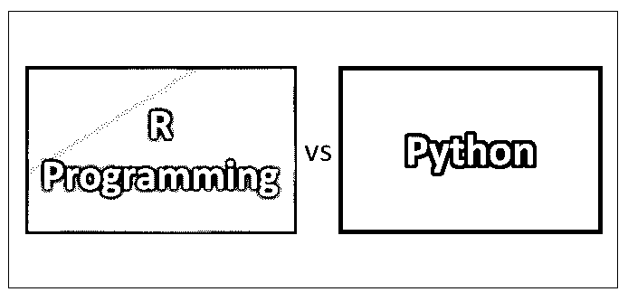
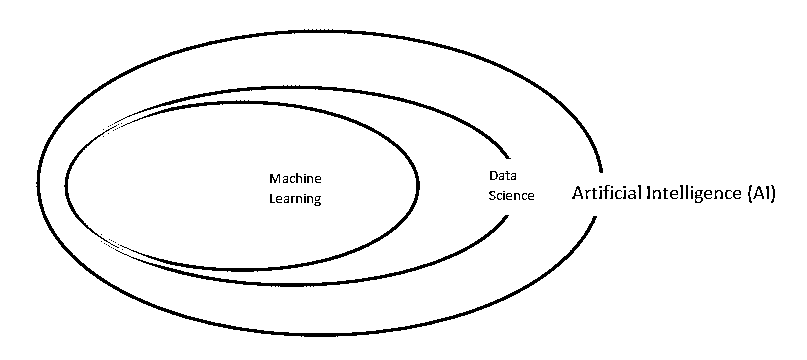
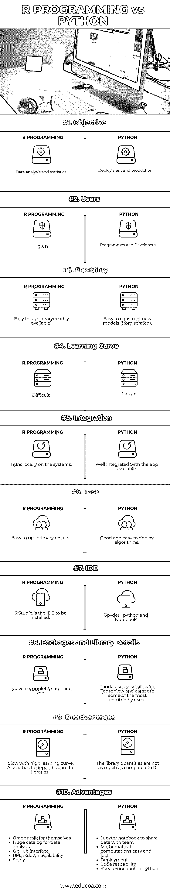

# r 编程 vs Python

> 原文：<https://www.educba.com/r-programming-vs-python/>

## R 编程与 Python 的区别

在这个主题中，我们将学习 R 编程和 python，哪一个是最好的，它们有着惊人的不同。

术语——人工智能/机器学习/算法/ R 编程/ Python/数据科学。

<small>Hadoop、数据科学、统计学&其他</small>

请按照维恩图

**Artificial Intelligence (AI)** is a broader term and is a [computer science branch](https://www.educba.com/career-in-computer-science/) that attempts to build machines which are capable of intelligent behavior.

**数据科学**处理从各种形式的原始数据(指无组织的)中提取知识或有用见解(指有意义的数据)的过程和系统。

**机器学习**无非就是从一段时间的数据中学习。这使得我们的计算机在没有被显式编程的情况下也能行动。机器学习是人工智能中最适合数据科学的分支。

**算法**是解题时遵循的一组规则。机器学习，算法获取并使用数据来执行计算并找到想要的结果。它可能简单，也可能复杂，这取决于所处理数据的复杂程度。你的算法的有效性取决于它被训练的有多好(意味着场景被测试到什么程度)。

R 是一种用于统计计算和图形的编程语言和免费软件环境，由 R 统计计算基金会支持。来源——[维基百科](https://www.wikipedia.org/)

**Python** 是一种通用编程的解释型高级编程语言。来源——[维基百科](https://www.wikipedia.org/)

### R 编程与 Python 之间的最佳面对面比较

下面是 R 编程和 Python 之间的十大最佳对比

### R 编程与 Python 之间的主要区别

### R 编程与 Python 的最佳对比表

因为我们已经研究了 R 编程与 python 之间惊人的差异。现在我们来看看 R 编程和 Python 的最佳对比表，就知道哪个最好了。

机器学习分为 3 种学习算法，它们是

*   [监督机器学习算法](https://www.educba.com/supervised-machine-learning-algorithms/)
*   [无监督机器学习算法](https://www.educba.com/unsupervised-machine-learning/)
*   强化机器学习算法

工具可能会根据基于可用性、需求和可用性的便利性而变化，但是算法将是相同的，并且以不同的方式执行。

| **比较的基础** | **R 编程** | **PYTHON** |
| 目标 | 数据分析和统计 | 部署和生产 |
| 用户 | 研究与开发(research and development) | 程序和开发者 |
| 灵活性 | 易于使用的库(随时可用) | 易于构建新模型(从零开始)。 |
| 学习曲线 | 困难的 | 线性的 |
| 综合 | 在系统上本地运行 | 与可用的应用程序很好地集成 |
| 工作 | 容易获得初步结果 | 良好且易于部署的算法 |
| 集成驱动电子设备 | RStudio 是要安装的 IDE | Spyder、Ipython 和 Notebook |
| 包和库详细信息 | Tydiverse、ggplot2、caret 和 zoo | 熊猫、scipy、scikit-learn、 [Tensorflow](https://www.educba.com/tensorflow-vs-pytorch/) 和 caret 是一些最常用的。 |
| 不足之处 | 学习曲线高，速度慢。用户必须依赖这些库 | 与 R 相比，库的数量没有那么多 |
| 优势 | 

*   The chart says it all.
*   Huge catalogue of data analysis
*   GitHub 接口
*   RMarkdown 可用性
*   glistening

 | 

*   Jupyter notebook shares data with the team
*   Mathematical calculation is simple and fast.
*   deploy
*   Code readability
*   speed
*   Functions in Python

 |

### 结论

R 编程和 Python 之间的选择取决于以下标准

*   你想解决的那种问题。
*   学习一门语言的净成本是什么——学习一门适合你想要解决的问题的新语言需要时间。
*   你所在领域使用的社区工具。
*   还有哪些工具可用，它们与组织内常用工具的匹配程度如何。
*   应该清楚的是，分析和部署是两回事。
*   时间因素也很关键

### 推荐文章

这对于 R 编程和 Python 之间的区别是一个有用的指南。在这里，我们讨论了 R 编程和 Python 的含义，以及它们的直接比较、主要区别和结论。您也可以阅读以下文章，了解更多信息——

1.  [编程与脚本的区别](https://www.educba.com/programming-vs-scripting/)
2.  [Python vs Matlab](https://www.educba.com/python-vs-matlab/)
3.  [Python 3 与 Python 2 的重要对比](https://www.educba.com/python-3-vs-python-2/)
4.  [Python 与 Ruby 的性能——哪个更好](https://www.educba.com/python-vs-ruby-performance/)
5.  [TensorFlow vs Caffe:差异](https://www.educba.com/tensorflow-vs-caffe/)

