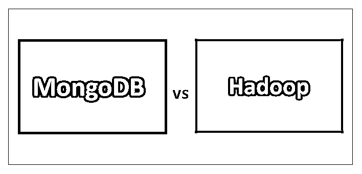
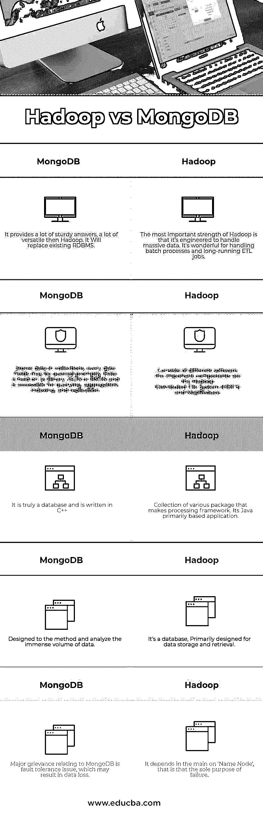

# MongoDB vs Hadoop

> 原文：<https://www.educba.com/mongodb-vs-hadoop/>

## MongoDB 与 Hadoop 的区别

这个概念没有开始，导致 10gen 放弃了应用相关的 unharness MongoDB 作为开源项目。MongoDB 实际上会被认为是一个巨大的数据答案，它的价格表明它是一个非常通用的平台。Hadoop 旨在运行在人工硬件集群上，具有任何格式的功耗数据，以及来自多个来源的聚合数据。Hadoop 成为了一个跨工件硬件集群多处理海量数据的平台。

### 什么是 MongoDB？

MongoDB 最初是由企业 10gen 在 2007 年开发的，作为一个基于云的应用引擎，旨在运行不同的软件包和服务。他们开发了两个主要元素，Babble(应用引擎)和 MongoDB(数据库)。这个概念没有开始，导致 10gen 放弃了应用相关的 unharness MongoDB 作为开源项目。MongoDB 实际上会被认为是一个巨大的数据答案，它的价格指出它是一个非常通用的平台，旨在交换或[增强现有的 RDBMS 系统](https://www.educba.com/rdbms-interview-questions/)，给它一个健康的用例类型。

<small>Hadoop、数据科学、统计学&其他</small>

### MongoDB 如何工作？

MongoDB 将数据存储在集合中，在集合中完全不同的数据字段可以被查询一次。数据库以二进制 JSON (BSON)的形式保存，可快速用于即席查询、索引、复制和 Map Reduced 聚合。可以应用数据库分片来允许跨多个系统的分布，用于水平可测量性 PRN。MongoDB[是用 C++](https://www.educba.com/c-vs-c-plus-plus/) 编写的，可以部署在 [Windows 或 UNIX](https://www.educba.com/uses-of-unix/) 操作系统机器上，但是特别考虑到 MongoDB 低延迟到来的时间，UNIX 操作系统在效能方面是一个完美的选择。MongoDB 与 Hadoop 之间的主要区别在于，MongoDB 是真正的数据库，而 Hadoop 可以是构成数据处理框架的各种包元素的组合。

### Hadoop 是什么？

区别在于，Hadoop 从一开始就是一个开源项目；Hadoop 由 Doug Cutting(因其在首选搜索分类平台 Apache Lucerne 上的工作而闻名)创建，最初源于 2002 年创建的开源网络爬虫 Nutch 项目。2004 年，Google 引入了 MapReduce 的[思想。Hadoop 并不意味着替代事务型 RDBMS 系统，而是作为它们的补充。](https://www.educba.com/mapreduce-interview-questions/)

### Hadoop 如何工作？

如前所述，Hadoop 可以是一个由打包方案组成的框架。Hadoop 的第一个元素是 [Hadoop 分布式文件系统](https://www.educba.com/hdfs-vs-hbase/) (HDFS)和用 Java 编写的 MapReduce。次要元素是一组替代的 Apache 商品，包括:Hive(用于查询数据)、Pig(用于分析海量数据集)、HBase(列定向数据库)、Oozie(用于编程 Hadoop 作业)、Sqoop(用于与 Bi、analytics 或 RBDMS 等替代系统接口)和 Flume(用于聚合和预处理数据)。像 MongoDB 一样，Hadoop 的 [HBase 数据库](https://www.educba.com/hbase-interview-questions/)通过数据库分片实现横向可测量性。数据存储的分配由 HDFS 处理，由 HBase 强制执行关联选择组织，h base 将数据分配到列中(相对于关联 RDBMS 在列和行中的二维分配)。然后，数据将被编入索引(通过使用 Solr 之类的包)，[用 Hive](https://www.educba.com/hive-interview-questions/) 查询，或者通过从 Hadoop 方案或您的替代商业智能平台获得的选择，在其上运行大量分析或批处理作业。

### MongoDB 和 Hadoop 的面对面比较(信息图)

下面是 MongoDB 和 Hadoop 之间的 5 大区别:

### MongoDB 和 Hadoop 之间的主要区别

让我们讨论一下 MongoDB 和 Hadoop 之间的一些主要区别:

*   Hadoop 在格式数据中是通用的；它可以是任何可获得的格式，而 MongoDB 只导入 CSV 和 [JSON](https://www.educba.com/json-interview-questions/) 格式的数据。
*   MongoDB 具有地理空间分类的能力，这有助于地理空间分析。这个特性在 Hadoop 中不可用。
*   MongoDB 属于 [NoSQL 家族](https://www.educba.com/nosql-interview-questions/)，而 Hadoop 使用 [SQL 来处理数据](https://www.educba.com/postgresql-interview-questions/)。
*   Hadoop 依赖于 Java，而 MongoDB 是用 C++语言编写的。
*   Hadoop 是一套商品，而 MongoDB 可能是一个完整的产品。
*   MongoDB 的硬件价格相比 Hadoop 是一个较小的量。
*   与 Hadoop 相比，MongoDB 更加通用，它将取代现有的 RDBMS。另一方面，Hadoop 可以执行所有的任务，但是，应该添加一个替代包。
*   Hadoop 可能是一个框架，它将有许多用于处理的包，而 MongoDB 可能是一个数据库排序器。
*   Hadoop 最适合大规模流程应用，而 MongoDB 最适合时间段[数据和流程挖掘。](https://www.educba.com/data-mining-process/)

### MongoDB 和 Hadoop 对照表

下面讨论 MongoDB 和 Hadoop 之间的主要比较:

| **序列号** | **MongoDB** | **Hadoop** |
| One | 它提供了许多可靠的答案，比 Hadoop 更加通用。它将取代现有的 RDBMS。 | Hadoop 最重要的优势在于它是为处理海量数据而设计的。它非常适合处理批处理和长时间运行的 ETL 作业。 |
| Two | 将数据存储在集合中，每个数据字段都可以被快速查询。数据以二进制 JSON 或 BSON 的形式保存，可用于查询、聚合、索引和复制。 | 由不同的软件组成，重要的组件是 Hadoop 分布式文件系统(HDFS)和 [MapReduce](https://www.educba.com/how-mapreduce-work/) 。 |
| Three | 它是一个真正的数据库，是用 C++编写的 | 构成处理框架的各种包的集合。它主要基于 Java 的应用程序。 |
| Four | 专为分析海量数据的方法而设计。 | 这是一个数据库，主要用于数据存储和检索。 |
| Five | 与 [MongoDB](https://www.educba.com/install-mongodb/) 相关的主要抱怨是容错问题，这可能会导致数据丢失。 | 这主要取决于“名称节点”，也就是说，失败的唯一目的 |

### 结论

在 Hadoop 和 MongoDB 作为[大数据解决方案](https://www.educba.com/careers-in-big-data/)的比较过程中，通过上面提到的各种主题，很明显，在选择哪一个是您组织的最佳选择之前，应该进行大量的分析和关注。如果您需要处理低延迟时间段的数据，或者试图找到大量的全面答案(比如更换 RDBMS 或者开始一个全新的事务系统)，MongoDB 也可能是一个不错的选择。如果您正在尝试为批量、长期运行的分析寻找答案，同时仍然能够质疑数据，那么 Hadoop 可能是一个明确的选择。

### 推荐文章

这是 MongoDB 和 Hadoop 之间主要差异的指南。在这里，我们还将讨论 MongoDB 与 Hadoop 的直接比较、主要差异以及信息图和比较表。您也可以看看以下文章，了解更多信息–

1.  [MongoDB vs PostgreSQL](https://www.educba.com/mongodb-vs-postgresql/)
2.  [Hadoop vs Cassandra–惊人的差异](https://www.educba.com/hadoop-vs-cassandra/)
3.  [MongoDB vs Postgres](https://www.educba.com/mongodb-vs-postgres/)

5.  [MongoDB vs Oracle:差异](https://www.educba.com/mongodb-vs-oracle/)
6.  [MongoDB vs Cassandra:有什么区别](https://www.educba.com/mongodb-vs-cassandra/)
7.  [MongoDB vs DynamoDB:有什么好处](https://www.educba.com/mongodb-vs-dynamodb/)
8.  [MongoDB vs SQL:特性](https://www.educba.com/mongodb-vs-sql/)

