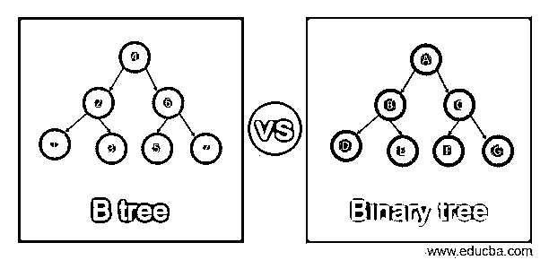
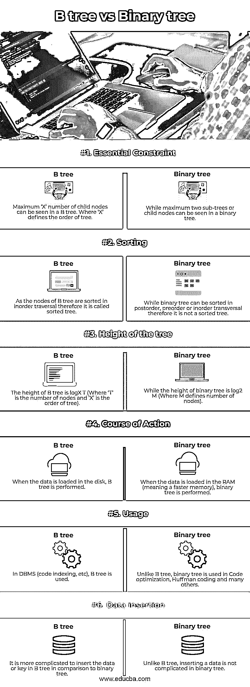

# b 树 vs 二叉树

> 原文：<https://www.educba.com/b-tree-vs-binary-tree/>

## B 树和二叉树的区别

由于 B 树的横向有序，它被称为自平衡搜索树。我们也可以说 B 树是平衡 N 路树，也是平衡排序树。B 树类似于二叉查找树，但是在 B 树中，节点是根据顺序遍历来组织的。B 树的空间复杂度为 O(n ),插入和删除的时间复杂度为 O (log n)。

二叉树是一种非线性数据结构，是一种特殊的通用树。二叉树为其子节点最多保存两个指针。这意味着一个节点的最高度数可以是 2，也可以是 1 度节点或 0 度节点。

<small>Hadoop、数据科学、统计学&其他</small>

### B 树和二叉树的直接比较(信息图)

以下是 B 树与二叉树的 6 大区别:

### B 树和二叉树的对照表

让我们看看下表中两者的对比。

| **序列号** | **描述** | **B 树** | **二叉树** |
| One | **本质约束** | 在 B 树中可以看到最多“X”个子节点。其中“X”定义了树的顺序。 | 而在二叉树中最多可以看到两个子树或子节点。 |
| Two | **排序** | 由于 B 树的节点是按顺序遍历排序的，因此它被称为排序树。 | 虽然二叉树可以按后序、前序或横序排序，但它不是有序树。 |
| Three | **树的高度** | B 树的高度是 logX T(其中‘T’是节点数，‘X’是树的阶)。 | 而二叉树的高度是 log2 M(其中 M 定义了节点的数量)。 |
| Four | **行动步骤** | 当数据加载到磁盘中时，执行 B 树。 | 当数据加载到 RAM(意味着更快的内存)时，执行二叉树。 |
| Five | **用途** | 在数据库管理系统(代码索引等)中，使用 B 树。 | 与 B 树不同，二叉树用于代码优化、霍夫曼编码和许多其他方面。 |
| Six | **数据插入** | 与二叉树相比，在 B 树中插入数据或关键字更复杂。 | 与 B 树不同，在二叉树中插入数据并不复杂。 |

### B 树和二叉树的主要区别

*   **B 树**

与二叉树不同，B 树的一个节点可以有两个以上的子节点。logX T 被认为是 B 树的高度(其中‘T’是节点数，‘X’是树的阶)。每次更新，B 树的高度都会自动调整。B 树中的数据按照特定的顺序排序，最高值在右边，最低值在左边。如果我们想在 B 树中插入关键字或数据，这将比二叉树更复杂。

有一些条件对于 B 树来说非常重要:

1.B 树的每个叶节点应该在同一层。
2。在 B 树的叶节点之上不应该有空的子树。
3。B 树的高度一定要尽量低。
4。除了离开节点，B 树的所有节点应该具有最少数量的子节点。

**M 阶的 B 树具有这些性质:**

1.树的每个节点最多可以包含 N 个子节点，并且应该至少有 N/2 个或 2 个以上的子节点。
2。如果子节点总数为 N，则每个节点可以拥有的最大键数为 N-1，或者也可以说，总键数应该比树拥有的子节点总数少 1。
3。在节点内，B 树的键以指定的顺序排列。在子树的关键字中，出现在右侧的被称为后继关键字，而最终位于左侧的关键字被认为是前趋关键字。
4。当插入一个完整的节点时，树被分成两部分。最终获得中值的键被作为父节点。
5。一旦删除了节点，就可以完成合并过程。

*   **二叉树**

在二叉树中，每个节点最多可以有两个子节点，它是一个树形数据结构。二叉树的这两个子树通常被识别为右子树和左子树。叶节点被定义为没有子节点的节点。因此，二叉树中的每个节点可以有 0、1 或 2 个子节点。插入、遍历和删除是对二叉树执行的常见操作类型。在横向操作中，树的每个节点以系统的方式被恰好访问一次。

基于二叉树的属性，它可以被分成各种变体，包括完全二叉树、线程二叉树、扩展二叉树、严格二叉树和许多其他二叉树。

*   严格二叉树——这种类型的树对于每个非终结符都有一个左右子树。
*   完全二叉树——这种类型的树在每个节点条件下满足 2 个节点。在这方面，我算是有水平的。
*   扩展二叉树–被定义为一种二叉树，其中原始树的所有空子树被称为外部节点的特殊节点替换，而其他节点被称为内部节点
*   线程二进制——为了使有序遍历更快，并且不需要递归和堆栈，线程二进制树的思想就是这样。通过将正常情况下为空的所有正确的子指针指向该节点的下级后继节点(如果存在的话)，我们可以使二叉树成为线程二叉树。线索二叉树由 0 个节点或 2 个节点组成。

### 结论

在以上讨论的基础上，我们了解了 B 树和二叉树。通过对照表和详细的讨论，我们也理解了 B 树和二叉树的主要区别。我们还根据二叉树的不同性质讨论了不同类型的二叉树。

### 推荐文章

这是一个 B 树 vs 二叉树的指南。这里我们分别用信息图和比较表来讨论 B 树和二叉树的关键区别。您也可以看看以下文章，了解更多信息–

1.  [选择排序 vs 冒泡排序](https://www.educba.com/selection-sort-vs-bubble-sort/)
2.  [伪代码 vs 算法](https://www.educba.com/pseudocode-vs-algorithm/)
3.  [Lisp vs Haskell](https://www.educba.com/lisp-vs-haskell/)
4.  [OpenGL vs 火山](https://www.educba.com/opengl-vs-vulkan/)

