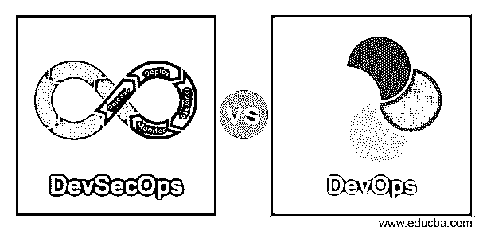
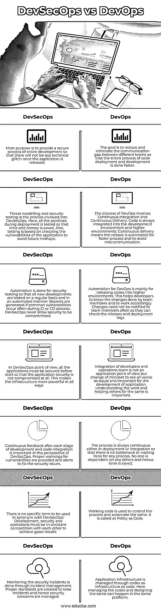

# DevSecOps vs DevOps

> 原文：<https://www.educba.com/devsecops-vs-devops/>

## DevSecOps 与 DevOps 的区别

当我们将 IT 中的开发和运营同等重要地结合起来时，我们称该过程为 DevOps。在这里，我们没有测试人员、开发人员和分析师。整个软件开发生命周期被组合起来形成 DevOps。所有团队为了一个共同的目标一起工作。DevOps 是敏捷方法的另一种形式，因为许多步骤都是从敏捷中复制的。DevSecOps 是一种涉及开发、安全和运营的文化。软件开发周期的每一个阶段都涉及到安全性，并且没有为相同的阶段分配单独的团队。在 DevSecOps 中，每个人都对安全负责。

### DevSecOps 与 DevOps 之间的直接比较(信息图表)

以下是 DevSecOps 与 DevOps 之间的 7 大区别:

<small>Hadoop、数据科学、统计学&其他</small>

### DevSecOps 与 DevOps 的主要区别

下面是 DevSecOps 与 DevOps 之间的主要区别:

*   DevOps 是传统开发的演变，开发人员过去依赖分析师和运营团队在开发后将他们的代码投入生产。在这里，开发代码或应用程序后的等待时间更长，因为运营团队还有其他优先事项。当考虑 DevSecOps 时，它是传统安全性的发展，在开发之后，安全专业人员会对代码进行多次测试，以检查代码的质量。将 DevOps 与安全性结合起来有助于 DevOps 团队了解代码的漏洞，并更快地修改它。
*   DevOps 发展背后的主要原因是提高开发和运营团队的工作效率，以避免任何沟通失误。随着 DevSecOps 的到来，不同的问题比以前更快地解决了，开发人员和安全团队之间的隔阂也消除了。现在，随着不同的团队一起思考和工作，思维方式得到了很大的改善。
*   对于开发团队来说，沟通差距和生产时间很长。因此 DevOps 的目标始终是速度。工作完成得越快；DevOps 的高效团队。DevSecOps 旨在提供安全性以及更快的开发和操作。当团队拥有更快的开发和运营团队时，没有什么是妥协的。
*   DevOps 团队更关注代码的开发和部署。团队成员之间的良好沟通可以加快流程。DevSecOps 团队关注代码的安全性以及更快的开发和部署。应用程序的密码对于用户的初始使用必须是清楚的，并且隐藏的密码不能被任何人轻易破解。
*   只有在将代码开发和部署到更高的环境中之后，才考虑 DevOps 过程的安全性。在这里，安全性在第一阶段并不重要。部署后只进行常规检查。但是在 DevSecOps 中，安全性在开发的所有阶段都得到考虑。安全性与构建应用程序或 DevOps 管道集成在一起。安全性不会在开发或部署的任何阶段受到损害，因此安全专业人员与开发人员或运营团队一样重要。
*   运营团队不被视为支持团队成员，他们与 DevOps 中的开发人员同等重要。开发和部署的责任对于开发运维团队来说是平等的。在 DevSecOps 中，开发人员、操作团队或测试团队以及基础设施团队的责任是平等的。

开发代码、将代码部署到更高的环境中，以及代码的漏洞被制作成一个称为 DevSecOps 的单一技能。这涉及到 DevOps 和 SecOps。最初的转换可能是困难和耗时的，但斗争是为了更好地监控应用程序作为一个整体，在所有阶段的安全性的观点。

### DevSecOps 与 DevOps 对比表

DevSecOps 与 DevOps 之间的比较如下:

| **DevSecOps** | **DevOps** |
| 主要目的是为整个开发提供一个安全的过程，这样一旦应用程序发布，就不会有任何技术故障。 | 目标是减少和消除不同团队之间的沟通差距，以便更快地完成代码部署和开发的整个过程。 |
| 威胁建模和安全测试是 DevSecOps 中涉及的过程。在这里，部署过程中的所有管道都要经过测试，这样可以节省时间和金钱。此外，测试是基于检查应用程序的漏洞，以避免未来的灾难。 | DevOps 的过程包括持续集成和持续交付。代码总是集成到开发环境和更高的环境中。连续交付意味着发布是自动化的，以实现更快的过程并避免误解。 |
| 自动化是为安全测试而做的，这样所有新的开发都可以定期地以自动化的方式进行测试。如果在 CI 或 CD 过程中经常出现常见漏洞，则会生成报告。DevSecOps 从不允许安全受到威胁。 | DevOps 的自动化主要用于将代码发布到更高的环境中。这有助于开发人员了解团队成员所做的更改，并据此开展工作。变更不需要经常通知团队成员，因为他们可以检查发布和部署日志。 |
| 从 DevSecOps 的角度来看，所有的应用程序在启动之前都必须是安全的，这样应用程序的安全性才不会受到损害。这使得基础设施在各方面都更加强大。 | 开发人员和运营团队的整合不是一个应用程序的观点，而是一种心态的转变，认为所有的工作对于应用程序的开发都是同等重要的。理解工作并帮助他人同样重要。 |
| 从 DevSecOps 的角度来看，在开发和代码集成的每个阶段之后的持续反馈是很重要的。针对漏洞提供适当的警告，并发出警报来修复安全问题。 | 无论是部署还是集成，该流程总是连续的，因此任何流程都不会出现瓶颈或等待时间。没有人依赖任何人，因此节省了时间。 |
| 在与 DevSecOps 的同义词中没有特定的术语。开发、安全和运营必须不断相互竞争才能取得好的结果。 | 工作代码用于控制流程并使其自动化。它被称为作为代码的策略。 |
| 通过事件管理来监控安全事件。创建适当的标准来提出事故，从而管理安全问题。 | 应用程序基础结构通过代码进行管理，就像基础结构和代码一样。在这里，管理代码和设计代码可以在同一个平台上进行。 |

### 推荐文章

这是 DevSecOps vs DevOps 的指南。在这里，我们还通过信息图和比较表讨论了 DevSecOps 和 DevOps 的主要区别。您也可以看看以下文章，了解更多信息–

1.  [DevOps 方法学](https://www.educba.com/devops-methodology/)
2.  [DevOps 服务](https://www.educba.com/devops-services/)
3.  [什么是持续集成？](https://www.educba.com/what-is-continuous-integration/)
4.  [AppDynamics vs Dynatrace](https://www.educba.com/appdynamics-vs-dynatrace/)

