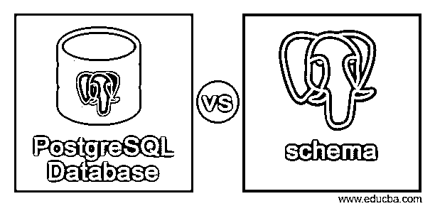
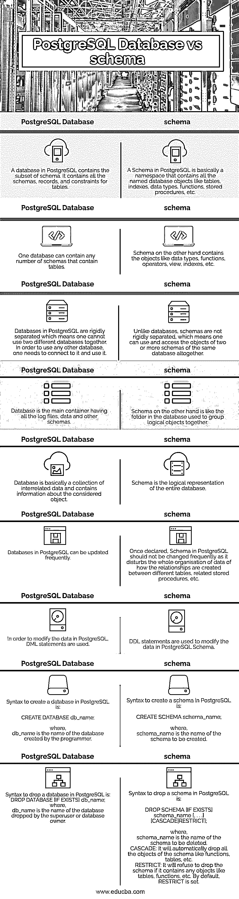

# PostgreSQL 数据库与模式

> 原文：<https://www.educba.com/postgresql-database-vs-schema/>

## PostgreSQL 数据库与模式的区别

PostgreSQL 数据库是包含表的所有模式、记录、日志和约束的容器。数据库是严格分离的，这意味着用户不能同时访问两个数据库。为了操作 PostgreSQL 数据库中的数据，使用了 DML(数据操作语言)命令。

PostgreSQL 模式定义了数据在数据库中的逻辑结构和存储方式。它包含了所有的表、数据类型、索引、函数、存储过程以及与之相关的一切。可以在数据库中为访问应用程序的不同人员定义不同的模式，以避免冲突和不必要的干扰。可以绘制一个图表来显示一个表的数据库模式(显示它包含的列、数据类型、键约束等)。)称为模式图。

<small>Hadoop、数据科学、统计学&其他</small>

### PostgreSQL 数据库与模式的直接比较(信息图表)

以下是 PostgreSQL 数据库与模式之间的 9 大区别:

### PostgreSQL 数据库与模式对照表

下面给出的比较表显示了 PostgreSQL 数据库和模式之间的直接比较:

| **序列号** | **PostgreSQL 数据库** | **PostgreSQL 模式** |
| 1. | PostgreSQL 中的数据库包含模式的子集。它包含表的所有模式、记录和约束。 | PostgreSQL 中的模式基本上是一个名称空间，包含所有命名的数据库对象，如表、索引、数据类型、函数、存储过程等。 |
| 2. | 一个数据库可以包含任意数量的包含表的模式。 | 另一方面，模式包含数据类型、函数、操作符、视图、索引等对象。 |
| 3. | PostgreSQL 中的数据库是严格分离的，这意味着不能同时使用两个不同的数据库。为了使用任何其他数据库，需要连接并使用它。 | 与数据库不同，模式不是严格分离的，这意味着可以同时使用和访问同一个数据库的两个或多个模式的对象。 |
| 4. | 数据库是包含所有日志文件、数据和其他模式的主要容器。 | 另一方面，模式就像数据库中用于将逻辑对象组合在一起的文件夹。 |
| 5. | 数据库基本上是相关数据的集合，包含关于所考虑对象的信息。 | 模式是整个数据库的逻辑表示。 |
| 6. | PostgreSQL 中的数据库可以频繁更新。 | PostgreSQL 中的模式一旦声明，就不应该频繁地更改，因为它会扰乱数据的整体组织，即如何在不同的表、相关的存储过程等之间创建关系。 |
| 7. | 为了修改 PostgreSQL 中的数据，需要使用 DML 语句。 | DDL 语句用于修改 PostgreSQL 模式中的数据。 |
| 8. | Syntax to create a database in PostgreSQL is:创建数据库数据库名称；在哪里，db_name 是程序员创建的数据库的名称。 | Syntax to create a schema in PostgreSQL is:创建架构 schema _ name在哪里，schema_name 是要创建的模式的名称。 |
| 9. | Syntax to drop a database in PostgreSQL is:`DROP DATABASE [IF EXISTS] db_name;`

在哪里，

db_name 是超级用户或数据库所有者删除的数据库的名称。

 | Syntax to drop a schema in PostgreSQL is:`DROP SCHEMA [IF EXISTS] schema_name [, . . .] [CASCADE&#124;RESTRICT];`在哪里，schema_name 是要删除的模式的名称。CASCADE:它将自动删除模式中的所有对象，如函数、表等。RESTRICT:如果模式包含表、函数等对象，它将拒绝删除模式。默认情况下，设置了 RESTRICT。 |

### PostgreSQL 数据库与模式的主要区别

下面详细描述了 PostgreSQL 数据库和模式之间的一些关键差异:

1.数据库中的模式基本上是描述整个数据库的数据库的逻辑表示。它包含视图、索引、表、数据类型、运算符等。模式定义了数据库的属性。相比之下，数据库是包含所有模式、日志、记录所有相关数据、表约束的容器，并且是相关数据的有组织的集合。

2.DML(数据修改语言)语句如 INSERT、SELECT、UPDATE、DELETE 用于修改数据库的数据，而 DDL(数据定义语言)语句如 CREATE、DROP、ALTER、TRUNCATE、RENAME 用于修改 PostgreSQL 模式中的数据。

3.如果我们谈到修改，数据库的数据必须定期更新，但模式中的修改不能频繁进行，因为它会影响所有内容，包括表中的值、表之间的关系(主键、外键)、相关的存储过程等。

4.PostgreSQL 中的模式使用逻辑结构来存储数据，但另一方面，数据库使用物理内存来存储数据。

5.正如我们已经说过的，数据库包含所有的模式和日志，模式包含所有的表、字段、索引等。所以程序员不能在一个模式中创建两个同名的表。但是，它可以在两种不同的模式中完成。但是用户可能在两个不同的数据库中创建了两个同名的表。因为这两个数据库是独立的并且彼此不相关。

6.不能同时使用两个不同的数据库。为了切换数据库，程序员需要断开前一个数据库并连接新的数据库，以便使用它的表和其他相关数据，而如果他/她有权限的话，可以同时访问两个不同的模式。

7.模式通常用于以易于访问和管理的结构化方式逻辑地组织数据库的数据。此外，它允许多个用户访问单个数据库，而不会相互干扰。因此，当有多个用户使用应用程序并以他们自己的方式访问数据库，或者有多个应用程序使用同一个数据库时，模式起着重要的作用。另一方面，数据库包含为不同用户创建的所有模式。

### 结论

上面的描述清楚地解释了什么是 PostgreSQL 数据库和模式，以及两者之间的主要区别。对于从事数据库工作的程序员来说，理解这些基本概念很重要，如数据库、模式、各种数据类型、字段等。，以便在处理真实数据库时有一个清晰的理解。

### 推荐文章

这是 PostgreSQL 数据库与模式的指南。在这里，我们讨论 PostgreSQL 数据库与模式的关键区别，包括信息图和比较表。您也可以看看以下文章，了解更多信息–

1.  [PostgreSQL UUID](https://www.educba.com/postgresql-uuid/)
2.  [PostgreSQL 检查约束](https://www.educba.com/postgresql-check-constraint/)
3.  [PostgreSQL 日期差异](https://www.educba.com/postgresql-datediff/)
4.  [PostgreSQL vs SQLite](https://www.educba.com/postgresql-vs-sqlite/)

