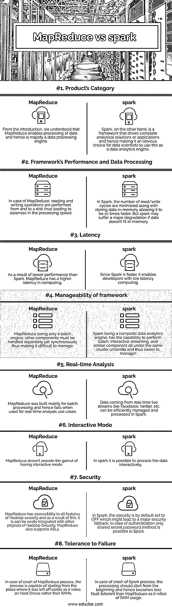

# MapReduce 与 spark

> 原文：<https://www.educba.com/mapreduce-vs-spark/>

## MapReduce vs spark 简介

MapReduce 和 Spark 被定义为支持构建大数据分析领域旗舰产品的框架。这些框架是 Apache 软件基金会的开源项目。单独定义它们，MapReduce 或更好地称为 Hadoop MapReduce，被定义为一个框架，它支持应用程序编写，进而支持以分布式形式处理集群上的大量数据，以便保持容错和可靠性。MapReduce 模型是通过将它分成两个单词“Map”和“Reduce”来构建的，这两个单词都表示为了使 MapReduce 工作而按顺序执行的任务。另一方面，spark 是一个框架，也用于处理跨计算机集群的大量数据分析应用程序，通常被称为“统一分析引擎”。

### MapReduce 与 spark 的面对面比较(信息图表)

以下是 MapReduce 与 spark 之间的 8 大区别:

<small>Hadoop、数据科学、统计学&其他</small>

### MapReduce 和 spark 的主要区别

在我们了解 MapReduce 和 Spark 之间的区别之前，我们需要了解相似之处，以便我们可以尝试了解混淆的原因以及本文脚本背后的意图。这两个框架都用于在各自的用例中处理大量的数据。不仅如此，Spark 本身使用 MapReduce 作为基础，MapReduce 和 Spark 的兼容性保持不变，最后两者都来自 Apache 软件基金会。

由于讨论的主题是“对比”，理解这种相似性使我们意识到为什么会产生这种混淆，因此，不要浪费太多时间，让我们进入第一个不同点，即产品的类别。MapReduce 是为批处理数据而构建的，主要用于批处理数据，而 spark 是一个完整的数据分析引擎，因此是数据科学用例的无可争议的选择。接下来，在 MapReduce 中，读取和写入操作是在磁盘上执行的，因为数据在映射后被持久化回磁盘，Reduce 操作会使处理速度稍慢，而 Spark 在内存中执行操作会导致更快的执行。由于这种差异，Spark 需要大量内存，如果内存不足以容纳数据，可能会导致性能大幅下降。MapReduce 用于处理数据无法存储在内存中的情况。由于 Spark 的处理速度更快，它提供了比 MapReduce 更低的处理延迟。

接下来是可管理性部分，因为 MapReduce 只是批处理的一个组件，管理与 MapReduce 同步的其他组件可能是一项困难的任务，而 Spark 是一个健康的引擎，所有组件都可以在单个集群中轻松管理。接下来，由于 MapReduce 是为了解决批处理的唯一问题而构建的，对于实时处理的用例，它可能会停止失败，而 Spark 在实时处理方面的工作方式类似于 charm。

谈到安全性，MapReduce 在其 kitty 中具有更好的安全特性，因为它可以轻松地将 Hadoop 安全项目的安全特性应用到其用例中，而对于 Spark，这可能有点挑战性，因为在身份验证的情况下，只有共享的秘密密码方法是可能的，并且默认情况下安全性是关闭的。最后但并非最不重要的一点是，MapReduce 对失败的容忍度更高一些，因为它涉及到与硬盘的交互，并且在 MapReduce 进程出现任何中断的情况下可能不需要完全重启，但是在 Spark 的情况下，因为操作发生在内存中，所以在进程中断的情况下需要从初始点启动进程。

### MapReduce 与 spark 对比表

| **比较的热恩** | **MapReduce** | **火花** |
| **产品类别** | 从介绍中，我们了解到 MapReduce 支持数据处理，因此主要是一个数据处理引擎。 | 另一方面，Spark 是一个驱动完整分析解决方案或应用程序的框架，因此数据科学家显然会选择将其用作数据分析引擎。 |
| **框架的性能和数据处理** | 在 MapReduce 的情况下，读写操作是从磁盘执行的，因此导致处理速度缓慢。 | 在 Spark 中，读取/写入周期的数量被最小化，同时将数据存储在内存中，使其速度提高了 10 倍。但是，如果数据不适合内存，spark 可能会遭受严重的降级。 |
| **等待时间** | 由于性能不如 Spark，MapReduce 的计算延迟更高。 | 由于 Spark 速度更快，它支持开发人员进行低延迟计算。 |
| **框架的可管理性** | MapReduce 只是一个批处理引擎，其他组件必须单独处理，但同时进行，因此很难管理。 | Spark 是一个完整的数据分析引擎，能够在同一个集群伞下执行批处理、交互式流和类似组件，因此更易于管理！ |
| **实时分析** | MapReduce 主要是为批处理而构建的，因此在用于实时分析用例时会失败。 | 来自脸书、推特等实时直播流的数据。可以在 Spark 中有效地管理和处理。 |
| **互动模式** | MapReduce 不提供交互模式的所有功能。 | 在 spark 中，可以交互处理数据 |
| **安全** | MapReduce 可以访问 Hadoop 安全的所有特性，因此，它可以很容易地与 Hadoop 安全的其他项目集成。MapReduce 也支持 ASLs。 | 在 Spark 中，安全性默认设置为 OFF，这可能会导致一个主要的安全性回退。在认证的情况下，在 Spark 中只有共享秘密密码方法是可能的。 |
| **故障容限** | 在 MapReduce 进程崩溃的情况下，该进程能够从先前停止的地方开始，因为它依赖于硬盘驱动器而不是内存 | 在 Spark 进程崩溃的情况下，处理应该从头开始，因此比 MapReduce 的容错性差，因为它依赖于 RAM 的使用。 |

### 结论

通过所有的差异，我们确实知道有一些相似之处，比如两者都用于处理大量的数据，但是没有明确的答案表明哪一个更好。这两种用法的答案取决于我们试图解决的问题陈述，并根据差异选择最适合该场景的选项！

### 推荐文章

这是 MapReduce vs spark 的指南。这里我们用信息图和比较表来讨论 MapReduce 和 spark 的主要区别。您也可以看看以下文章，了解更多信息–

1.  [基维 vs 特克因特](https://www.educba.com/kivy-vs-tkinter/)
2.  [Hadoop vs Spark](https://www.educba.com/hadoop-vs-spark/)
3.  [TeraData vs 甲骨文](https://www.educba.com/teradata-vs-oracle/)
4.  [数据科学家 vs 大数据](https://www.educba.com/data-scientist-vs-big-data/)

