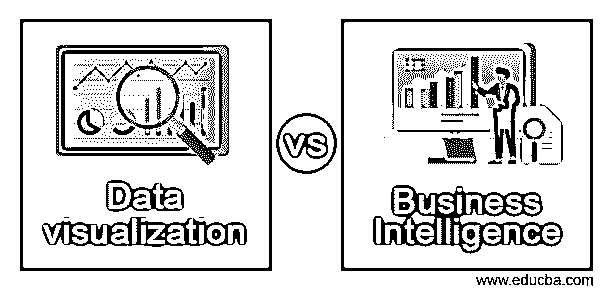
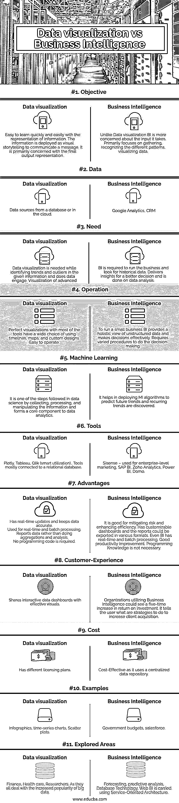

# 数据可视化与商业智能

> 原文：<https://www.educba.com/data-visualization-vs-business-intelligence/>

## 数据可视化与商业智能的区别

数据可视化的定义是通过采用不同的形式(如数据透视表、折线图、饼图)将数据转换为可视的上下文来理解数据的模式和见解。商业智能代表了一组为商业用户提供很少指标的技术。外行术语定义了所发生的事情并分解了促成因素。商业智能解决方案生成的报告可以是可视化的。在本主题中，我们将了解数据可视化与商业智能。

### 数据可视化与商业智能的直接比较(信息图表)

以下是数据可视化与商业智能之间的主要区别

<small>Hadoop、数据科学、统计学&其他</small>

### 主要差异

1.  BI 有助于理解商业世界中的信息，并使用它来分析数据，而数据可视化是一种讲述上述信息故事的技术，并明确给出参数来理解故事。
2.  数据可视化通过将原始信息转换为图形格式的见解来实现，并且是许多商业智能工具的一部分。BI 处理做出相关决策和调整增长导向战略所需的源数据。
3.  数据可视化在商业智能环境中有两种应用方式。数据可视化是通过软件直观地表示数据和交互作用。它处理结构化数据，侧重于报告；BI 使用历史数据进行未来预测，并查看业务数据。
4.  商业智能从多个资源中挖掘数据，执行操作和转换，并将其存储在数据仓库中，该数据仓库形成具有模式的数据集。
5.  商业智能由前端仪表板和后端算法组成，前端仪表板将数据转换为可视化界面。
6.  专家表示，应该选择 BI 工具来满足业务需求并确保数据质量。它们在所有业务领域都提供了额外的商业价值。数据可视化不是自助式 BI。
7.  Power BI dashboard 的当前限制是，在移动设备中，不支持使用 REST API 的主题。它们不是为数据可视化的切片而构建的。Tableau dashboard 非常灵敏，具有强大的报告功能，我们可以在手机和笔记本电脑上定制它。

### 对照表

|  | **数据可视化** | **商业智能** |
| **目标** | 简单易学的快速和轻松的信息表示。这些信息被部署为可视的故事来传达信息。它主要关注最终的输出表示。 | 与数据可视化不同，BI 更关心它所接受的输入。主要侧重于收集、识别不同的模式、可视化数据。 |
| **数据** | 数据源来自数据库或云中。 | 谷歌分析、CRM |
| **需要** | 在识别给定信息中的趋势和异常值时，需要数据可视化，数据是否参与其中。与数字输出相比，高级算法的可视化更容易解释。 | 需要 BI 来运行业务和查找历史数据。为更好的决策提供见解，并基于数据分析完成。 |
| **操作** | 使用大多数工具的完美可视化在使用时间线、地图和定制设计方面有广泛的选择。易操作的 | 要运营一家小型企业，BI 可提供非结构化数据的整体视图，并有效地做出决策。需要不同的程序来做决策。 |
| **机器学习** | 这是数据科学中收集、处理和操作信息的步骤之一，也是数据分析的核心组成部分。 | 它有助于部署 MI 算法来预测未来趋势，并发现重复出现的趋势。 |
| **工具** | Plotly，Tableau，Qlik(智能利用)，。主要连接到关系数据库的工具。 | si sense–用于企业级营销、SAP BI、Zoho Analytics、Power BI、Domo |
| **优势** |  Has real-time updates and keeps data accurate.用于实时和批处理。报告数据，而不是进行汇总和分析。

不需要编程代码。

 | 它有利于降低风险和提高效率。具有可定制的仪表板，报告可以以各种格式导出。甚至 BI 都有实时和批量处理。良好的生产力提升。编程知识不是必须的。 |
| **客户体验** | 共享具有有效视觉效果的交互式数据仪表板。 | 利用商业智能的组织可以看到五倍的投资回报增长。它告诉用户应该采取什么策略来增加客户获取量。 |
| **成本** | 拥有不同的许可计划。 | 成本效益高，因为它使用了集中式数据存储库 |
| **例题** | 信息图、时序图、散点图 | 政府预算，销售队伍 |
| **探索过的地区** | 金融，医疗保健，研究人员。因为它们都在应对日益流行的大数据。 | 预测，预测分析，数据库技术。Web BI 是使用面向服务的架构来实现的。 |

数据可视化成为通过 BI 界面向客户介绍信息的标准平台。该工具是整个商业智能系统的 UI。BI 不是一个单一的软件，而是有一组应用程序，可以将数据转换成公司可以理解的结构，并有效地执行这一过程。最常用的工具是 Power BI，它需要业务分析，被认为是市场领导者之一。它利用 Azure 和 Excel 来启动数据可视化。

**我们来看看 PowerBI 和 Qlik 原理有几点:**

Power Bi 是一个商业智能工具，我们可以向其上传数据，并在整个组织中传递数据。Power BI 有一个服务叫自然查询处理。

**Qlik:**

Qlik View 是数据可视化商业智能工具，可生成报告并执行内存数据处理。它们提供了高端的分析特性，对数据源的深刻见解，并组合了不同大小的数据集(关系型、平面文件)。您可以在移动应用程序中使用 QlikView 来访问 Qlik 文档。它们不需要任何特殊技能，通常用于市场营销、销售和人力资源，以监控业务流程和运营。Qlik view 本身支持 ODBC 连接来访问大量数据源。

### 结论–数据可视化与商业智能

因此，在本文中，我们广泛地研究了两个相关的技术过程，以帮助我们分析大量的信息。总结一下我们在本文中研究的内容，区分这两个术语的效果，现在我们可以建立在决策中表现最好的那个。在竞争激烈的商业环境中，两者都需要有一个成功的市场。

### 推荐文章

这是数据可视化与商业智能的指南。在这里，我们讨论数据可视化和商业智能与信息图和比较表的主要区别。您也可以看看以下文章，了解更多信息–

1.  [单元测试 vs 系统测试](https://www.educba.com/unit-testing-vs-system-testing/)
2.  [F# vs 哈斯克尔](https://www.educba.com/f-sharp-vs-haskell/)
3.  [jQuery children vs find](https://www.educba.com/jquery-children-vs-find/)
4.  [气雾 vs 雷耶斯](https://www.educba.com/aerospike-vs-redis/)

