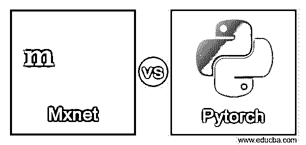
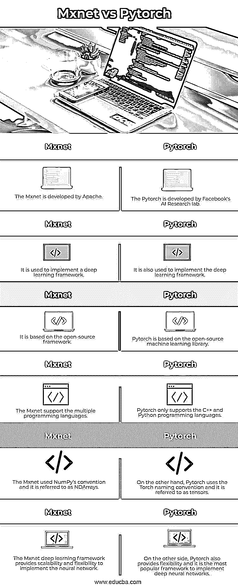

# Mxnet vs Pytorch 游戏

> 原文：<https://www.educba.com/mxnet-vs-pytorch/>

## Mxnet 与 Pytorch 的区别

基本上，Mxnet 是一个软件框架，它是一个用于深度学习的开源框架。通过使用 Mxnet，我们可以根据用户需求训练和部署深度神经网络。Mxnet 框架是可扩展的，并且它允许我们进行快速的模型训练。Mxnet 支持多种编程语言，如 C++、Java 和 Python 等。另一方面，Pytorch 也用于实现深度学习框架，并且很容易实现 API。Pytorch 允许我们按照用户网络实现混合神经网络，并且它还提供了网络的简单性和灵活性。

### Mxnet 与 Pytorch 的面对面比较(信息图)

以下是 Mxnet 与 Pytorch 之间的主要区别:

<small>Hadoop、数据科学、统计学&其他</small>

### 主要差异

现在让我们看看 Mxnet 和 Pytorch 之间的主要区别如下。

**首先，我们来看看 Mxnet 是什么—**

MXNet 是一个开源的深度学习结构，用于表征、准备和发送神经组织。MXNet 是 blend net 的缩写，因为这种结构是通过将不同的编程方法合并为一种而创建的。这个系统支持 Python、R、C++、Julia、Perl 和许多不同的方言，这些方言解决了学习新方言以利用各种结构的需要。

另一个好处是，利用 MXNet 构建的模型在某种程度上是通用的，它们可以放入适量的内存中。因此，当你的模型被准备和尝试后，它往往会毫不费力地被传递到手机或相关的框架中。MXNets 适用于各种机器和图形处理器。这就是亚马逊选择这种结构作为其深度学习网络管理的原因。

现在让我们讨论 Mxnet 架构的要点，如下所示。

**n array:**MXNet 系统的基本信息种类是 n array。这是一个 n 维展示，存储的信息有一个比较排序的地方。如果您已经使用过 Python 的 NumPy 展示，NDArrays 是非常具有可比性的。深刻的神经组织有大量的边界需要存储，所有这些都被收藏在这些展品中。当然，一个 NDArray 拥有 32 个周期的漂移，但是，我们可以修改它。

符号 API: 在神经组织的某个随机层中，准备工作一直在进行。自由层同样可以等量运行。按照这些思路，对于一个像样的演示，我们需要利用多线程或几乎相同的东西来执行相同的准备。MXNet 利用数据流编程和标志性的 API 实现了这一点。

编写计算机程序的数据流是一种等价编程，其中信息通过图表移动。它完全可以被认为是一个黑匣子，它接收信息源，同时给出不同的产量，而不显示隐藏的行为。

为了安装 Mxnet 框架，我们需要使用如下命令。

**pip 安装 mxnet**

成功安装后，我们需要根据我们的要求创建数据集，并将其存储到 NDArrays 中。之后，我们可以根据我们的要求使用经过训练的数据集来实现神经网络或人工智能。

最后，我们可以说 MXNet 是一个人工智能库，它将符号连接与展示计算结合起来，以提高熟练程度和适应性。具有这种熟练程度的同等计算有助于执行深奥的学习模块，即使是在没有固有 GPU 的框架中。MXNet 是在 Apache 中正式交付的，对于任何编程语言的设计人员来说，它都是一个尖端的结构。

对于数据操作，我们可以在 Mxnet 中使用如下代码。

**举例:**

`from mxnet import nd
A = nd.ones((4,2))
B = A + 1
B`

同样，我们可以根据需求编写模型训练的代码。

**现在让我们看看 py torch—**

PyTorch 用 Python、C++和 CUDA 编写，很可能是最著名的人工智能开源库。CUDA 不能保证熟练运行代码的理想机会。

由于脸书是其工程师，Torch 还被 Twitter 和 Salesforce 等许多其他公司使用。它有一个非常简单的支持 python 的 API，可以轻松地将 python 信息科学堆栈与 NLP 应用程序结合起来。

此外，在不切实际地知道一个神经组织需要多少储备的情况下，PyTorch 系统结合了构建计算图。

PyTorch 仍然是一个被众多分析师和设计师所接受的创造平台，因为它有很多好处。我们知道 Pytorch 是一个流行的实现神经网络的框架，因为它提供了大量不难整合的独立部分，还提供了一个简单的构建自己的层类型并在 GPU 和相关模型上运行的方法。

通过使用 pip 命令，我们可以在 windows 中安装 PyTorch，与 Mxnet 框架相同，但安装取决于操作系统。

对于数据操作，我们可以在 Pytorch 中使用如下代码。

**举例:**

`import torch
A = torch.ones(4,2)
B = A + 1
B`

### 对照表

现在我们来看看 Mxnet 和 Pytorch 的对比如下。

| **Mxnet** | **指针** |
| Mxnet 是由 Apache 开发的 | Pytorch 是由脸书人工智能研究实验室开发的 |
| 它用于实现深度学习框架 | 它还用于实现深度学习框架。 |
| 它基于开源框架 | Pytorch 基于开源的机器学习库。 |
| Mxnet 支持多种编程语言 | Pytorch 只支持 C++和 Python 编程语言。 |
| Mxnet 使用 NumPy 的约定，它被称为 NDArrays。 | 另一方面，Pytorch 使用 torch 命名约定，它被称为 tensors。 |
| Mxnet 深度学习框架提供了实现神经网络的可扩展性和灵活性。 | 另一方面，Pytorch 还提供了灵活性，它是实现深度神经网络的最流行的框架。 |

### 结论

我们希望从这篇文章中你能更多地了解 Mxnet 和 Pytorch。从上面的文章中，我们已经了解了 Mxnet vs Pytorch 的基本概念，也看到了 Mxnet vs Pytorch 的不同例子。从本文中，我们了解了如何以及何时使用 Mxnet vs Pytorch。

### 推荐文章

这是 Mxnet vs Pytorch 的指南。在这里，我们用信息图和比较表来讨论 Mxnet 和 Pytorch 的主要区别。您也可以看看以下文章，了解更多信息–

1.  [Mxnet vs TensorFlow](https://www.educba.com/mxnet-vs-tensorflow/)
2.  [Gnome vs Xfce](https://www.educba.com/gnome-vs-xfce/)
3.  [Verilog vs SystemVerilog](https://www.educba.com/verilog-vs-systemverilog/)
4.  [Log4j vs Logback](https://www.educba.com/log4j-vs-logback/)

