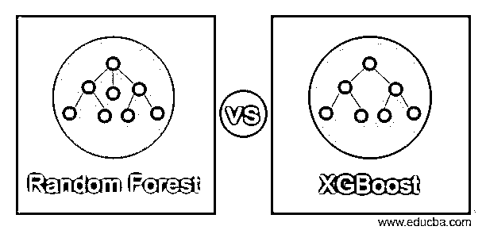
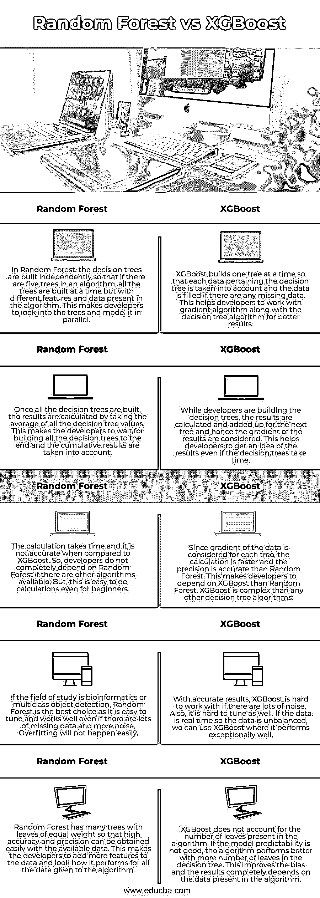
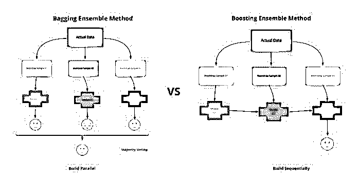

# 随机森林 vs XGBoost

> 原文：<https://www.educba.com/random-forest-vs-xgboost/>

## 随机森林与 XGBoost 的区别

下面的文章提供了随机森林与 XGBoost 的概要。一种机器学习技术被称为随机森林算法，其中回归和分类问题是在不同分类器组合的帮助下解决的，因此决策是基于决策树的结果。考虑输出的平均值，因此如果决策树越多，精确度将越高。极端梯度推进(Extreme Gradient Boosting)或 XGBoost 是一种机器学习算法，其中结合了几种优化技术，以在短时间内获得完美的结果。在正则化的帮助下避免了过度拟合，缺失数据得到了很好的处理，同时对事实和数据进行了交叉验证。

### 随机森林与 XGBoost 的直接比较(信息图)

以下是随机森林与 XGBoost 之间的 5 大区别:

<small>Hadoop、数据科学、统计学&其他</small>

### 随机森林与 XGBoost 的主要区别

让我们讨论一下随机森林与 XGBoost 之间的一些主要区别:

*   随机森林和 XGBoost 是决策树算法，其中以不同的方式获取训练数据。XGBoost 专门训练梯度增强数据和梯度增强决策树。两种算法使用的训练方法不同。如果随机森林算法具有高梯度数据，我们可以使用 XGBoost 来训练随机森林算法，或者我们可以使用随机森林算法来为其特定的决策树训练 XGBoost。此外，如果训练数据很大，我们可以采集数据样本，如果数据很少，我们可以使用整个训练数据来了解其梯度。

*   XGBoost 有助于数值优化，在弱学习器的帮助下，数据的损失函数被最小化，从而以可微分的方式在局部函数中进行迭代。这里没有修改样本，但是对数据中的每个特征赋予了不同的重要性级别。随机森林主要是一种装袋技术，其中考虑各种子集并计算每个子集的平均值。对于数据中的每个实验，采取特征的随机子集或数据的引导样本。
*   为随机森林选择数据的随机子样本，其中生长并行发生，并且通过算法中若干欠拟合特征的组合来减少过拟合。通常只选择包含在决策树中的随机特征子集，因此结果不依赖于任何数据子集。XGBoost 中的正则化参数有助于根据决策树中的弱特征和强特征选择特征，从而减少了过拟合。算法是通过组合决策树中所有先前的迭代来组合顺序增长。计算每片叶子的最佳值，因此给出树的总梯度作为输出。
*   使用 XGBoost 计算结果时涉及到几个超参数。一些包括正则化率、子样本、最小权重、最大深度和学习率。尽管 XGBoost 以更好的性能和更高的速度而著称，但这些超参数总是阻止开发人员研究这种算法。在随机森林中不需要超参数，开发人员可以很容易地理解和可视化随机森林算法，数据中只存在很少的参数。

### 随机森林与 XGBoost 比较表

我们来讨论一下 Random Forest 与 XGBoost 之间的顶级比较:

| **随机森林** | **XGBoost** |
| 在随机森林中，决策树是独立构建的，因此如果一个算法中有五棵树，则所有的树都是同时构建的，但算法中存在不同的特征和数据。这使得开发人员可以并行地研究这些树并对它们建模。 | XGBoost 一次构建一个树，以便考虑与决策树相关的每个数据，并且如果有任何缺失的数据，就填充该数据。这有助于开发人员使用梯度算法和决策树算法来获得更好的结果。 |
| 一旦构建了所有决策树，就可以通过取所有决策树值的平均值来计算结果。这使得开发人员不得不等待所有决策树的构建完成，并考虑累积结果。 | 当开发人员构建决策树时，会计算结果并将其相加用于下一个树，因此会考虑结果的梯度。这有助于开发人员了解结果，即使决策树需要时间。 |
| 计算需要时间，并且与 XGBoost 相比不准确。因此，如果有其他算法可用，开发人员不完全依赖随机森林。但是，即使对初学者来说，这也很容易计算。 | 由于每棵树都考虑了数据的梯度，因此计算速度更快，精度比随机森林更精确。这使得开发者更依赖 XGBoost 而不是 Random Forest。XGBoost 比其他任何决策树算法都复杂。 |
| 如果研究领域是生物信息学或多类对象检测，随机森林是最佳选择，因为它易于调整，即使有大量丢失数据和更多噪声也能很好地工作。不会轻易发生过度拟合。 | 有了精确的结果，如果有很多噪音，XGBoost 就很难工作。此外，也很难调整。如果数据是实时的，所以数据是不平衡的，我们可以使用 XGBoost，它表现得非常好。 |
| 随机森林有许多树叶重量相等的树，因此利用现有数据很容易获得高准确度和精确度。这使得开发人员可以向数据中添加更多的功能，并查看它对所有提供给算法的数据的执行情况。 | XGBoost 不考虑算法中存在的叶子数量。如果模型可预测性不好，决策树中的叶子越多，算法的性能越好。这改善了偏差，并且结果完全取决于算法中存在的数据。 |

### 结论

了解这两种算法对于决定哪种算法用于我们的数据非常重要。如果数据集没有很多差异，并且我们不熟悉决策树算法，最好使用随机森林，因为它也提供了数据的可视化形式。如果我们想深入研究决策树和梯度，XGBoost 是个不错的选择。

### 推荐文章

这是一个随机森林 vs XGBoost 的指南。这里我们分别讨论信息图和比较表的主要区别。您也可以看看以下文章，了解更多信息–

1.  [回归 vs 分类](https://www.educba.com/regression-vs-classification/)
2.  [监督学习 vs 深度学习](https://www.educba.com/supervised-learning-vs-deep-learning/)
3.  [机器学习与预测分析](https://www.educba.com/machine-learning-vs-predictive-analytics/)
4.  [机器学习 vs 预测建模](https://www.educba.com/machine-learning-vs-predictive-modelling/)

