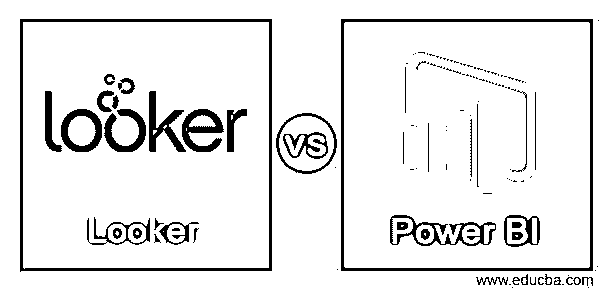
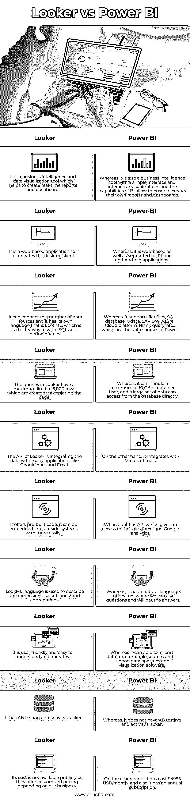

# 长相 vs 实力 BI

> 原文：<https://www.educba.com/looker-vs-power-bi/>

## 长相与实力的区别

下面的文章提供了一个外形与功率 BI 的概要。Looker 是一个数据发现应用程序，这意味着它是一个为大型和小型企业提供数据探索功能的数据平台，它允许任何人查找、导航和了解他们的数据，对于探索数据，它有一个分析界面，对于管理数据体验，使用了一个可重用的开发范例，它还有一个可扩展的 API 集，因此数据可以存在于其他系统中，而， Power BI 是一套业务分析工具，旨在系统地帮助企业，它将数据转换为交互式可视化，并且该工具可以在所有设备上共享基于仪表板的洞察力。

### 长相与实力的直接对比(信息图)

以下是长相与实力之间的 10 大差异:

<small>Hadoop、数据科学、统计学&其他</small>

### 长相与实力的关键区别

让我们来讨论一下长相与实力之间的一些主要区别:

*   **数据库连接:**looker 是一个商业智能工具，它需要连接多个数据源，它有自己强大的数据模型，这是提供的最佳功能，它使用 LookML 语言来编写 SQL 查询，这种语言也是 looker 自己的语言，而 power 商业智能工具也是一个工具，它支持许多数据源，具有平面文件的数据源，基于 SQL 的数据库，以及 OData、SAP、BW、SAP HANA、Azure 云平台等。，在这方面他们彼此不同。
*   **数据量:**looker 可以添加、过滤和限制用于查看的数据，它可能对结果日期、客户、位置等有限制，但不需要添加维度或测量我们的结果，它最多可以浏览 5000 行，并且可以通过浏览页面设计对它的查询，looker 非常易于使用和操作，因为没有复杂的编码。 我们可以合并来自图表和表格的数据，而 power BI 可以直接从数据库处理数据，它可以通过分析数据来处理大量数据，这意味着数据首先在 power BI 上进行分析，它还可以在我们的场所存储和收集数据，并根据需要在任何地方访问数据，它可以为每个用户处理最多 10 GB 的数据。
*   **数据平台:**looker 的架构旨在提供云数据库的可扩展性和性能，允许根据我们的需求选择云提供商，根据未来的目的提供数据安全，因为它具有多云功能，我们可以根据用户的观点轻松选择部署 looker 的位置，这样用户就不会受到影响，而， Power BI 的客户在部署到 Microsoft azure 时，在利用云公共环境上可用的服务方面受到限制，这对于组织来说不是一个紧迫的问题，将来当其他云环境更具吸引力时，这可能会增加复杂性。
*   **可视化:**looker 具有方便的可视化，在创建可视化时，它具有特殊的数据方案，我们可以拖放元素，我们可以分配角色，如管理员、用户、开发人员等，还可以通过导入或导出外部仪表板来准备高度技术性的可视化，因为它具有映射功能，looker 允许将数据对象与第三方的工作流连接，以使用外部应用程序的功能。 另一方面，power business intelligence 具有非常交互式且令人印象深刻的可视化，可与大量查看者共享，因为它提供了我们组织及其绩效的实时视图，它提供了一个关于交互式可视化、简单报告创建和快速发布的扩展库，它具有用于桌面拖放导航的自由格式画布。

### 外形与功率 BI 对照表

让我们来讨论一下长相与实力的对比:

| **Sr 号** | **看客** | **功率 BI** |
| 1. | 这是一个商业智能和数据可视化工具，有助于创建实时报告和仪表板。 | 然而，它也是一个商业智能工具，具有简单的界面和交互式可视化，BI 的功能允许用户创建自己的报告和仪表板。 |
| 2. | 这是一个基于网络的应用程序，因此它消除了桌面客户端。 | 然而，它是基于网络的，并且支持 iPhone 和 Android 应用程序。 |
| 3. | 它可以连接到许多数据源，并且有自己的语言 LookML，这是编写 SQL 和定义查询的一种更好的方法。 | 而它支持平面文件、SQL 数据库、Odata、SAP BW、Azure、云平台、空白查询等。，它们是 Power BI 中的数据来源。 |
| 4. | Looker 中的查询最多有 5，000 行，这是通过浏览页面创建的。 | 而每个用户最多可以处理 10 GB 的数据，大量数据可以直接从数据库中访问。 |
| 5. | Looker 的 API 正在将数据与许多应用程序集成，如谷歌文档和 Excel。 | 另一方面，它集成了微软工具。 |
| 6. | 它提供预构建的代码，可以更容易地嵌入到外部系统中。 | 然而，它有 API，可以访问销售人员和谷歌分析。 |
| 7. | LookML 语言用于描述维度、计算和聚合。 | 然而，它有一个自然语言查询工具，我们可以问问题，并会得到答案。 |
| 8. | 它是用户友好的，易于理解和操作。 | 然而，它可以从多个来源导入数据，是一个很好的数据分析和可视化软件。 |
| 9. | 它有一个 AB 测试和活动跟踪器。 | 然而，它没有 AB 测试和活动跟踪器。 |
| 10. | 它的成本不公开，因为他们根据我们的业务提供定制的价格。 | 另一方面，它的费用是 4995 美元/月，并且它有一个年度订阅。 |

### 结论

在本文中，我们得出结论，Power BI 更适合利益相关者构建可视化，因为它具有广泛的功能，而且用户熟悉微软，这是一个额外的优势。另一方面，looker 用于存储所有业务逻辑数据，具有许多功能。

### 推荐文章

这是一个关于长相 vs 实力 BI 的指南。这里我们分别讨论信息图和比较表的主要区别。您也可以看看以下文章，了解更多信息–

1.  [元数据库与表格](https://www.educba.com/metabase-vs-tableau/)
2.  [Splunk vs Tableau](https://www.educba.com/splunk-vs-tableau/)
3.  [Quicksight vs Tableau](https://www.educba.com/quicksight-vs-tableau/)
4.  [Power BI vs Tableau vs Qlik](https://www.educba.com/power-bi-vs-tableau-vs-qlik/)

