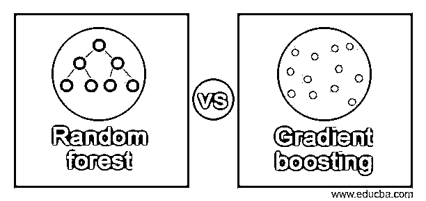
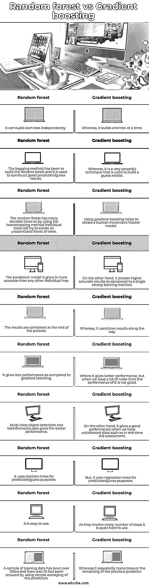

# 随机森林与梯度增强

> 原文：<https://www.educba.com/random-forest-vs-gradient-boosting/>

## 随机森林与梯度增强的区别

随机森林对梯度森林的定义是，随机森林是一种用于解决分类和回归问题的集成学习方法，它有两个步骤，第一步涉及用于训练和测试的引导技术，第二步涉及用于预测目的的决策树，而梯度推进被定义为也用于解决回归和分类问题的机器学习技术，它以逐步的方式创建模型， 它是通过优化一个目标函数得到的，我们可以组合一组弱学习模型来构建单个强学习器。

### 随机森林与梯度推进的直接比较(信息图)

以下是随机森林与梯度增强之间的主要差异:

<small>Hadoop、数据科学、统计学&其他</small>

### 主要差异

*   **性能:**

随机森林和梯度增强之间的性能有两个不同之处，即随机森林可以独立构建每棵树，另一方面，梯度增强可以一次构建一棵树，因此与梯度增强相比，随机森林的性能较低，另一个不同之处是随机森林在过程结束时组合其结果，而梯度在过程中组合结果。

*   **装袋与增压:**

决策树的组合是随机森林和梯度推进之间的主要区别，随机森林是通过使用 bagging 方法建立的，bagging 方法是并行使用每个决策树的方法，其中每个决策树可以适合从整个数据集中取出的子样本，如果分类结果是通过取出决策树的所有结果来确定的，并且对于回归任务， 通过取所有预测的平均值来计算总体结果，另一方面，梯度提升使用提升技术来建立集成模型，以建立新的强树。决策树串联连接，其中决策树不适合整个数据集。

*   **过拟合:**

过度拟合是机器学习技术中的关键问题，因为我们知道在机器学习中我们使用算法，所以存在过度拟合的风险，这可以被认为是机器学习中的瓶颈。当任何模型很好地拟合训练数据时，可能会出现过度拟合，因为我们的模型可以在训练数据下获取一些不必要的细节，所以它无法推广到整个数据。

正如我们在上面看到的，随机森林和梯度推进都是集成学习模型，随机森林使用几个非关键或不会导致过度拟合的决策树，如果我们在其中添加更多的树，则模型的准确性将会降低，因此我们不想添加更多的树，因此可能会出现计算原因，但在随机森林中，没有过度拟合的风险，相反， 在梯度提升中，由于树的数量可能会出现过拟合，在梯度中，新的树已经从剩余的树添加到先前的树，因此每次添加都可能在训练数据中出现噪声，因此在梯度提升中添加许多树将导致过拟合。

*   **自举:**

Bootstrapping 是一种用于统计的技术，它使用数据样本来生成预测数据。每个数据样本都称为 bootstrap 样本，在随机森林中，如果我们不使用 bootstrapping 技术，则每个决策树都适合数据集，因为许多算法将应用于同一个数据集。这种方式很好，因为我们重复进行，因此它可以提供更好的性能。 如果我们使用相同或不同的决策树，那么我们得到的结果与我们通过单个决策树得到的结果相比不会有很大不同，因此自举在创建不同的决策树中起着重要的作用，而梯度提升不使用自举技术，其中的每个决策树都适合前一个决策树的剩余部分，因此它不能很好地与具有不同树的决策树一起工作。

### 随机森林与梯度增强对比表

| **序号** | **随机森林** | **梯度推进** |
| 1. | 它可以独立构建每棵树。 | 然而，它一次构建一棵树。 |
| 2. | bagging 方法已经被用于构建随机森林，并且被用于构建良好的预测/猜测结果。 | 然而，这是一种用于构建猜测模型的非常强大的技术。 |
| 3. | 随机森林有许多决策树，因此通过使用自举方法，各个树将试图创建不相关的森林。 | 使用梯度推进有助于创建人体运动跟踪器模型。 |
| 4. | 它给出的预测模型比其他任何一棵树都要精确。 | 另一方面，与单一的强学习方法相比，它创建了更高精度的结果。 |
| 5. | 结果在过程结束时被合并。 | 然而，它结合了整个过程的结果。 |
| 6. | 与梯度提升相比，它的性能较低。 | 在这种情况下，它可以提供更好的性能，但当我们有很多噪声时，它的性能就不好了。 |
| 7. | 多类对象检测和生物信息学也提供了更好的性能。 | 另一方面，当我们有不平衡的数据时，如在实时风险评估中，它给出了一个很好的性能。 |
| 8. | 它使用决策树进行预测/猜测。 | 但是，它使用回归树进行预测/猜测。 |
| 9. | 它很容易使用。 | 因为它们涉及许多步骤，所以很难使用。 |
| 10. | 训练数据的样本已经过拟合，然后通过使用预测值的简单平均来减少过拟合。 | 而它重复训练树或先前预测器的剩余部分。 |

### 结论

在这篇文章中，我们得出结论，随机森林和梯度推进都有非常有效的算法，其中它们使用回归和分类来解决问题，并且过拟合不会发生在随机森林中，但会发生在梯度推进算法中，因为添加了几个新的树。

### 推荐文章

这是一个随机森林与梯度推进的指南。在这里，我们通过信息图和比较表来讨论随机森林与梯度增强的主要区别。您也可以看看以下文章，了解更多信息–

1.  [QGIS vs ArcGIS](https://www.educba.com/qgis-vs-arcgis/)
2.  [粉笔 vs GIMP](https://www.educba.com/krita-vs-gimp/)
3.  [SCTP vs TCP](https://www.educba.com/sctp-vs-tcp/)
4.  [侏儒 vs KDE](https://www.educba.com/gnome-vs-kde/)

