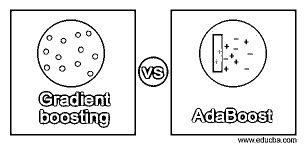
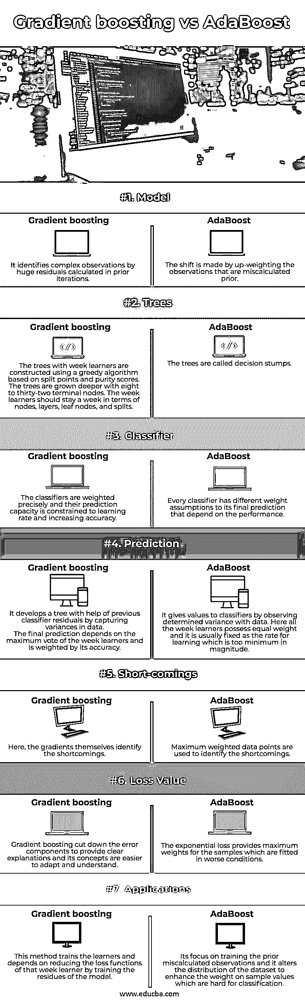

# 梯度增强与 AdaBoost

> 原文：<https://www.educba.com/gradient-boosting-vs-adaboost/>

## 梯度增强与 AdaBoost 的区别

Adaboost 和梯度增强是在机器学习中应用的集成技术类型，用于提高弱学习者的效率。boosting 算法的概念是连续破解预测器，其中每个后续模型都试图修复其前一个模型的缺陷。Boosting 将许多简单的模型组合成一个单一的复合模型。通过尝试许多简单的技术，整个模型成为一个强大的模型，组合起来的简单模型被称为弱学习者。因此，自适应增强和梯度增强增加了这些简单模型的功效，从而在机器学习算法中带来巨大的性能。

### 梯度增强与 AdaBoost 的面对面比较(信息图)

以下是梯度增强与 AdaBoost 之间的主要区别:

<small>Hadoop、数据科学、统计学&其他</small>

### 梯度增强和 AdaBoost 的主要区别

梯度增强之间的重要差异将在下一节讨论。

**定义:**

Adaboost 提高了所有可用的机器学习算法的性能，并用于处理弱学习者。它获得的准确性刚好高于对问题进行分类的任意几率。AdaBoost 中适应性强且最常用的算法是单级决策树。当与最小化累积预测误差的先前模型相结合时，梯度提升依赖于下一个合适的可能模型的直觉。梯度推进的关键思想是确定下一个模型的目标结果，以减少误差。

**原理:**

第一增强集成模型是自适应增强，其将其参数修改为取决于当前迭代的原始性能的数据值。用于重新计算数据值的权重和用于最终组合的权重都被再次迭代地重新操纵。这里，它被用在简单的分类树中作为基础学习，当与分类单个基础学习器或一个树算法相比时，它提供了提高的性能。梯度提升结合了提升和梯度下降的思想，形成了一个强大的机器学习算法。术语“梯度”表示具有相似函数的二重或多重导数。弱学习器、损失函数和加法模型是梯度推进的三个组成部分。它从数值优化的角度对 boosting 技术进行了直接分析，在一个函数中推广了 boosting 技术，从而实现了随机损失函数的优化。

**损失函数**

损失函数被测量以计算预测模型对其期望值或结果的性能。用户将学习问题改变为描述损失函数的优化函数，并再次调整算法以减少损失函数，从而获得更高的精度。自适应增强方法使指数损失函数最小化，这使得算法对其异常值的改变更加深刻。在梯度增强中，与 AdaBoost 相比，可微分损失函数对异常值更敏感。

**易处理性:**

Adaboost 是用特定的损失函数计算的，当迭代次数很少时变得更加严格。但在梯度推进中，它有助于找到额外迭代建模问题的正确解决方案，因为它是用一些通用功能构建的。由此可以看出，与 AdaBoost 相比，梯度提升更加灵活，因为它的损失函数值是固定的。

**优点:**

Adaboost 在弱学习者中是有效的，并且当它与少量分类错误相关时，它减少损失函数。它是为需要二进制分类的问题开发的，可用于提高决策树的效率。在梯度推进中，它被用来解决微分损失函数的问题。回归问题和分类问题中都可能隐含这一点。尽管这两种助推技术存在一些差异，但它们都遵循着相似的路径，有着相同的历史根源。两者都通过持续地将注意力转移到难以计算和预测的有问题的评论上来提高单个学习者的表现。

**缺点:**

现有的周学习器可以在梯度提升中找到，在 Adaboost 中可以找到最大权重数据点。

### Adaboost 和梯度增强对照表

| **特性** | **梯度推进** | **Adaboost** |
| **型号** | 它通过先前迭代中计算的巨大残差来识别复杂的观测值 | 这种转变是通过对先前误算的观测值进行加权来实现的 |
| **树木** | 使用基于分裂点和纯度分数的贪婪算法来构建具有弱学习者的树。树越长越深，有 8 到 32 个终端节点。周学习者应该在节点、层、叶节点和拆分方面停留一周 | 这些树被称为决策树桩。 |
| **分类器** | 分类器被精确地加权，并且它们的预测能力受限于学习速率和增加的准确度 | 每个分类器对其最终预测都有不同的权重假设，这取决于性能。 |
| **预测** | It develops a tree with help of previous classifier residuals by capturing variances in data.最终的预测取决于一周学习者的最大投票，并根据其准确性进行加权。 | 它通过观察数据的确定方差来给分类器赋值。在这里，一周的学习者拥有相同的权重，它通常被固定为学习率，而学习率在数量上是最小的。 |
| **不足之处** | 在这里，梯度本身确定了缺点。 | 最大加权数据点用于识别缺点。 |
| **损失值** |  梯度增强减少了误差成分以提供清楚的解释，并且其概念更容易适应和理解 | The exponential loss provides maximum weights for the samples which are fitted in worse conditions. |
| **应用程序** | 该方法训练学习者，并依赖于通过训练模型的残差来减少该周学习者的损失函数 | 它的重点是训练先前误算的观察值，并改变数据集的分布，以增强难以分类的样本值的权重 |

### 结论

因此，当涉及自适应提升时，该方法是通过提升加权的观察值来完成的，该加权的观察值是先前错误分类的，并且用于训练模型以给出更高的效率。在梯度推进中，复杂的观测值是通过在前一次迭代中留下的大量残差来计算的，以提高现有模型的性能。

### 推荐文章

这是梯度增强与 AdaBoost 的对比指南。在这里，我们通过信息图和比较表来讨论梯度增强与 AdaBoost 的主要区别。您也可以看看以下文章，了解更多信息–

1.  [QGIS vs ArcGIS](https://www.educba.com/qgis-vs-arcgis/)
2.  [粉笔 vs GIMP](https://www.educba.com/krita-vs-gimp/)
3.  [RxJava vs 反应器](https://www.educba.com/rxjava-vs-reactor/)
4.  [气流 vs 詹金斯](https://www.educba.com/airflow-vs-jenkins/)

