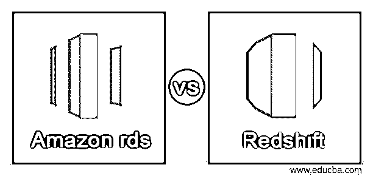
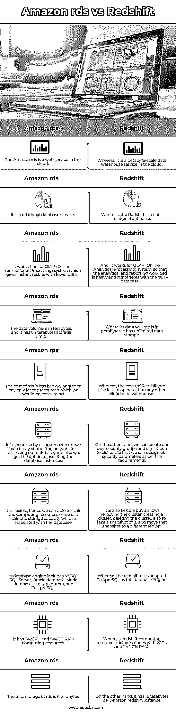

# 亚马逊 rds 与红移

> 原文：<https://www.educba.com/amazon-rds-vs-redshift/>

## 亚马逊 rds 与红移简介

Amazon rds 是由 Amazon web services 提供的关系数据库服务，它支持存储和组织数据库引擎的数据并帮助管理数据库的任务，它在云中操作和扩展关系数据库，它以一种简单的方式建立数据库而不用担心基础设施，而 Amazon Redshift 是一种基于云的服务或数据仓库服务，用于收集和存储数据， 此外，它使用户能够使用商业智能工具分析数据，并简化处理大规模数据集的过程。

### 亚马逊 rds 与 Redshift 的直接对比(信息图)

以下是亚马逊 rds 与 Redshift 之间的 10 大差异:

<small>Hadoop、数据科学、统计学&其他</small>

### 亚马逊 rds 与红移对比表

| **序列号** | **亚马逊 rds** | **红移** |
| 1. | Amazon rds 是云中的一个 web 服务。 | 然而，它是云中的 Pb 级数据仓库服务。 |
| 2. | 它是一种关系数据库服务。 | 然而，红移是一个非关系数据库。 |
| 3. | 它适用于 OLTP(在线事务处理)系统，这种系统可以用较少的数据提供即时结果。 | And, it works for OLAP (Online Analytical Processing) system, so that the analytical and reporting workload is heavy and it interferes with the OLTP database. |
| 4. | 数据量以兆兆字节为单位，它有 64tb 的存储限制。 | 它的数据量以 Pb 为单位，拥有无限的数据存储空间。 |
| 5. | rds 的成本更低，但我们只想为我们将消耗的资源付费。 | 然而，Redshift 的运营成本也比任何其他云数据仓库都要低。 |
| 6. | 它是安全的，所以通过使用 Amazon rds，我们可以轻松地控制访问我们数据库的网络，并且我们还可以选择隔离数据库实例。 | 另一方面，我们可以创建自己的安全组，并可以连接到集群，这样我们就可以根据需求设计我们的安全参数。 |
| 7. | 它非常灵活，因此我们可以扩展计算资源，也可以扩展与数据库相关的存储容量。 | 它也很灵活，但允许删除群集、创建群集、删除群集，还可以拍摄群集的快照，以及将快照移动到不同的区域。 |
| 8. | 其数据库引擎包括 MySQL、SQL Server、Oracle 数据库、Maria 数据库、Amazon Aurora、PostgreSQL。 | 而 redshift 使用修改后的 PostgreSQL 作为数据库引擎。 |
| 9. | 它拥有 64vCPU 和 244GB RAM 计算资源。 | 然而，红移计算资源包括具有 vCPU 和 244 GN RAM 的节点。 |
| 10. | rds 的数据存储量为 6tb。 | 另一方面，它的每个 Amazon Redshift 实例有 16tb。 |

### 亚马逊 rds 与红移的主要区别

**可扩展性:**

当我们可以选择不同的数据库时，最重要的是检查它的可伸缩性，rds 和 redshift 都允许我们根据需要扩展数据库。
rds 的扩展基于虚拟实例，这是通过重新配置虚拟实例的功能来完成的，rds 的扩展可能需要几分钟时间，只需在 AWS 的控制台中单击几下即可完成，而 redshift 的体系结构很复杂，这意味着扩展不像 rds 中那样无缝。实例的大小调整可以在几分钟内完成，因为它支持弹性大小调整，数据库不可用时间窗口高于 rds，这意味着缩放红移的存储容量更高，以便无限数量的用户可以访问它。

**性能:**

两个数据库的性能都取决于密钥分配机制，其中 rds 具有分片功能，通过精心设计的密钥，客户可以获得更高的性能，而 redshift 具有排序密钥和 DIST 密钥选项，当正确使用时，连接和复杂查询的性能将会提高，redshift 是计算平台上性能最快的数据仓库。

**维护:**

rds 的维护比 redshift 低，因为它具有简单的体系结构，而且它具有自动化的任务，因此终端用户不需要维护更多的东西。redshift 中的管理任务需要由集群管理员手动执行，该任务使用删除标记来执行“删除”和“更新”查询，这意味着归档过程对于实际删除是必要的，并且该过程将通过使用“真空”命令来完成，而 redshift 也有一个“分析”命令来确保所有元数据和表保持更新。

**数据结构:**

基本上，rds 的结构是面向行的，它存储数据，另一方面，redshift 具有列结构，因此它优化了列的快速检索。rds 查询依赖于所使用的引擎，redshift 使用 Postgres 标准。当遇到插入键中的唯一约束时，redshift 就不能很好地完成任务，预计最终用户将自己管理它，而 rds 支持数据库引擎中的唯一键约束。

**定价:**

rds 和 redshift 的价格包括存储和计算，仅允许按使用付费。rds 的价格较低，因为它简单且具有较低的扩展能力，MySQL、Postgres、Maria DB 的起价为 0.17 美元/小时，这非常低，如果客户希望使用现有的 oracle 数据库，AWS 也有一个针对 Oracle 的较低费率政策，而 redshift 的价格更多是当前最低一代的价格，其起价为 0.25 美元/小时，并且是高度可用的服务。当客户使用多个节点时，价格会随着节点数量的增加而增加。

### 结论

在本文中，我们得出的结论是，RDS 和 Redshift 都有吸引人的使用案例，我们可以代表它们考虑扩展它、操作它，并根据我们的要求使用它们，这两种服务都可以单独工作，我们无法在它们之间做出选择。

### 推荐文章

这是亚马逊 rds vs 红移的指南。这里我们分别讨论信息图和比较表的主要区别。您也可以看看以下文章，了解更多信息–

1.  [Hadoop vs 红移](https://www.educba.com/hadoop-vs-redshift/)
2.  [Hadoop vs Splunk](https://www.educba.com/hadoop-vs-splunk/)
3.  [亚马逊 SQS](https://www.educba.com/amazon-sqs/)
4.  [亚马逊替代品](https://www.educba.com/amazon-alternatives/)

