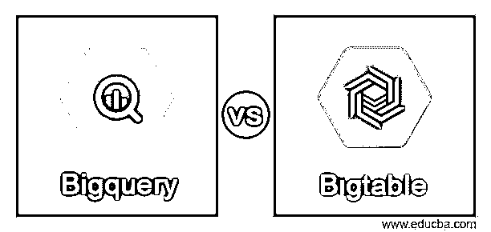
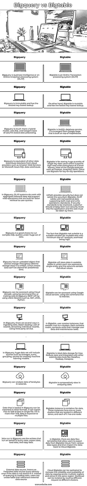

# Bigquery vs Bigtable

> 原文：<https://www.educba.com/bigquery-vs-bigtable/>

## Bigquery vs Bigtable 简介

Bigquery vs Bigtable 是 Bigquery 和 Bigtable 之间的比较。Bigquery 是企业数据仓库，它通过使用 Google 的结构和设施的处理能力来实现超快速的 SQL 查询。Bigtable 是一个高性能存储系统，以键-值对的形式存储大量数据，并以最低的延迟支持高读写吞吐量，以便更快地访问数据。这两种服务有许多相似之处，但仍然支持大数据生态系统中不同种类的使用情形。Bigquery 是一个用于存储大量关系数据的企业数据仓库，而 Bigtable 是一个 NoSQL 列宽数据库，针对更好的读写进行了优化。在这里，我们将比较 Bigquery 和 Bigtable，看看两者的主要区别和相似之处。

### Bigquery 与 Bigtable 的直接比较(信息图表)

以下是 Bigquery 与 Bigtable 之间的 14 大区别:

<small>Hadoop、数据科学、统计学&其他</small>

### 比较表(Bigquery 与 Bigtable)

| **Bigquery** | **Bigtable** |
| Bigquery 是商业智能或在线分析处理系统(OLAP) | Bigtable 是一个在线事务处理系统(OLTP) |
| Bigquery 是不可变的，具有最慢的基于键的查找。 | 另一方面，Bigtable 是可变的，具有最快的基于键的查找。 |
| Bigquery 更像是一个混合模型，使用 SQL 和 Google 基于列的数据处理。 | Bigtable 是 NoSQL 的数据库服务，它来自 Google forge，建立在 MapReduce 之上。 |
| Bigquery 相当于亚马逊 Web 服务或微软 Azure SQL 数据仓库等云提供商的其他数据仓库解决方案。 | Bigtable 用于存储大量的单键数据值，以较低的延迟支持高读写吞吐量。大多数 Google 产品，如 Finance、Analytics、Earth、Orkut 都使用 Bigtable 进行日常操作。 |
| 在 Bigquery 中，OLAP 系统确实处理聚合历史数据，并支持为更快检索用户查询而构建的读取操作。 | 在 Bigtable 中，OLTP 处理支持读写操作的事务数据。 |
| Bigquery 是在大量数据下运行复杂 SQL 查询的好选择。 | Bigtable 不适合的事实是，对于最小大小为 1tb 的可变集合来说，它是一个合适的解决方案，开销很高。 |
| Bigquery 有一个上传的对象，它一旦被写入就不能在整个生命周期存储中更改，这意味着数据在预定义的时间内不能被更改。 | Bigtable 将数据存储在可伸缩的表中，其中每一行代表一个实体，每一列包含单独的值。 |
| 可以使用云控制台、使用 bq 命令行或者通过使用客户端库调用 Bigquery REST API 来访问 Bigquery，比如。NET，JAVA，Python。 | Bigtable 可以使用 Google cloud console 访问，使用 cbt 命令行进行交互。 |
| 在 Bigquery 中，有几种方法可以接收数据、批量加载一组记录、流式传输单个记录、使用第三方服务 | 在 Bigtable 中，用户创建最多包含 4 个集群的实例。每个都包含节点、管理用户数据和维护任务的计算单元。 |
| 在 Bigquery 中，庞大的数据集将包括用于创建机器学习模型的查询，如平均值、总和、分组、计数。 | Bigtable 是 Map Reduce 风格的理想数据存储，并与其他现有的数据工具集成，如 Dataflow、Hadoop、Dataproc。 |
| Bigquery 可以在几秒钟内分析万亿字节的数据。 | Bigtable 在分析数据时相对较慢。 |
| Bigquery 中加载的数据可以以其他格式导出。它最多可以在单个文件中导出 1GB 的数据。如果超过 1GB，数据将导出到多个文件中。 | Bigtable 实例是数据的容器，这些实例有一个或多个位于不同区域的集群，每个集群有一个节点。 |
| Bigquery 中运行的作业是代表查询数据、导出数据、加载数据和复制数据而运行的操作。 | 在 Bigtable 中，有数据流模板，允许用户从 Bigtable Cloud 导出各种数据类型的数据，然后将数据导入回 Cloud Bigtable。 |
| 外部数据源，称为联邦数据源，即使数据没有存储在其中也可以直接查询。用户可以创建引用外部数据源的表，而不是查询或加载数据。 | 通过跨多个区域和同一区域中的分区进行复制，可以复制云 Bigtable 以提高数据的可靠性和可用性。可以通过将不同的请求路由到不同的集群来隔离工作负载。 |

### Bigquery 与 Bigtable 的主要区别

*   Bigquery 是 SQL 大数据仓库，而 Bigtable 是 NoSQL 数据库。
*   Bigtable 最初开发于 2004 年，构建于 Google 文件系统(即 GFS)之上。
*   Bigquery 的数据扫描速度要快得多，并允许扩展到 Pb，是一个很好的企业数据仓库。
*   两者都托管在服务器操作系统上，Bigquery 支持用户定义的服务端脚本函数，而 Bigtable 不支持。
*   Bigquery 支持一些编程语言，如 Java、.NET、Objective C、PHP、Ruby、Python 和 JavaScript。
*   Bigtable 支持一些编程语言，如 Go、C++、C、JavaScript(Node Js)、Python 和 Java。

### 结论

至此，我们将结束“Bigquery vs Bigtable”这个主题。我们已经看到了 Bigquery vs Bigtable 的含义。还引用了 Bigquery 和 Bigtable 的单独定义。我们已经看到了许多相似之处，并在上面的比较表中比较了所有的差异。还列出了 Bigquery 和 Bigtable 中需要注意的一些关键区别。谢谢！快乐学习！!

### 推荐文章

这是 Bigquery vs Bigtable 的指南。这里我们分别讨论信息图和比较表的主要区别。您也可以看看以下文章，了解更多信息–

1.  [JSON vs BSON](https://www.educba.com/json-vs-bson/)
2.  [JSON vs SOAP](https://www.educba.com/json-vs-soap/)
3.  [JSON vs AJAX](https://www.educba.com/json-vs-ajax/)
4.  [JSON vs CSV](https://www.educba.com/json-vs-csv/)

