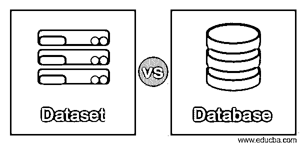
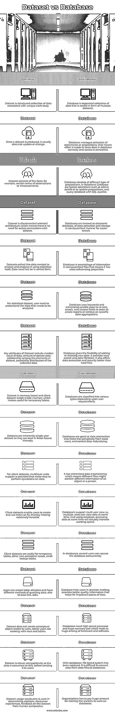

# 数据集与数据库

> 原文：<https://www.educba.com/dataset-vs-database/>

## 数据集与数据库的区别

Dataset vs Database 将通过在专业领域对两者进行比较，为我们提供不同之处。数据集是数据的结构化集合，通常与唯一的工作主体相关联。并且数据库是存储在多个数据集中的数据的有组织的集合，并且这些数据集被存储并且从计算机系统电子地访问，该计算机系统允许容易地访问、操作和更新。这两个术语使用不严格，总体上有不同的定义。数据库倾向于管理语句的集合，而数据集是命题的固定集合。在这里，我们将比较数据集和数据库，列出相似之处和不同之处。此外，还将了解数据集和数据库之间的主要区别。

### 数据集与数据库之间的直接比较(信息图表)

以下是数据集与数据库之间的主要区别。

<small>Hadoop、数据科学、统计学&其他</small>

### 数据集与数据库的主要区别

1.  通常，数据是一种以各种格式呈现的信息，并且仅仅是数据。当这些数据以结构化的方式保存在一起时，就称为信息数据。
2.  为了利用真实的数据，用户需要一个数据库管理系统。
3.  Dataset 将所有行(即数据)从数据源提取到内存区域，并在加载到内存后释放数据。
4.  在数据集中，用户可以根据需要来回移动以随机获取记录。
5.  数据集可以序列化，并以 XML 的形式表示，这样就可以很容易地传递到其他层。
6.  数据库主要用于小型和原子事务，需要 24/7/365 可用，即停机时间成本更高。
7.  数据库是结构化的和高效的，在多个表中没有这种重复的信息。

### 数据集与数据库对照表

| **数据集** | **数据库** |
| 数据集是与唯一工作体相关联的数据的结构化集合。 | 数据库是以多个数据集的形式存储的有组织的数据集合。 |
| 数据集一旦生成，通常不会更新或更改。 | 数据库管理语句或命题的集合，这意味着努力将数据正确地保存在数据库中，并且访问是受控的。 |
| 数据集由几个事实组成，例如，某些系列的观察或测量。 | 数据库由不同类型的命题组成，在关系数据库中典型的操作有添加、删除或更新命题，以及用 SQL 查询来查询数据库。 |
| 数据集是面向断开连接的体系结构，这意味着不需要与数据集的活动连接。 | 数据库被称为电子数据库，以计算机化的方式收集和存储数据，以便于搜索。 |
| 数据集收集使用统计工具进行分析所需的数据。数据不需要以排序的形式。 | 数据库是计算机化文件中信息的集合，这意味着它具有相互参照的特性。 |
| 对于统计数据集，用户需要了解需要分析的数据。 | 数据库使用关键字和命令使用户能够重新排序、搜索和选择字段，以便创建报告或检索特定的数据聚合。 |
| 数据集的关键属性包括数据的中值、分布数据量、数据集中元素之间的关系、收集数据的概率分布。 | 数据库提供了添加或删除新数据的灵活性。它提供了简单的搜索和数据过滤。它还提供了比硬文件更好的数据保护和安全性。 |
| 数据集是基于内存的，客户端数据集驻留在内存中，这使得它对于临时表非常有用。 | 根据用户的需求，数据库被分为不同的类型。 |
| 数据集本质上是单用户数据集，因为它们保存在读访问内存中。 | 数据库擅长对基本用户隐藏复杂性的数据抽象，并控制数据冗余。 |
| 对于客户端数据集，提供了多级撤销支持，使得对数据执行操作变得容易。 | 它最大限度地减少了数据不一致性，这意味着不同的文件可能包含关于一个对象或一个人的不同信息。 |
| 客户端数据集使用户能够动态地创建和使用索引，从而使其非常通用。 | 数据库支持多用户视图，即多个用户可以同时查看数据。而使用数据库，同时访问数据实际上会提高工作速度。 |
| 客户端数据集对于临时表、其他非持久需求、小型查找表非常有用。 | 在数据库中，几个用户可以同时访问数据库。 |
| 用户可以创建表适配器，使用不同的方法查询数据，也可以加载 XML 数据。 | 数据库帮助用户进行决策，提供更高质量的信息，有助于改善数据的访问。 |
| 数据集并不创建概念上的对象模型来工作，而是让用户使用行和表。 | 数据库需要高速的处理器和巨大的内存容量，这就导致了硬件和软件之间的巨大差异。 |
| 数据集相对较慢，因为数据在发送给用户之前被转换为 XML。 | 对于数据库，基于文件的系统已被取代。很难将数据从数据文件转换到数据库。 |
| 数据集使用词汇表用于从人的角度确定对数据集的引用、消费者体验和反馈。 | 组织不得不支付巨额费用来培训从事数据库工作的工人。 |

### 结论

至此，我们将结束“数据集与数据库”这一主题。我们已经看到了数据集与数据库的含义，以及它们之间的相似性和差异是如何进行比较的，并在上面的比较表中列出。我们还列出了在选择数据集或数据库时要记住的一些关键区别或要点。谢谢！快乐学习！!

### 推荐文章

这是数据集与数据库的指南。在这里，我们用信息图和比较表来讨论数据集和数据库的主要区别。您也可以看看以下文章，了解更多信息–

1.  [ArangoDB vs MongoDB](https://www.educba.com/arangodb-vs-mongodb/)
2.  [QGIS vs ArcGIS](https://www.educba.com/qgis-vs-arcgis/)
3.  [粉笔 vs GIMP](https://www.educba.com/krita-vs-gimp/)
4.  [SCTP vs TCP](https://www.educba.com/sctp-vs-tcp/)

