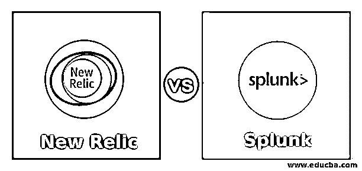
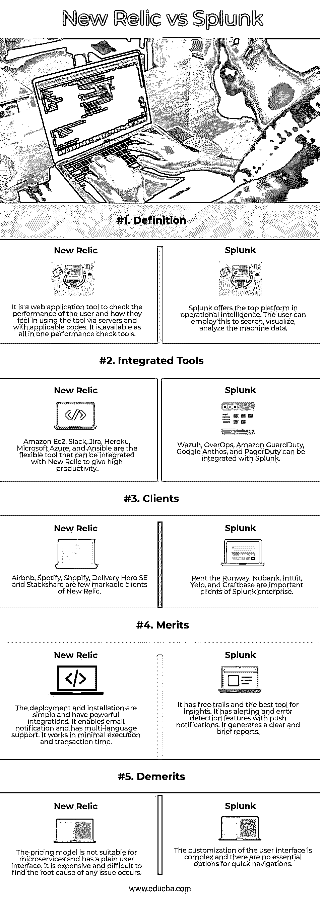

# 新遗迹 vs Splunk

> 原文：<https://www.educba.com/new-relic-vs-splunk/>

## New Relic 与 Splunk 的区别

以下文章提供了 New Relic vs Splunk 的概述。Splunk 和 New Relic 为企业提供了定制要在应用程序中执行的事件的愿景。New Relic 是一个监控工具，用于跟踪基于移动设备、web 浏览器和桌面应用程序的特征视图。而 Splunk 基于事件管理并处理数据，为企业提供警报和事件日志。它还为数据提供了高安全性。但是大多数公司都同时使用 Splunk 和 New relic，因为它们之间已经建立了集成。新的 relic 可以从应用程序中提取数据，并提供 Splunk 来创建报告、日志和警报。

### New Relic 与 Splunk 的直接对比(信息图)

以下是 New Relic 与 Splunk 之间的 5 大区别:

<small>Hadoop、数据科学、统计学&其他</small>

### New Relic 与 Splunk 的主要区别

New Relic 与 Splunk 之间的主要区别在于它们的功能、局限性、优点和定价。

*   **显著特性:**New Relic 和 Splunk 在视图和数据应用上或多或少都有相似的特性。New Relic 提供了有关应用程序中用户特征的简要信息，使企业能够查看应用程序的性能，检查它们是否有任何缺点，并完全专注于应用程序监控。除了一般的分析功能之外，它还提供了一些分析功能，包括与许多工具和详细数据的高级和强大的集成。尽管它有更多的优点，但也有一些限制，如复杂的界面和艰难的曲线。Splunk 为企业生成事件日志和警报，因为用户可以与应用程序或网站交互，并确保他们响应所有不同的日志和流程。它可以用适合用户的过滤方法管理所有类型的数据。用户可以根据自己的喜好定制日志和数据。它为客户端提供了通过日志解析来了解事件及其请求的工具。
*   **套餐价格:**新圣物可以用基本费用套餐购买，每月收费 12.50 美元，可以保留几天。高级套餐每月花费大约 25 美元，并且可以持续三个月。Splunk 为单个用户提供免费试用，但许多企业需要适用于无限用户的完整 Splunk 包，并且要访问高级登录功能，每年的费用为 1800 美元。
*   **整合:**新舍利让用户钻；它们是应用程序的本质，并根据偏好削减要求。但是当他们想通过请求的生命周期来查询应用程序的性能时。它提供了与其他技术和服务的大量集成，并使其易于部署和使用。然后 New Relic 提供了很多可视化的类型和视图，让用户详细的认识到背后运行的是什么东西和流程。Splunk 实现了控制权分离，少数人无权访问少数人。因为所有的访问都可以被完美地安排，一些用户可以诊断问题，一些用户可以解决问题。应该访问公共位置，并且可以检查所有日志的位置不是存储在同一个位置。所以应该做相应的配置。Splunk 可以从不同的位置接收日志，而无需更改任何代码来将日志定位到正确的位置。
*   **利弊:**两者都是以操作系统为中心，以云为中心对指标查询没有其他限制，如果有安装代理的话。警报和仪表板上的 insight 相关查询仅限于数千条，现在尚未达到 2000 条记录，这在企业规模上是不可行的。NRQL 是辉煌的，没有例外，QL 替换更快，对初学者来说很难学习。平台中没有其他的代理管理工具，要经过多次部署才能安装。在 Splunk 中，虽然有一个搜索选项，但必须阅读许多文档才能找到合适的答案，有时用户无法找到正确的答案。Splunk 中的帮助选项应该得到改进，以便在仪表板和面板中直观、自然地提供内置报告。仪表板是直的，不能根据用户偏好定制，但它提供了一个更高级的工具来改变图形和文本中有吸引力的颜色和字体。

### New Relic 与 Splunk 对比表

让我们讨论一下 New Relic 与 Splunk 之间的主要比较:

| **属性** | **新遗迹** | **Splunk** |
| **定义** | 这是一个 web 应用程序工具，用于检查用户的表现以及他们通过服务器和适用代码使用该工具的感受。它是一种功能齐全的性能检查工具。 | Splunk offers the top platform in operational intelligence. The user can employ this to search, visualize, analyze the machine data. |
| **集成工具** | 亚马逊 Ec2、Slack、吉拉、Heroku、微软 Azure 和 Ansible 是灵活的工具，可以与 New Relic 集成，以提高生产率。 | Wazuh、OverOps、Amazon GuardDuty、Google Anthos 和 PagerDuty 可以与 Splunk 集成。 |
| **客户端** | Airbnb、Spotify、Shopify、Delivery Hero SE 和 Stackshare 是 New Relic 的几个显著客户。 | 租跑道、Nubank、Intuit、Yelp、Craftbase 都是 Splunk enterprise 的重要客户。 |
| **优点** | 部署和安装非常简单，并且具有强大的集成功能。它支持电子邮件通知，并支持多语言。它以最少的执行和事务时间工作。 | 它有免费的路径和最好的洞察工具。它必须通过推送通知来提供警报和错误检测功能。它生成一个清晰而简短的报告。 |
| **记过** | 该定价模型不适合微服务，并且具有简单的用户界面。找到发生的任何问题的根本原因既昂贵又困难。 | 用户界面的定制很复杂，而且没有快速导航的基本选项。 |

### 结论

据该企业称，New Relic 是一个灵活的工具，而 Splunk 最适合解析应用程序和 IT 数据。因此，New Relic 和 Splunk 应该集成在一起才能有效地应用。

### 推荐文章

这是一个新的遗物与 Splunk 的指南。在这里，我们通过信息图和比较表来讨论 New Relic 与 Splunk 的主要区别。您也可以看看以下文章，了解更多信息–

1.  [相扑逻辑 vs Splunk](https://www.educba.com/sumo-logic-vs-splunk/)
2.  [Splunk vs 弹性搜索](https://www.educba.com/splunk-vs-elastic-search/)
3.  [Graylog vs Splunk](https://www.educba.com/graylog-vs-splunk/)
4.  [Hadoop vs Splunk](https://www.educba.com/hadoop-vs-splunk/)

