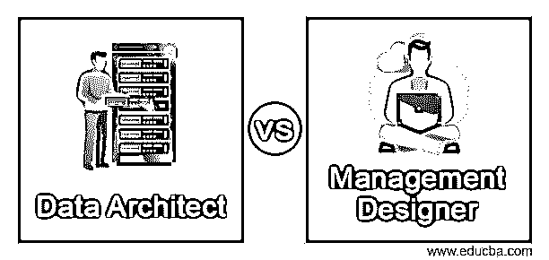

# 数据架构师和管理设计师

> 原文：<https://www.educba.com/data-architect-and-management-designer/>

## 数据架构师和管理设计师简介

通过管理设计和将组织的需求部署到数据库中来遵循数据架构的工程师被称为数据架构师。他们与数据管理系统一起工作，在数据管理系统中，他们总是有一个计划来维护所有需求的数据库，以便可以从正确的位置收集信息。项目管理和供应链技术在组织中任何创造性过程的设计中的应用领域被称为管理设计，从事这项工作的人被称为管理设计师。该过程是协作性的，设计是由所有团队成员的输入创建的。

### 数据架构师和管理设计师的面对面比较(信息图表)

以下是数据架构师和管理设计师之间的 5 大区别:

<small>Hadoop、数据科学、统计学&其他</small>

### 数据架构师和管理设计师之间的区别

数据架构师与不同领域的不同人员一起工作，例如数据工程师、数据科学家、数据矿工和数据分析师，因此他们的工作主要是数据存储、数据可视化、数据安全和系统访问。数据架构师的角色不是纯技术性的，也不完全融入软件。因此，他们充当公司管理层和 IT 部门之间的中介。管理设计师与数据架构师和公司管理层合作，以便架构师的数据输入应该与公司的管理结构保持一致，其中数据应该从某些来源收集，数据应该基于药物或结构或完全依赖于管理层的任何内容。

### 数据架构师和管理设计师的主要区别

*   数据架构师与数据科学家密切合作，在数据科学家那里，数据分析更加活跃。支持框架是由数据工程师创建的，他们不支持任何其他团队，而是为自己工作。数据架构师需要了解数据库管理系统、他们的工作方式以及他们应该向哪些人提供访问权限。管理设计师更多地与公司管理层合作，以便更好地理解公司在职能和战略层面的政策。该职位包括项目设计和对公司未来的战略思考。
*   数据架构是由数据架构师来完成的，他给出了相同的想法，提供了构建数据架构的概念和各种想法，并向涉众展示了数据架构，以便让所有人都知道数据架构的重要性。最初，很难将结构设计与管理联系起来，但随着角色基于管理而演变，它很容易与整个组织联系起来，该职位不仅进行管理设计，还将公司与更具创新思维的外部市场联系起来。
*   管理设计人员根据组织的需求向数据架构师提供输入，以便他们从所需的平台收集数据，并将这些数据提供给数据工程师。管理设计者的输入来自组织，他们从组织中得出设计并教育员工组织的目标。这种设计被作为品牌名称和公司产品与市场上其他公司的区别。管理设计人员将数据架构设计与公司策略和功能需求联系起来。
*   数据架构师应该具备数据建模、仓库、数据算法、数据库架构和数据可视化方面的知识。管理设计师应该精通管理技能和数据库设计。这种设计应该与将由数据架构师负责的数据库架构相联系。团队合作在管理设计中非常重要，合作形式的工作有助于更好的管理设计。

### 数据架构管理设计器对照表

| **数据架构师** | **管理设计师** |
| 数据架构师参与数据提取、数据转换和数据加载的过程。他们不需要知道任何编程语言，管理技能少一点也没关系。 | 管理设计器直接从管理层收集数据，并基于这些数据创建数据库。这有助于他们与数据架构师保持联系，因为两个人的协作有助于从相关来源收集数据。管理技能在这里是最重要的。 |
| Data architects should be strong in database skills as they will decide the access roles to the database whether a user should be allowed to read and write in a database or not. Data modelling is also important for a data architect as the framework is based on their design. | 设计管理结构包括从组织以前的努力和他们的故事中收集数据，不管它是否成功。应该收集所有过去的数据，设计应该基于组织计划如何发展业务。 |
| 对于数据架构师来说，拥有机器学习技能是件好事，但对于他们来说，能否保住工作并不重要。他们不需要知道用于将数据转换成另一种格式的算法。 | 管理设计人员应该了解数据库的工作方式，以及一个组织需要多少个数据库来存放所有数据。削减成本从数据库级别开始，因此管理设计人员应该能够在管理和数据架构师之间取得平衡。 |
| 尽管数据库是由数据库管理员设计的，但数据库是由数据架构师管理的，因此了解数据库体系结构和所执行的所有数据仓库活动对他们来说非常重要 | 用户方面是设计中要考虑的另一个层面。在设计架构时，应该始终考虑用户以及管理和数据架构师。设计不应该跟随竞争对手的策略，因为用户应该体验产品级设计的变化。 |
| 数据架构师应该关注数据库或容器的系统开发和存储空间。他们的主要目标应该是通过管理几个数据点来扩大数据框架。此外，他们应该与数据工程师和管理设计师合作。 | 管理人员接受过这个角色的培训，他们是从数据架构师和设计经理中挑选出来的。他们应该对公司有更深的了解，并对数据库的架构结构有很好的了解。 |

### 结论

在小公司里，有一个管理设计师作为一个特定的角色并不总是重要的，因为这个角色将由管理层自己负责。但当有一个特定的人将管理目标与数据收集联系起来时，它在公司的整体架构中有所帮助，并能很好地管理团队。

### 推荐文章

这是数据架构师和管理设计师的指南。在这里，我们分别讨论数据架构师和管理设计人员与信息图和比较表的主要区别。您也可以看看以下文章，了解更多信息–

1.  [数据可视化与商业智能](https://www.educba.com/data-visualization-vs-business-intelligence/)
2.  [数据 vs 元数据](https://www.educba.com/data-vs-metadata/)
3.  [数据 vs 信息](https://www.educba.com/data-vs-information/)
4.  [TeraData vs 甲骨文](https://www.educba.com/teradata-vs-oracle/)

