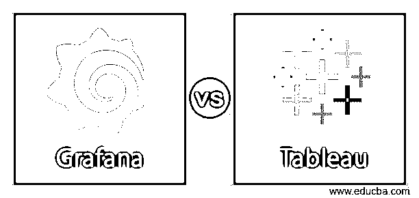
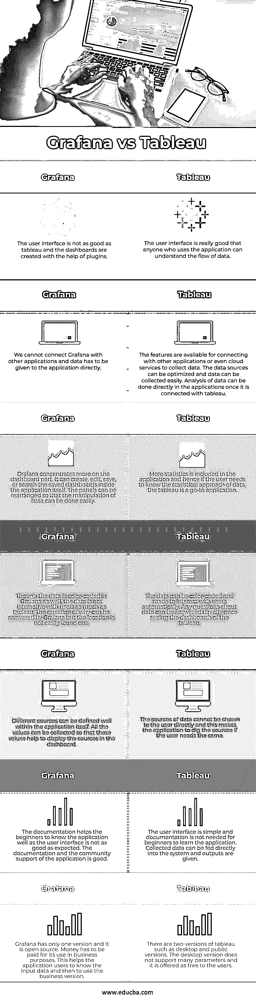

# Grafana vs 黑板

> 原文：<https://www.educba.com/grafana-vs-tableau/>

## Grafana 和 Tableau 的区别

Grafana 用于指标分析，与存储区域无关。执行查询是为了可视化存储过程和操作指标。仪表板是在团队内部创建和共享的，以便整个团队了解数据并进行分析。将数据可视化并在图表中提出特定模式以便进行不同分析来理解数据的开源软件称为 Tableau。视觉表示是交互式的，这使得用户可以改变它们并将其用于各种目的。原始数据很容易转换成表格并使用。在这个主题中，我们将学习 Grafana vs Tableau。

### Grafana 与 Tableau 的直接对比(信息图)

以下是 Grafana 和 Tableau 之间的主要区别

<small>Hadoop、数据科学、统计学&其他</small>

### Grafana 与 Tableau 的主要区别

以下是 Grafana 与 Tableau 的主要区别:

*   Grafana 是一个数据可视化系统，其中集成了不同的数据存储，以便可以形成有时间限制的数据的适当度量。这有助于监控数据，并使用它来分析业务中使用的过去和当前数据。Tableau 被称为商业智能工具，可以帮助创建仪表板并在那里保存数据，以便用户可以以任何形式可视化数据的存在。
*   当数据以 excel 格式存储时，Tableau 易于使用。Tableau 将输入的数据作为 excel，并给出图形的可视化。但是在格拉夫纳。图表是在任何来源的日志或指标的帮助下形成的。
*   在 Grafana 中，借助指标和形成的图表，可以很容易地创建警报。如果有任何不可预见的事件或变化，这些警报帮助用户了解数据。这有助于纠正它和预测它的缺陷。但是在 tableau 中，警报是不可用的，用户需要检查用户界面才能知道数据的流向。
*   Grafana 帮助数据输出形成有组织的数据，以便用户可以容易地理解数据。这有助于数据用于特定的需求或团队之间的交流。在 tableau 中，输入本身是 excel 格式的，因此不需要数据组织。
*   使用 Grafana 可以很容易地创建查询，这有助于用户识别系统中的数据流并组织它们。仪表板有助于创建图表，以便数据可以很容易地可视化。但是，不能在 tableau 中创建查询，如果必须在应用程序中使用查询，则需要外部源。
*   Grafana 中的插件库可以帮助用户可视化数据，并在需要时进行修改。这种创造性有助于用户根据自己的需求定制图表，并在团队中共享。此外，tableau 具有用于仪表板的扩展，因此它可以与其他应用程序进行交互和数据收集。
*   在 tableau 中，可以根据地区或任何需要的类别来组织数据。这有助于了解一个特定的部门，并根据该地区做出决策。这在 Grafana 中是不可能的，因为数据是分散的，无法分类。信息必须直接从图表中收集。
*   与 tableau 相比，Grafana 的价格较低。虽然两者都提供免费版本，但 Grafana 的商业价格是每月 100 美元，tableau 是每月 120 美元。

### Grafana 与 Tableau 对比表

为了便于理解，让我们通过一个比较表来看看 Grafana 和 Tableau 之间的更多差异:

| **格拉法纳** | 表 |
| 用户界面不如 tableau，仪表盘是借助插件创建的。 | 用户界面非常好，任何使用该应用程序的人都能理解数据流。 |
| 我们无法将 Grafana 与其他应用程序连接，数据必须直接提供给应用程序。 | 这些功能可用于连接其他应用程序甚至云服务来收集数据。可以优化数据源，并且可以容易地收集数据。一旦与 tableau 连接，就可以直接在应用程序中进行数据分析。 |
| Grafana 更专注于仪表板部分。它可以在应用程序内部创建、编辑、保存或搜索已保存的仪表板。面板可以重新排列，以便可以轻松操作数据。 | 应用程序中包含了更多的统计数据，因此如果用户需要了解数据的统计方法，tableau 是一个必不可少的应用程序。 |
| 虽然 Grafana 中的数据也是彩色编码的，但数据与用户的交互性不如 tableau。为什么的问题格拉夫纳可以回答，但是地点不容易查出来。 | 这些数据可以用颜色编码，并与用户自动互动。任何关于数据的问题都可以在看到 tableau 的仪表盘后直接回答。 |
| 可以在应用程序本身中很好地定义不同的源。可以收集所有的值，以便这些值有助于在仪表板中显示源代码。 | 数据源不能直接显示给用户，这使得应用程序在用户需要时挖掘数据源。 |
| 文档帮助初学者很好地了解应用程序，因为用户界面不如预期的好。该应用程序的文档和社区支持都很好。 | 用户界面简单，初学者学习应用程序不需要文档。收集的数据可以直接输入系统，并给出输出。 |
| Grafana 只有一个版本，而且是开源的。金钱在商业用途上的使用必须付费。这有助于应用程序用户了解输入数据，然后使用业务版本。 | tableau 有两个版本，如桌面版和公共版。桌面版本不支持很多参数，并且免费提供给用户。 |

### 结论

当 tableau 与其他应用程序连接并收集数据时，它可以与 Grafana 连接以获取数据并开始工作。这有助于用户从这两个应用程序中受益，并在系统中自由处理任何可用数据。

### 推荐文章

这是一个指南 Grafana vs Tableau。在这里，我们讨论 Grafana 和 Tableau 的差异，用信息图和比较表进行面对面的比较。您也可以看看以下文章，了解更多信息–

1.  [石墨 vs 格拉法纳](https://www.educba.com/graphite-vs-grafana/)
2.  [格拉法纳 vs 基巴纳](https://www.educba.com/grafana-vs-kibana/)
3.  [表格 vs Domo](https://www.educba.com/tableau-vs-domo/)
4.  [格雷洛与基巴纳](https://www.educba.com/graylog-vs-kibana/)

