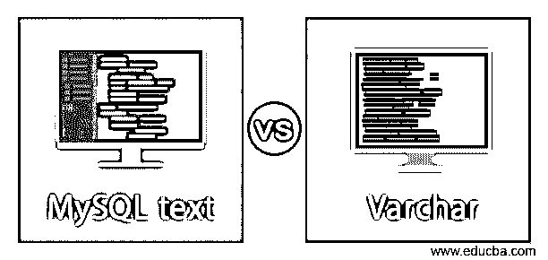
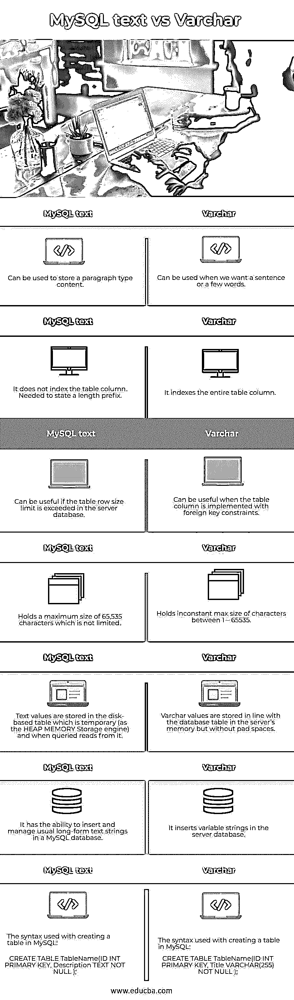
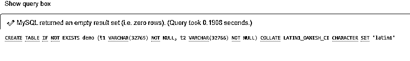
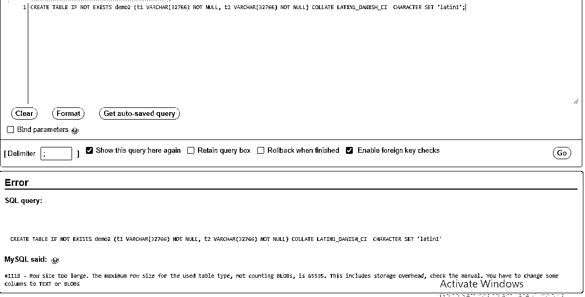

# MySQL 文本 vs Varchar

> 原文：<https://www.educba.com/mysql-text-vs-varchar/>

## MySQL 文本和 Varchar 的区别

MySQL Varchar 定义了一个可变长度的数据类型 string，它将一个值存储为 1 字节或 2 字节加实际数据的长度前缀。除了 Varchar 和 char 数据类型之外，MySQL 服务器还支持 TEXT 数据类型，包括前两者不包含的其他特性。在这个主题中，我们将学习 MySQL 文本和 varchar。

MySQL Text 是 MySQL 中的一种数据类型，负责在数据库表中存储文本数据值。文本类型有利于存储长度从 1 字节到 4 GB 的长格式文本字符串。与 Varchar 不同，我们不需要使用文本类型为表列指定长度存储。长度前缀表示值中存在的字节数。假设，如果一个表列需要少于 255 个字节，那么使用一个 1 字节长的前缀。此外，当列需要超过 255 个字节时，使用 2 字节长度的前缀。但是所有列的总长度最大为 65，535。

<small>Hadoop、数据科学、统计学&其他</small>

### MySQL 文本与 varchar 的面对面比较(信息图表)

以下是 MySQL 文本和 varchar 之间的主要区别

### MySQL 文本与 varchar 的主要区别

以下是 MySQL 文本与 varchar 的主要区别:

#### 1.可变长字符串

VARCHAR 遵循标准 ASCII 字符。这种数据类型使用动态内存分配。对于 Varchar，表行大小的最大长度不得超过 65，535 个字符。这意味着数据库表中可用的列的总长度应该小于最大长度。假设，让我们用下面的例子来说明上述情况:

我们正在创建一个包含两列 t1 和 t2 的表，其长度为 32765 和 32766，即长度前缀+2。在这里，您可以将行大小评估为 32765+2+32766+2=65535，这是最大大小。该查询是:

`CREATE TABLE IF NOT EXISTS demo (t1 VARCHAR(32765) NOT NULL, t2 VARCHAR(32766) NOT NULL) COLLATE LATIN1_DANISH_CI  CHARACTER SET 'latin1';`

**输出:**

上面的查询将创建名为 demo 的表。但是，当我们为另一个表 demo2 将列 t1 的长度大小增加 1 时，查询将按如下方式执行:

`CREATE TABLE IF NOT EXISTS demo2 (t1 VARCHAR(32766) NOT NULL, t2 VARCHAR(32766) NOT NULL) COLLATE LATIN1_DANISH_CI  CHARACTER SET 'latin1';`

**输出:**

服务器将生成错误消息，因为我们已经将列大小增加了 1，因此总的行大小变成了 65536，这太大了。因此，查询语句变成 fail。

在存储 VARCHAR 类型值时，MySQL 服务器不会删除空格。但是，在插入或选择 Varchar 值的过程中，服务器将保留尾随空格。

#### 2.文本

另一方面，文本类型值没有保存在服务器的数据库内存中。因此，每当用户查询文本数据时，MySQL 服务器必须从磁盘上查看它。与 varchar 相比，这是一个非常慢的过程。

MySQL 支持四种类型的文本数据:Text、TinyText、MediumText 和 LongText。

让我们使用字符集(1 字节存储一个字符)来查看所有四种文本类型的大小:

#### 3\. TINYTEXT

这种文本类型最多可以存储 255 个字符(255 个字节)。如果表格列需要少于 255 个字符，包含不一致的长度，并且不需要像文章或博客文章的摘要那样进行排序。为了说明这一点，让我们看看下面的例子:

`CREATE TABLE Books (BookID INT AUTO_INCREMENT PRIMARY KEY, BookName VARCHAR (255), Summary TINYTEXT);`

#### 4.文本

这种文本类型最多包含 65，535 个字符(64KB)，需要 2 字节的开销。此外，文本类型能够包含文章的正文。例如:

`CREATE TABLE Books (BookID INT AUTO_INCREMENT PRIMARY KEY, BookName VARCHAR (255), Body TEXT NOT NULL);`

#### 5.中文字

这种类型的文本最多可以存储 16，777，215 个字符(16MB)。对于文本数据，它需要 3 字节的开销。这种文本类型有利于存储相当大的数据，例如白皮书、书籍等的文本。

`CREATE TABLE Books (BookID INT AUTO_INCREMENT PRIMARY KEY, BookName VARCHAR (255), Body MEDIUMTEXT NOT NULL);`

#### 6 .长文本

这种文本类型可以容纳 4，294，967，295 个字符(4 GB)，这是一个很大的数量，需要 4 字节的开销。查看下面的示例:

`CREATE TABLE Books (BookID INT AUTO_INCREMENT PRIMARY KEY, BookName VARCHAR (255), Body LONGTEXT NOT NULL, Price INT NOT NULL);`

因此，TEXT 类型支持 family 列类型，该类型旨在成为高容量字符存储数据类型。名为 TINYTEXT 的最小文本类型绑定了与 VARCHAR 相同的字符长度。文本类型保存除排序规则和二进制字符集之外的字符串。因此，在这个字符集的基础上，进行排序和比较。如果在插入表列时超出了从文本值中截断尾随空格的范围，那么不管 SQL 模式如何，MySQL 通常都会产生一个警告。这是因为文本表列不包含任何默认值。

**用于演示:**

`CREATE TABLE Books (BookID INT AUTO_INCREMENT PRIMARY KEY, BookName VARCHAR (255), Body TEXT NOT NULL, Price INT NOT NULL);
Describe Books;`

**输出:**

### MySQL 文本与 varchar 的比较表

下面是 MySQL 中 TEXT 和 VARCHAR 数据类型的比较表:

| **正文** | **VARCHAR** |
| 它可以用来存储段落类型的内容。 | 当我们想要一个句子或几个单词时，可以使用它。 |
| 它不索引表列。我需要声明一个长度前缀。 | 它索引整个表列。 |
| 如果服务器数据库中的表行大小超出了限制，这将非常有用。 | 当使用外键约束实现表列时，它会很有用。 |
| 它的最大容量为 65，535 个字符，没有限制。 | 保存 1-65535 之间的不恒定最大字符大小。 |
| 文本值存储在基于磁盘的表中，该表是临时的(作为堆内存存储引擎)，当被查询时，从该表中读取。 | Varchar 值存储在服务器内存中的数据库表中，但没有填充空间。 |
| 它能够在 MySQL 数据库中插入和管理常见的长格式文本字符串。 | 它在服务器数据库中插入变量字符串。 |
| The syntax used with creating a table in MySQL:创建表 TableName(ID INT 主键，描述文本不为空)； | The syntax used with creating a table in MySQL:CREATE TABLE TableName(ID INT 主键，Title VARCHAR(255)非空)； |

### 结论

MySQL 中的 VARCHAR 数据类型通常可以应用于包含标题、名称、个人资料、产品名称、公司名称等值的数据。，它在表列中保存简短的内容。

通常，MySQL 中的数据类型 TEXT 用于存储生产描述中的文章内容体，使用电子商务产品的网站中的新闻站点。

### 推荐文章

这是 MySQL 文本 vs varchar 的指南。在这里，我们用信息图和比较表来讨论 MySQL text 和 varchar 的主要区别。您也可以看看以下文章，了解更多信息–

1.  [Wrike vs Asana](https://www.educba.com/wrike-vs-asana/)
2.  [Rollup vs Webpack](https://www.educba.com/rollup-vs-webpack/)
3.  [DSL vs 电缆](https://www.educba.com/dsl-vs-cable/)
4.  [PIC vs Arduino](https://www.educba.com/pic-vs-arduino/)

