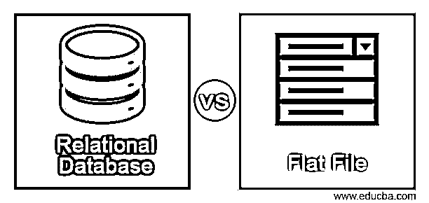
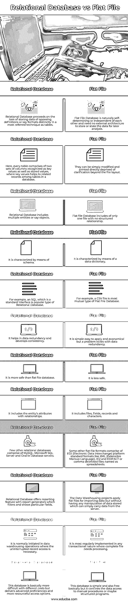

# 关系数据库与平面文件

> 原文：<https://www.educba.com/relational-database-vs-flat-file/>

## 关系数据库与平面文件的区别

以下文章提供了关系数据库与平面文件的概要。首先，让我们简单地了解一下什么是数据库。我们可以将数据库定义为以结构化方式存储在系统中的数据记录的集合，使信息的可访问性更容易。类似地，关系数据库是一种数据库形式，它应用某些配置来允许识别和访问与数据库中的另一条数据相关的数据记录。通常，关系数据库记录被组织成由行和列组成的表。另一种类型的数据库是平面文件，也称为文本数据库，它以纯文本格式存储数据记录。在 20 世纪 70 年代早期，这种平面文件数据库被工业化并由 IBM 执行。

### 关系数据库与平面文件的直接比较(信息图表)

以下是关系数据库与平面文件之间的 12 大区别:

<small>Hadoop、数据科学、统计学&其他</small>

### 关系数据库与平面文件的主要区别

让我们讨论一下关系数据库与平面文件之间的一些主要区别:

*   数据库是组织成结构化表格的文件组，这些表格系统地提供了访问、管理和更新数据记录的便利。
*   为任何项目定义要部署的特定类型的数据库需要结合偏好和访问需求。因此，数据库知识是必须的，有其各自的利弊。关系型和平面文件型数据库是两种常见的数据库类型。
*   关系数据库可以说是基于 E.F. Codd 在 1970 年提出的数据关系模型的数字数据库。
*   关系数据库管理系统，即 RDBMS，是被实现来维护关系数据库的软件系统。
*   RDBMS 将信息存储在表格中，表格可以变得很大，包含行和列。RDBMS 应用 SQL(结构化查询语言)来处理这些大表中的数据记录，借助于数据库中表之间建立的关系结构。这提供了关系操作符来控制表格形式的数据记录。
*   平面文件数据库通常包含文本文件，其中包括所有的文字处理，没有结构标记。这里，平面文件构造了一个每行只有一条记录的表。
*   与关系数据库不同，平面文件不包含数据库中的几个表。平面文件数据库中的数据信息没有相关的文件夹或路径。执行这些表是为了保存数据库中要表征的对象的统计信息。
*   平面文件数据库增加了数据冗余，这有助于它的缺点，而关系数据库编程非常耗时，并且设置可能很困难。
*   数据仓库项目实现了用于导入数据记录的平面文件。这里，我们不能对存储的数据执行任何操作。
*   关系数据库提供了创建用户自己的报告模块的能力，这些模块在报告生成器的帮助下是健壮的。
*   因为关系数据库有一个标准的结构，但它们通常需要一个称为解释器的工具来编辑和查看数据。这种解释工具可以作为数据库的一部分，也可以作为一种补充的连接产品，在本质上可能是专有的。
*   程序员在构建应用程序时应用平面文件，因为它们的简单结构比结构化文件占用的空间少。
*   Linux、Macintosh 和 Windows 操作系统在一系列平面文件数据库上执行。但是，随着数据重复量的增加，处理大量无效的更新、编辑和维护数据记录可能是一个很大的挑战。
*   关系数据库提供了一些优势，如数据完整性、简单性、可伸缩性、数据准确性、安全性和协作性。
*   大多数 RDBMS 应用编程语言 SQL 按照数据库的 ACID 属性访问数据库。这些酸性包括原子性、一致性、隔离性以及持久性。

### 关系数据库与平面文件对照表

让我们讨论一下关系数据库与平面文件之间的主要比较:

| **关系数据库** | **平面文件** |
| 关系数据库以表的形式存储不同定义或格式的数据。 | 平面文件数据库自然是自我决定或相互独立的，不需要外部架构来存储或陈述数据以供以后分析。 |
| 这里，每个表都包含两组列，它们被识别为键值和存储值，其中键值有助于数据库中表之间的相关记录。 | 它们可以被简单地修改和直接打印，除了文件布局之外不需要澄清。 |
| 关系数据库包括多个实体，或者说，对象。 | 平面文件数据库只包含一个没有结构化关系的文件。 |
| 它以图式为特征。 | 它通过数据字典来表征。 |
| 例如，作为标准接口的 SQL 是一种流行的关系数据库类型。 | 例如，CSV 文件是最常见的平面文件数据库类型。 |
| 它有助于数据冗余和发展一致性。 | 它简单、易于应用并且经济，但是存在数据冗余的问题。 |
| 它比平面文件数据库更安全。 | 它不太安全。 |
| 它包括实体的属性和关系。 | 它包括文件、字段、记录和字符。 |
| 很少有其他关系数据库由 MySQL、Microsoft SQL Server 和 Oracle 数据库服务器组成。 | 其他一些平面文件格式由 EDI(电子数据交换)平台标准格式组成，如 XML(可扩展标记语言)、X12 和 EDIFACT 或逗号分隔的电子表格文件。 |
| 关系数据库提供带有报告生成器的报告功能，报告生成器过滤并显示特定的字段。 | 数据仓库项目应用平面文件来导入数据，但是不需要对存储的数据进行任何操作，它可以简单地从服务器传送数据。 |
| 它通常在需要不间断记录访问的数据仓库操作中启动。 | 在任何需要处理完整文件的事务中，这是最常见的实现方式。 |
| 这个数据库基本上是更困难的不同成本，但提供了先进的专业知识和更足智多谋的访问选项。 | 这个数据库很简单，基本上也是免费的，但是它将数据访问限制在手动程序或者结构化程序中。 |

### 结论

关系数据库可以说是数据元素的集合，这些数据元素之间存在预定义的关系，其中这些元素被结构化为一组具有行和列的表。平面文件可以说是一种存储表数据的简单方法，在现有的表或实体之间没有关系。关系数据库比平面文件数据库更加灵活，尽管它很难设计和保留。

### 推荐文章

这是关系数据库与平面文件的指南。这里我们讨论信息图和比较表的主要区别。您也可以看看以下文章，了解更多信息–

1.  [大数据 vs 数据仓库](https://www.educba.com/big-data-vs-data-warehouse/)
2.  [数据仓库与数据挖掘](https://www.educba.com/data-warehousing-vs-data-mining/)
3.  [Hadoop vs RDBMS](https://www.educba.com/hadoop-vs-rdbms/)
4.  [MariaDB vs MongoDB](https://www.educba.com/mariadb-vs-mongodb/)

