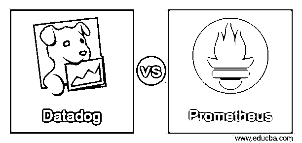
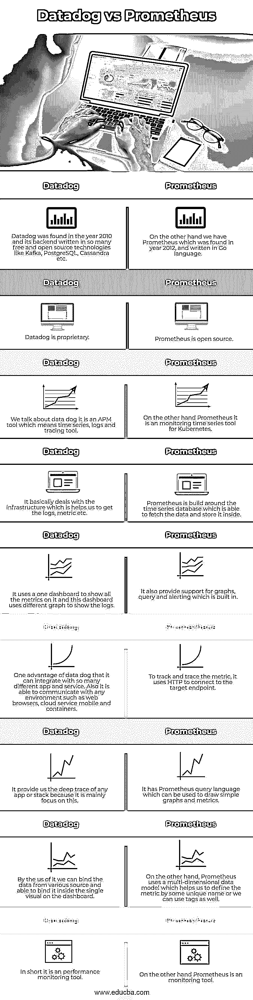
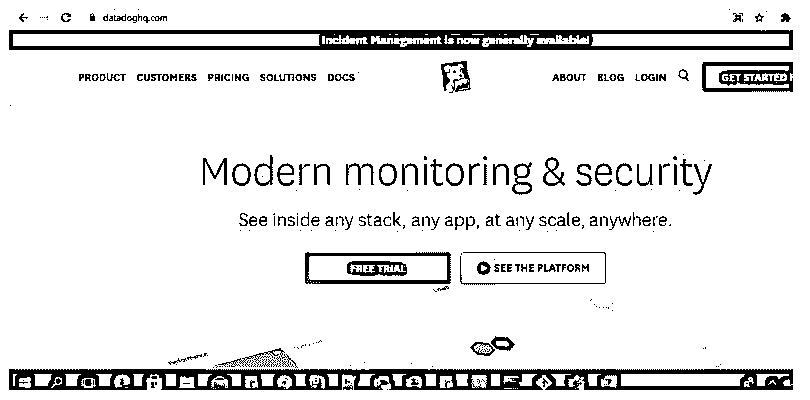

# 数据狗大战普罗米修斯

> 原文：<https://www.educba.com/datadog-vs-prometheus/>

## 数据狗和普罗米修斯的区别

下面的文章提供了数据狗 vs 普罗米修斯的概要。Datadog 和 Prometheus 用于监控服务器；两者都提供相同的目的。首先，我们将看到 Datadog，如果我们想要监控我们的云规模应用程序，那么我们应该选择 Datadog，因为它可以帮助我们监控我们的服务器、数据库、服务和工具。它使用基于 SAAS 的数据分析程序，最初是在 2010 年发现的。

Datadog 是用 GO 语言写的；以前，它是在 Python 中，它的后端是建立在我们将转换的许多技术之上的。另一方面，我们有 Prometheus，基本上用于交替和监控它是一个自由软件应用程序；它还为我们提供了通过使用 HTTP 拉模型来捕获实时指标的工具。这个项目也是用 GO 写的，成立于公元 2012 年；普罗米修斯由多个工具组成，帮助我们监控。

<small>Hadoop、数据科学、统计学&其他</small>

### Datadog 与 Prometheus 的正面比较(信息图)

以下是 Datadog 和 Prometheus 之间的 9 大区别:

### 数据狗和普罗米修斯的主要区别

让我们讨论一下 Datadog 和 Prometheus 之间的一些主要区别:

正如我们已经知道的，两者都被用作监控工具，但这里有一点需要注意，Datadog 是一个性能监控工具，它关注并提供有关基础架构的所有细节；另一方面，普罗米修斯被用作监控工具。

在这里，我们将看到它们之间的一些关键差异，这些差异使它们独一无二。

**1。定价:** Datadog 免费；它有一些统计数据，并监控每台服务器的具体客户数量。对于一台服务器，它提供 200 个自定义指标，由 datadog 监控。

举一个简单场景的例子:

假设我们有一个应用程序运行 5 个不同服务器中的一个；然后，对于 1000 个自定义指标，数据日志是免费的，但在此之后，我们必须支付一些变化，100 个自定义指标收费 5.00 美元。另一方面，我们有普罗米修斯，它是自由的；这一切我们能做的都是免费的，但是在普罗米修斯官网上的这个检查总成本可能会很高；他们已经给出了所有的价格。

它使用了一些我们可以说的组件或工具，列举如下:

*   PromQl: Prometheus 允许我们拥有查询语言，用户可以用它来聚集他们的数据并查看。它基本上代表普罗米修斯查询语言。
*   **数据收集:**这是一个按时间序列收集数据的数据收集，存储在数据库中。
*   **数据存储格式:**现在我们有了存储格式普罗米修斯以公制的形式存储数据。

**2。用法:**如果我们谈论两者，我们根据需求有多个案例使用它们。

**对于数据狗:**

*   如果您想监控您的基础设施日志，那么请使用 Datadog。
*   如果您需要事件提醒。
*   如果您希望或需要通过仪表板本身与团队交流。
*   如果您想从不同的来源收集数据并呈现单一的视觉效果。

**对于普罗米修斯:**

*   如果您想要所有不同数据源的警报。
*   如果您想将标签用于数据度量。
*   想要时序监控，那就去找普罗米修斯。

**3。找到:**下面的参考，我们有两个链接，在那里我们可以得到所有必要的信息。

对于 Datadog，请访问以下链接:

**网址:**【https://www.datadoghq.com/ T2】

**输出:**

对于普罗米修斯，下面继续:

**URL:**[https://Prometheus . io/](https://prometheus.io/)

**输出:**

### 数据狗与普罗米修斯对比表

让我们讨论一下 Datadog 与 Prometheus 之间的 9 大对比:

| **Datadog** | **普罗米修斯** |
| Datadog 成立于 2010 年，它的后端是用许多免费和开源技术编写的，如 Kafka、PostgreSQL、Cassandra 等。 | 另一方面，我们有普罗米修斯，它是在 2012 年发现的，是用 Go 语言写的。 |
| Datadog 是专有的。 | 普罗米修斯是开源的。 |
| 我们谈论数据狗；这是一个 APM 工具，即时间序列、日志和跟踪工具。 | 另一方面，Prometheus it 是 Kubernetes 的一个时间序列监测工具。 |
| 它主要处理基础设施，帮助我们获取日志、指标等。 | Prometheus 是围绕时间序列数据库构建的，它能够获取数据并将其存储在内部。 |
| 它使用一个控制面板来显示所有指标，这个控制面板使用不同的图表来显示日志。 | 它还支持内置的图形、查询和警报。 |
| 数据狗的一个优势是它可以集成许多不同的应用程序和服务。此外，它能够与任何环境通信，如 web 浏览器、云服务移动和容器。 | 为了跟踪和追踪指标，它使用 HTTP 连接到目标端点。 |
| 它为我们提供了任何应用程序或堆栈的深度跟踪，因为它主要关注于此。 | 它有 Prometheus 查询语言，可以用来画简单的图形和度量。 |
| 通过使用它，我们可以绑定来自各种来源的数据，并能够在仪表板上的单一视觉范围内绑定数据。 | 另一方面，Prometheus 使用多维数据模型，这有助于我们通过一些独特的名称来定义指标，或者我们也可以使用标记。 |
| 简而言之，它是一个性能监控工具。 | 另一方面，普罗米修斯是一个监控工具。 |

### 结论

从以上几点，我们已经知道，两者都是监控工具，但用于不同的目的。它们易于使用和处理；这样，我们可以有事件监控和警报、时间序列日志和指标等。我们可以确定我们的需求，然后选择其中最适合的两个。

### 推荐文章

这是一个数据狗 vs 普罗米修斯的指南。这里我们分别讨论信息图和比较表的主要区别。您也可以看看以下文章，了解更多信息–

1.  [数据狗 vs 新遗迹](https://www.educba.com/datadog-vs-new-relic/)
2.  [Datadog vs Splunk](https://www.educba.com/datadog-vs-splunk/)
3.  [普罗米修斯 vs Influxdb](https://www.educba.com/prometheus-vs-influxdb/)
4.  [普罗米修斯 vs 纳吉奥斯](https://www.educba.com/prometheus-vs-nagios/)

