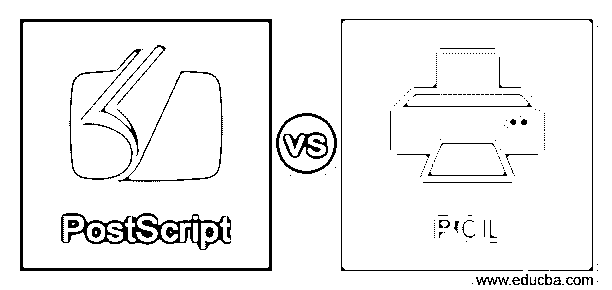
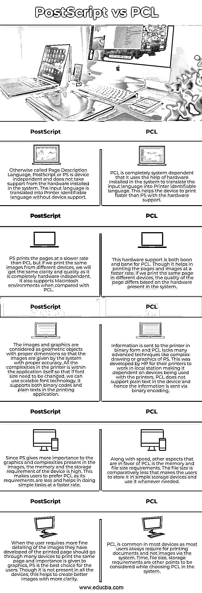

# PostScript vs PCL

> 原文：<https://www.educba.com/postscript-vs-pcl/>

## PostScript 与 PCL 的区别

下面的文章提供了 PostScript 和 PCL 的概要。由 Adobe 于 1984 年开发的一种描述页面的文本和图形内容以便图形的外观在屏幕和脱机页面上都可以改变的技术称为 PostScript。Adobe 制作了一种标准格式，适用于所有包含文本、图像和艺术线条的设备，因此任何人都可以使用 PostScript。PCL 是打印机控制语言，帮助用户控制打印机，以便打印机可以在不同的操作系统中工作。PCL 依赖于主要为一般应用程序打印文本和格式的设备。

### PostScript 与 PCL 的直接比较(信息图表)

以下是 PostScript 与 PCL 之间的 5 大区别:

<small>Hadoop、数据科学、统计学&其他</small>

### PostScript 与 PCL 的主要区别

让我们讨论一下 PostScript 和 PCL 之间的一些主要区别:

*   如果我们正在寻找高质量的图像和精确计算的打印页面，PS 是一个选择，因为它以质量换取打印速度。给我们打印的页面需要一些时间，但是质量很好。如果我们在不同的 PS 语言设备上打印带有图形内容的相同页面，质量不会因其硬件独立性而有所不同。PCL 提供了高速打印页面，但图形不会像 PS 那样精确。此外，用户应该注意不要从不同的设备上重复打印，因为这会影响页面上图像和文字的质量。
*   由于 Adobe 开发了 PS，提供的图像更加准确。此外，Adobe 产品也提供给使用 ps 的用户，这有助于增强具有不同 PS 功能的打印文档。然而，脚本并不容易理解，因为它显示了如何增强打印机中的图像。另一方面，PCL 有一个非常简单的脚本，并且由于它的速度和小尺寸而受到用户的喜爱。
*   PCL 基本上是为与 Windows 或任何类似的 GUI 一起工作而开发的，这使得用户可以很容易地直接使用它。输出被压缩，以便以较小的尺寸向用户提供所需的输出。当在不支持 Adobe 的系统中使用 PS 或使用 PS 打印 Adobe 以外的其他产品时，会导致通过打印机给出 PS 代码，从而使输出比所需时间更长。
*   与 PCL 相比，PS 输出打印页面提供的颜色更加丰富。这是因为尺寸管理和图形设计都涉及到打印应用。PS 自己打印文档，而 PCL 依赖于设备来打印文档，这显然使应用程序变得更小。
*   PCL 更易于使用，易于在任何系统中配置，并且可以安装所有可用的更新。用户文档可在安装的各个方面为用户提供帮助。PS 不容易安装，因为 Adobe 必须先安装许可证，然后安装 PS 应用程序。还应该检查系统是否支持 PS 和 Adobe。

### PostScript 与 PCL 对照表

我们来讨论一下 PostScript 和 PCL 的顶级对比:

| **PostScript** | **PCL** |
| 也称为页面描述语言、PostScript 或 PS，与设备无关，不支持系统中安装的硬件。输入语言在没有设备支持的情况下被翻译成打印机可识别的语言。 | PCL 完全依赖于系统，因为它借助系统中安装的硬件将输入语言翻译成打印机可识别的语言。这有助于设备在硬件支持下比 ps 打印速度更快。 |
| PS 打印页面的速度比 PCL 慢，但如果我们从不同的设备打印相同的图像，我们将获得相同的清晰度和质量，因为它完全独立于硬件。与 PCL 相比，它还支持 Macintosh 环境。 | 这种硬件支持对 PCL 来说是好事也是坏事。虽然它有助于以更快的速度打印页面和图像，但如果我们在不同的设备上打印相同的页面，页面的质量会因系统中存在的硬件而异。 |
| 图像和图形被认为是具有适当尺寸的几何对象，使得系统以适当的精度给出图像。打印机中的所有复杂性都在应用程序本身之内，因此如果需要更改字体大小，我们可以使用可扩展字体技术。它在打印应用程序中支持二进制代码和纯文本。 | 信息以二进制形式发送到打印机，PCL 缺乏许多高级技术，如 PS 的复杂绘图或图形。这是惠普为其打印机在本地工作站中工作而开发的，使其依赖于打印机使用的设备。PCL 不支持设备中的纯文本，因此信息通过二进制编码发送。 |
| 由于 PS 更重视图像中存在的图形和复杂性，因此设备的内存和存储要求很高。这使得用户更喜欢 PCL，因为它的要求更少，有助于以更快的速度完成简单的任务。 | 除了速度之外，有利于 PCL 的其他方面是内存和文件大小要求。文件大小相对较小，使得用户可以将其存储在简单的存储设备中，并在需要时随时使用。 |
| 当用户需要他们开发的打印页面的图像的更精细细节时，应该通过许多设备来打印同一页面，并且给予图形重要性；PS 是用户的最佳选择。虽然不是所有的设备都有，但这有助于创建更清晰的图像。 | PCL 在大多数设备中很常见，因为大多数用户总是需要通过系统打印文档，而不是图像。在系统中选择 PCL 时，时间、文件大小、存储要求是需要考虑的其他因素。 |

### 结论

两种应用各有利弊，但 PCL 主要是为惠普打印机开发的，PS 支持所有带有 PostScript 应用的设备。如果是普通文档，我们可以用 PCL，如果文档有图形图像，PS 是个不错的选择。

### 推荐文章

这是 PostScript vs PCL 的指南。这里我们分别用信息图和比较表来讨论 PostScript 和 PCL 的关键区别。您也可以看看以下文章，了解更多信息–

1.  [PostgreSQL 联合 vs union all](https://www.educba.com/postgresql-union-vs-union-all/)
2.  [PostgreSQL Varchar vs Text](https://www.educba.com/postgresql-varchar-vs-text/)
3.  [Oracle vs PostgreSQL](https://www.educba.com/oracle-vs-postgresql/)
4.  [PostgreSQL vs MariaDB](https://www.educba.com/postgresql-vs-mariadb/)

