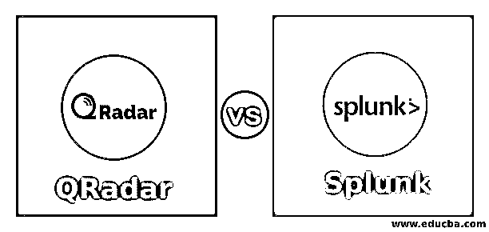
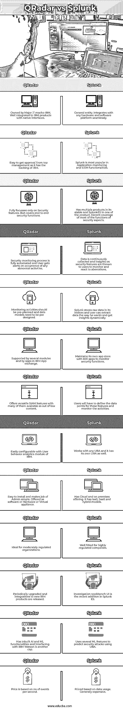

# QRadar 与 Splunk

> 原文：<https://www.educba.com/qradar-vs-splunk/>

## QRadar 与 Splunk 的区别

以下文章概述了 QRadar 与 Splunk。QRadar，IBM 在 2011 年收购了位于马萨诸塞州的软件公司 Q1 实验室，专门从事安全情报工作。Q1 实验室的安全解决方案 QRadar 是在 IBM 的旗帜下销售的，它通过利用该平台的分析功能和安全仪表板的力量帮助其客户保护 it 资产。QRadar 为组织的整个 IT 环境提供强大的安全智能平台，并提供访问管理、数据安全、风险管理、端点管理、网络安全和入侵防御等服务。QRadar 部署为软件、硬件和虚拟设备。它的流处理器收集网络数据(第 4 层)和应用程序数据(第 7 层)以及用于管理安全运营中心的中央控制台。

总部位于美国的软件公司 Splunk 处理大数据分析，并在监控业务应用程序/网络和管理安全运营方面提供智能。该工具以原始格式将数据存储在索引中，IT/业务用户可以动态地从这些数据中提取见解。其核心 Splunk 产品处理应用性能监控，Splunk 企业安全管理终端安全、网络安全、身份管理、恶意软件和漏洞，Splunk storm 处理托管服务，Hunk 管理 Hadoop 数据的分析工具。

<small>Hadoop、数据科学、统计学&其他</small>

### QRadar 与 Splunk 的面对面比较(信息图表)

以下是 QRadar 与 Splunk 之间的 13 大区别:

### QRadar 与 Splunk 的主要区别

让我们讨论一下 QRadar 与 Splunk 之间的一些主要区别:

*   **平台:**IBM stable 中的 QRadar 与其他 IBM 产品集成良好，当与其他 IBM 产品(如用户行为分析、IBM Watson 和 IBM 云相关工具)一起部署时，它的性能更优越。Splunk 是一个独立的产品，可以部署在任何硬件和软件安装中。可以和任何软件公司的相关产品很好的集成。
*   **专业化:** QRadar 主要专注于安全相关工具，在监控组织的网络活动方面有着深厚的基础。Splunk 拥有多种产品，可管理应用性能监控、提供托管服务、处理 Hadoop 大数据分析以及处理安全相关主题。
*   **自动化:** QRadar 具有自动识别网络中出现的新源的功能。它将多个事件联系起来，并应用智能来检测违规、恶意软件攻击和数据窃取，并提醒用户保护组织的 It 资产。Splunk 收集数据、整理数据，并将结果以可视板的形式呈现给用户。用户必须使用所提供的信息来监控安全漏洞。
*   **支持:** QRadar 解决方案附带了 400 多个支持模块，IBM app exchange 中还提供了更多模块。Splunk 维护着独家应用商店，其中包含大约 600 个可与 Splunk Enterprise 安全解决方案一起使用的应用。这些应用程序管理勒索软件、欺诈检测和 PCI 合规性。Splunk 与 30 家合作伙伴一起开发了多种应用程序，用于管理威胁情报、下一代防火墙和终端安全等新技术。
*   **最新更新:** QRadar 不断升级和增强，例如与 Watson for AI 功能集成以构建安全分析功能，整合用户行为分析以跟踪恶意活动，以及采用网络洞察来监控网络攻击。Splunk 中新增了一些功能，包括 es 内容更新，以帮助用户检测威胁。Splunk 还推出了自己的用户行为分析模块。
*   **应用:** QRadar 适用于大中型组织和适度监管的行业。这些行业大多使用核心 SIEM 功能，由于一些问题，端点解决方案没有得到有效利用。Splunk 用于高度管制的行业，在分析方面很强。它们用于拥有更多数据源的组织。
*   **价格:**QRadar 定价的指标是每秒的事件数量。它遵循云与内部部署的不同定价。它的社区版本是免费的。Splunk 根据每天的数据使用量定价，与用户数量无关。

### QRadar 与 Splunk 对比表

让我们来讨论 QRadar 与 Splunk 之间的主要比较:

| **Sl** | **QRadar** | **Splunk** |
| One | 归 IT 巨头 IBM 所有。通过本机接口很好地集成到 IBM 产品中。 | 一般实体。与任何硬件和软件平台无缝集成。 |
| Two | 由于有 IBM 的支持，很容易获得高层管理人员的批准。 | Splunk 在应用监控和 SIEM 功能方面最受欢迎。 |
| Three | 完全只关注安全特性。但是涵盖了端到端的安全功能。 | 在其产品系列中有多种产品，其中一种产品中有 SplunkES。安全方面的大部分功能覆盖良好。 |
| Four | 安全监控过程是完全自动化的，用户会在出现任何异常活动时收到警报。 | 持续收集数据，并向用户提供关于安全功能的见解，以监控异常情况并做出反应。 |
| Five | 监控活动应该预先计划，数据模型需要预先设计。 | Splunk 将原始数据存储在其索引中，用户可以按照自己想要的方式提取数据，并动态获得见解。 |
| Six | 由几个模块和 IBM 应用程序交换中的应用程序支持。 | 维护自己的应用程序商店，有 600 个应用程序来监控安全功能。 |
| Seven | 提供多种多样的 SIAM 功能，其中许多都是现成的内容。 | 用户必须定义这些特征的数据点并监控活动。 |
| Eight | 可以通过 IBM 的用户行为分析模块轻松配置。 | 工程与任何 UBA，它也有自己的 UBA。 |
| Nine | 易于安装，使管理工作变得简单。以软件、硬件或虚拟设备的形式提供。 | 拥有云和本地产品。它有 IaaS、SaaS 和混合动力车型。 |
| Ten | 非常适合适度监管的组织。 | 非常适合高度监管的公司。 |
| Eleven | 定期升级和集成新的 IBM 产品。 | 调查工作台 UI 是 Splunk ES 中最近新增的功能。 |
| Twelve | 具有内置的 AI 和 ML 功能，与 IBM Watson 的接口是另一个 cap。 | 使用几个 ML 特征来预测使用 UBA 的安全攻击。 |
| Thirteen | 价格基于每秒的事件数量。 | 根据数据使用情况定价。普遍贵。 |

### 结论

对安全工具的投资对本组织的生存至关重要。由于这些工具相当昂贵，在做出投资决定之前，要进行广泛的谨慎和充分的研究。

### 推荐文章

这是 QRadar 与 Splunk 的对比指南。在这里，我们分别通过信息图和比较表来讨论 QRadar 与 Splunk 的主要区别。您也可以看看以下文章，了解更多信息–

1.  [Splunk vs Tableau](https://www.educba.com/splunk-vs-tableau/)
2.  [Datadog vs Splunk](https://www.educba.com/datadog-vs-splunk/)
3.  [Splunk vs 弹性搜索](https://www.educba.com/splunk-vs-elastic-search/)
4.  [Kibana vs Splunk](https://www.educba.com/kibana-vs-splunk/)

