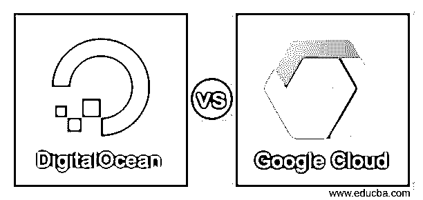
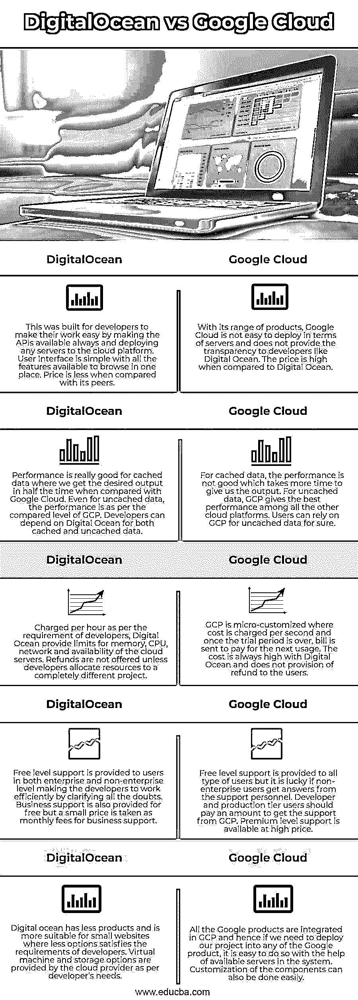

# 数字海洋 vs 谷歌云

> 原文：<https://www.educba.com/digitalocean-vs-google-cloud/>

## 数字海洋与谷歌云的区别

以下文章提供了数字海洋 vs 谷歌云的概要。为客户提供基础设施即服务的云计算平台称为数字海洋，可帮助客户构建具有可扩展效率的云产品，并通过数据库管理对其进行优化。应用程序是在云平台中提供的，在云平台中，我们可以使用安全的网络和资源创建任意数量的应用程序。谷歌的所有公共计算服务都可以通过谷歌云访问，谷歌云有一个 GUI，我们可以在那里管理所有的谷歌产品，包括谷歌搜索，这样我们就可以在一个地方拥有所有的谷歌产品。此外，网络界面用于访问谷歌产品。

### 数字海洋与谷歌云的面对面比较(信息图)

以下是数字海洋与谷歌云的 5 大区别:

<small>Hadoop、数据科学、统计学&其他</small>

### 数字海洋与谷歌云的主要区别

让我们讨论一下数字海洋与谷歌云之间的一些主要差异:

*   更适合企业用户，GCP 有一个云存储桶和一个应用引擎管理平台以及一个 Kubernetes 容器。DigitalOcean 随 Kubernetes 集群提供 droplet 虚拟机，更适合资金较少的小网站开发者或小企业。GCP 和数字海洋都不提供免费域名，这使得开发者需要为他们的计算需求建立自己的平台。数字海洋中的存储依赖于 droplet 包，用户可以每月改进存储。GCP 允许用户增加并行存储，使其更加灵活。
*   与 GCP 相比，数字海洋的性能确实很好，但数字海洋偶尔会停机，使用户等待一些重要的部署。该停机时间将提前通知用户。DigitalOcean 的性能可以通过仪表盘进行测试，这使得它优于其他云提供商。GCP 总是运行和可靠的，因为 GCP 几乎在世界各地都有无止境的服务器，所以不会停机。性能很好，没有停机时间，GCP 是用户的好选择。
*   所有网站都提供一键安装，使开发人员可以轻松使用虚拟机实例、云存储选项、数据库和服务器。这里因为是 IaaS，所以任何云操作都必须先安装服务器。该平台提供 CDN 增强型云存储以及 Kubernetes 集群。只有在 GCP 的小规模部署中才能进行单击式安装，对于较大规模的部署，所有服务器和数据库以及资源组都应该准备就绪。与任何谷歌产品的集成都很容易，让用户在一个保护伞下管理应用程序。云增强数据库服务与由 Google 支持的 Kubernetes 引擎一起提供。
*   DigitalOcean 的支持在基础设施层面和开发者层面都有知识，使用户在需要时可以依赖支持和支持文档。销售电话可以通过正常定价的“特优”支持层来完成。在 GCP，支持是广泛的，但开发者支持较少，使得用户依赖于在线和社区平台。
*   数字海洋在其 droplets 中使用了基于 SSD 的存储，使用户可以轻松地在驱动器中搜索他们的数据。固态硬盘存储快速可靠。然而，GCP 并不依赖 SSD，而是他们自己的谷歌存储。谷歌存储有各种类型的个人和专业文档，用户必须小心管理它们。

### 数字海洋与谷歌云对比表

我们来讨论一下 DigitalOcean 与 Google Cloud 的顶级对比:

| **数字海洋** | **谷歌云** |
| 这是为开发人员构建的，通过使 API 始终可用并将任何服务器部署到云平台，使他们的工作变得简单。用户界面简单，所有的功能都可以在一个地方浏览。与同类产品相比，价格更低。 | 就其产品范围而言，谷歌云在服务器方面不容易部署，并且不像数字海洋那样向开发者提供透明性。与数字海洋相比，价格很高。 |
| 缓存数据的性能非常好，与 Google Cloud 相比，我们只需一半的时间就能获得所需的输出。即使对于未缓存的数据，性能也与 GCP 的水平相当。开发人员可以依赖 Digital Ocean 获得缓存和未缓存的数据。 | 对于缓存的数据，性能并不好，需要更多的时间才能给我们输出。对于未缓存的数据，GCP 提供了所有其他云平台中最好的性能。对于未缓存的数据，用户可以肯定地依赖 GCP。 |
| 按照开发者的要求每小时收费，数字海洋对云服务器的内存、CPU、网络和可用性进行了限制。除非开发者将资源分配给一个完全不同的项目，否则不会提供退款。 | GCP 是微定制的，按秒计费，一旦试用期结束，账单就会被发送来支付下一次使用。数字海洋的费用总是很高，并且不向用户提供退款。 |
| 向企业和非企业级别的用户提供免费级别支持，通过澄清所有疑问使开发人员高效工作。业务支持也是免费提供的，但收取少量费用作为业务支持的月费。 | 向所有类型的用户提供免费级别的支持，但如果非企业用户从支持人员那里获得答案，这是幸运的。开发者和生产层用户应该支付一定的费用来获得 GCP 的支持。高级支持的价格很高。 |
| 数字海洋的产品较少，更适合选择较少满足开发者要求的小网站。虚拟机和存储选项由云提供商根据开发人员的需求提供。 | 所有谷歌产品都集成在 GCP，因此，如果我们需要将我们的项目部署到任何谷歌产品中，在系统中可用服务器的帮助下，很容易做到这一点。组件的定制也可以轻松完成。 |

### 结论

如果需求不大，短期内不考虑可扩展性，DigitalOcean 是云平台省钱的最佳选择。然而，如果梦想是远大的，企业是要做大的，GCP 是所有可提供的选项中最好的。

### 推荐文章

这是数字海洋 vs 谷歌云的指南。这里我们分别讨论信息图和比较表的主要区别。您也可以看看以下文章，了解更多信息–

1.  [回归 vs 分类](https://www.educba.com/regression-vs-classification/)
2.  [监督学习 vs 深度学习](https://www.educba.com/supervised-learning-vs-deep-learning/)
3.  [机器学习与预测分析](https://www.educba.com/machine-learning-vs-predictive-analytics/)
4.  [机器学习 vs 预测建模](https://www.educba.com/machine-learning-vs-predictive-modelling/)

