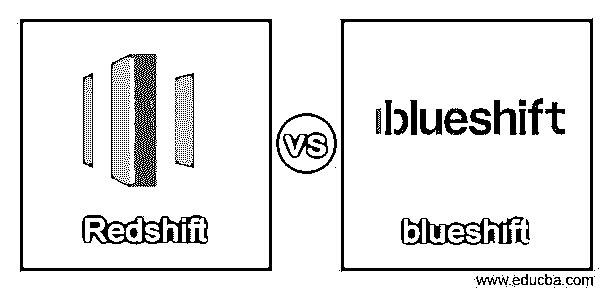
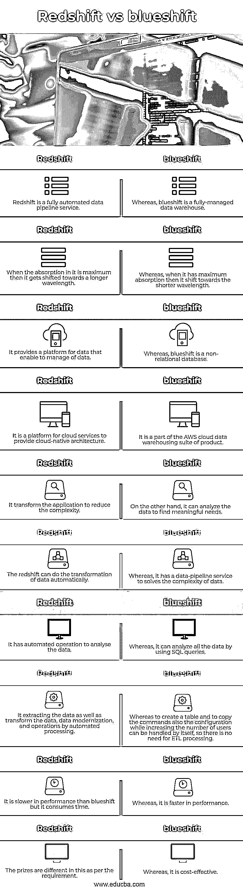

# 红移与蓝移

> 原文：<https://www.educba.com/redshift-vs-blueshift/>

## 红移和蓝移的区别

红移 vs 蓝移的定义是，红移是一个完全管理的 Pb 级云或数据仓库服务，具有无限的灵活性和可扩展性，由亚马逊网络服务运行，用于收集和存储大量数据，其架构允许高速分析和优化大量数据，而蓝移是一个基于云的平台服务，结合了商业规划和个人的复杂性， 它提供了云原生架构来自动转换应用程序，减少了大多数转换项目所需的手动工作和时间。

#### 什么是红移？

红移是一种基于云或数据仓库的服务或产品，快速而强大；它使用在线分析处理系统来帮助提取大量数据，它也是一个节点集合，是一种计算资源并组织在一个组中，它被称为集群，速度快 10 倍，因为它将数据组织在列中，易于处理。它还使用并行处理来跨各种节点加载查询和压缩，以基于行的方式存储数据。它还允许 redshift 对大量数据执行操作。它还通过使用 AWS 架构和机器学习提供了更好的性能。

<small>Hadoop、数据科学、统计学&其他</small>

#### 什么是蓝移？

blueshift 是一个免费的平台，提供自动应用程序转换到云原生架构；它用于通过处理或通过转换应用程序的复杂性和非功能性需求来组织自动化任务和人工任务，并且它支持添加云服务，相对于波长向光谱的较短波长偏移，因此被称为蓝移。

### 红移和蓝移的直接对比(信息图)

以下是红移和蓝移的主要区别

### 红移和蓝移的主要区别

以下是红移和蓝移的主要区别:

*   **复杂度:**

红移的性能很快，它是一个完全管理的数据库仓库，它本身使 ETL 过程成为一个简单的数据，它允许使用工具来分析数据，并通过使用结构化查询语言(SQL)来满足需求，因为它使用数据管道服务，所以它降低了数据的复杂性，这是更有效的，所以如果它降低了数据的复杂性，那么数据可以容易地读取和上传， 而在 blueshift 中，由于没有数据管道服务，数据复杂度更高，所以它自动进行数据分析，降低数据复杂度。

*   **性能:**

redshift 是一个非关系数据库，它通过使用 SQL 查询来分析数据，因此在创建表、配置和执行命令时，它不使用 ETL 过程，因为它可以自己处理，因此，redshift 的性能比 blueshift 和其他数据库服务快 10 倍。据了解，它具有更快的查询性能，因为在 redshift 中，我们可以上传数据集。因此，根据数据的大小，它给出了一个性能，而 blueshift 不是一个数据库。尽管如此，它是一个提供服务的平台；它可以提取数据。它自动执行操作，所以它也提供更快的性能，但比红移慢；蓝移有标准的数据库访问。它的架构允许在架构内访问数据的一致性。

*   **成本:**

成本是取决于满足需求的要求的因素，其中红移比蓝移更具成本效益；它使用结构化查询语言来管理或处理数据，以便我们将获得最有效的数据，我们知道，由于 redshift 通过与亚马逊网络服务的频谱配对来支持亚马逊网络服务的扩展，因此它优化了存储容量，这意味着由于优化，它需要更少的存储空间，因此更具成本效益，然而， 蓝移的成本根据需求而变化，如果我们有更多的空间需求，那么成本就高，当我们需要更少的空间，那么成本就会更低，所以这意味着它根据使用或根据需求有不同的奖励。

### 红移和蓝移的比较

让我们看看红移和蓝移的对比表:

| **序号** | **红移** | **蓝移** |
| 1. | Redshift 是一个全自动的数据管道服务。 | 然而，blueshift 是一个完全托管的数据仓库。 |
| 2. | 当它的吸收达到最大值时，它就会向更长的波长移动。 | 而当它具有最大吸收时，它就向更短的波长移动。 |
| 3. | 它为数据提供了一个平台，可以对数据进行管理。 | 而 blueshift 是一个非关系数据库。 |
| 4. | 它是云服务提供云原生架构的平台。 | 它是 AWS 云数据仓库产品套件的一部分。 |
| 5. | 它改变了应用程序以降低复杂性 | 另一方面，它可以分析数据，找到有意义的需求。 |
| Six | 红移可以自动完成数据的转换。 | 而它有一个数据管道服务来解决数据的复杂性。 |
| 7. | 它有分析数据的自动化操作。 | 而它可以通过使用 SQL 查询来分析所有数据。 |
| 8. | 它通过自动化处理来提取数据以及转换数据、数据现代化和操作。 | 而创建表和复制命令以及增加用户数量时的配置本身就可以处理，因此不需要 ETL 处理。 |
| 9. | 它在性能上比 blueshift 慢，但是很费时间。 | 而它的性能更快。 |
| 10. | 根据不同的要求，奖品是不同的。 | 而它是有成本效益的。 |

### 结论

在本文中，我们得出结论，redshift 和 blueshift 都支持商业智能和数据可视化的广泛数据，因为 redshift 允许确保服务通过 sing 数据库更快地运行，而 blueshift 是一个提供自动化服务以转变应用程序的平台。

### 推荐文章

这是红移和蓝移的对比指南。在这里，我们用信息图和比较表来讨论红移和蓝移的主要区别。您也可以看看以下文章，了解更多信息–

1.  [Asana vs Todoist](https://www.educba.com/asana-vs-todoist/)
2.  Arduino Leonardo vs Uno
3.  [PDF vs Word](https://www.educba.com/pdf-vs-word/)
4.  [Mxnet vs Pytorch](https://www.educba.com/mxnet-vs-pytorch/)

