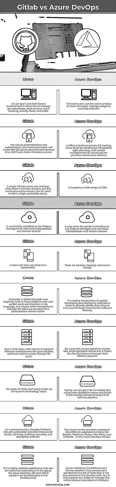

# Gitlab vs Azure DevOps

> 原文：<https://www.educba.com/gitlab-vs-azure-devops/>

## Gitlab 与 Azure DevOps 的区别

GitLab 是一个 DevOps 平台，它将开发、运营和其他安全团队统一到一个应用程序中，但它使团队能够降低开发成本和安全问题，同时将软件交付从数周缩短到数分钟。devops 是一套文化概念、实践和技术，可提高组织生产高速应用程序和服务的能力，同时允许 it 以比传统软件开发和基础架构管理方法更快的速度发展和改进产品。

### GitLab vs azure devops 简介

基本上，首先，我们必须是 Azure DevOps 的外观，它看起来类似于 GitLab，并且成本也更低。不过仔细一查可能会发现，在 GitLab 下有比 Azure DevOps 更关键的特性，比如秘密管理等项目方案，大部分 AWS 和 Google 云服务器都使用了这样的支持工具和基于浏览器的 ide。Azure DevOps 是针对闭源项目的，而 GitHub 是针对开源项目的。GitLab 是完整 DevOps 生命周期的完全集成的单一应用程序，超过了 Jenkins 的期望。除了 Jenkins 关注的 CI/CD 目标，GitLab 还支持规划、SCM、打包、发布、配置和监控服务。GitLab 通常是一个开源平台，用于应用程序版本管理、代码审查和其他任务。GitLab 平台与当时每台服务器可以处理多达 n 个百万用户的服务器相连。Visual Studio Team Services (VSTS)和 Team Foundation Server (TFS)拥有一些名为 Azure DevOps Services 和 Azure DevOps Server 的新版本，与服务器相对应。Azure DevOps Services 是一个基于云的软件开发平台。

<small>Hadoop、数据科学、统计学&其他</small>

### Gitlab 与 Azure DevOps 的直接对比(信息图)

以下是 Gitlab 和 Azure DevOps 之间的主要区别

### GitLab 与 azure devops 的主要区别

以下是 Gitlab 和 Azure DevOps 的区别

**Gitlab:**

实际上，gitlab 页面已经被重新定位到我们的文档部分，以便可以更容易地更新来部署代码。推荐将 Azure 安装文档用于存储库中合适的数据。GitLab 是一个自托管和可伸缩的 Git 存储库，使用“生态系统”然后它会有不同的版本，比如免费社区版和付费企业版。GitLab 是一个基于 web 的 Git 库，它为免费版本、问题跟踪和 wikis 提供了更多的主要和私有的库。这是一个完整的 DevOps 平台，允许开发人员处理项目的所有方面，从项目规划到源代码管理到监控和安全。总的来说，GitLab 是一个开源公司。它可以被用来为软件开发生命周期创建工具，估计有一百万注册用户和超过一百万的活跃许可用户，以及由某些特定贡献者组成的活跃社区。它也比大多数其他公司分享更多的信息。默认情况下，它是公开的，这意味着我们的项目、战略、方向和分析都是公开讨论的，可以在 gitlab 网站或应用程序上获得。它主要是由协作、结果、效率、多样性、包含和归属、迭代以及用户资源利用的透明性(信用)的某些原则来定义的。

**Azure devops:**

微软的 Azure DevOps 平台被用作软件即服务(SaaS)平台，提供完整的 DevOps 工具链来创建构建和分发软件。它还连接了大多数流行的工具，使其成为协调 DevOps 工具链的绝佳选择。当我们使用 Azure DevOps 服务环境时，它由我们自己的云托管。VSTS、TFS 和 Azure DevOps 之间的主要区别在于，它们都有一个由 Azure 环境托管的服务。此外，这些服务已被划分为不同的升级服务，如电路板、管道、回购、测试计划和工件，可在 Azure DevOps 版本及其功能中单独使用。DevOps 的主要目的是在软件开发生命周期(SDLC)模型的每个阶段(从集成到测试和发布部署和其他基础设施管理工具)与自动化和监控紧密集成。它为软件驱动的组织提供了一个强大的平台，以便在管道框架中部署其解决方案，并支持 It 持续集成和部署模式。此外，AWS 工具包用于 Azure DevOps 平台。它托管了对 Microsoft Azure DevOps 平台和插件的内部需求，以便在 AWS 简单集成上管理和部署自己的应用程序。与 AWS 服务集成的其余部分是更需要的，并且不需要对现有的构建/发布管道或其他流程任务进行任何更改。无服务器应用程序也可以部署在云或其他环境中。

### GitLab 与 azure devops 的比较

下面是 GitLab 和 Azure devops 之间的最高对比:

| **Gitlab** | **Devops** |
| 这是一个开放的自托管环境；它允许管理 git 存储库、代码审查、问题跟踪、活动提要和 wikis。 | 团队可以使用一些服务来共享代码、管理进度和发布软件。 |
| 为了安全认证和授权，业务团队将在内部安装 GitLab，并将其连接到 LDAP 和 Active Directory 服务器。 | 它提供无限的私有 Git 托管、用于持续集成的云构建、敏捷规划以及用于云和内部持续交付的发布管理。 |
| 一台 GitLab 服务器可以管理 n 个以上的用户，但是众多的活动服务器可以用来组成一个高可用性设置。 | 它支持广泛的 ide。 |
| 它主要分为项目管理和代码协作，以及版本控制。 | 也和 gitlab 一样；它被划分为项目管理、代码协作和版本控制。 |
| 它没有任何免工具的库。 | Tools are Kanban, backlog, and scrum boards. |
| 一般来说，在 Gitlab 中，代码最初是在 Ruby 平台上构建的，某些部分用 Go 语言重写，作为团队内部软件开发协作的源代码管理解决方案。 | 它主要是快速开发和部署软件的实践，以便通过增量软件交付为最终用户提供持续的价值。 |
| 但是后来它成长为一个集成的软件开发生命周期解决方案，然后成为整个 DevOps 生命周期。 | 通过使用这种方法，我们可以快速地将商品推向市场，跨专业的团队，it 部门在交付渠道中遵循 DevOps 阶段。 |
| Go、Ruby on Rails、Vue.js 组成了目前的技术栈。 | 主要是，我们可以使用跨专业团队，并通过交付渠道遵循这些开发运维阶段，快速将其推向市场。 |
| 作为一个全面的 DevOps 平台，GitLab 的应用程序提供了联合规划、构建、保护和部署软件的功能。 | 在 Azure DevOps 版本中，这个 Azure 服务被分成不同的升级服务，如板、管道、回购、测试计划和工件。 |
| 它是一个高度可扩展的应用程序，可以在内部或云中托管。环境中还包括问题跟踪、IDE 和 CI/CD 管道。 | Azure 将软件作为一个服务平台来维护，它由一套全面的工具组成，不仅在 DevOps 技能中提供，而且还支持管理整个产品开发生命周期的能力。 |

### 结论

目前，azure devops 和 gitlab 有一个带有托管功能的存储库，为几个阶段 devops 生命周期提供持续集成和部署能力。此外，gitlab 创建了单一类型的应用程序，包括针对用户界面和无缝数据流以及各阶段的操作而升级的规划和其他 devops 工具链。

### 推荐文章

这是 Gitlab vs Azure DevOps 的指南。在这里，我们讨论 Gitlab 与 Azure DevOps 的关键区别，并提供信息图表和比较表。您也可以看看以下文章，了解更多信息–

1.  [新遗迹 vs Splunk](https://www.educba.com/new-relic-vs-splunk/)
2.  [XAMPP vs MAMP](https://www.educba.com/xampp-vs-mamp/)
3.  [数据集 vs 数据库](https://www.educba.com/dataset-vs-database/)
4.  [认证 vs 授权](https://www.educba.com/authentication-vs-authorization/)

