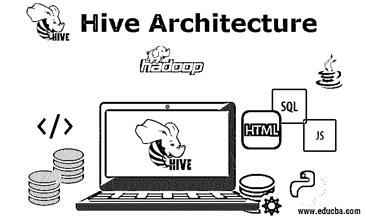
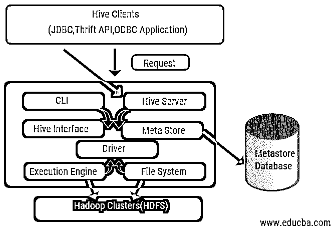
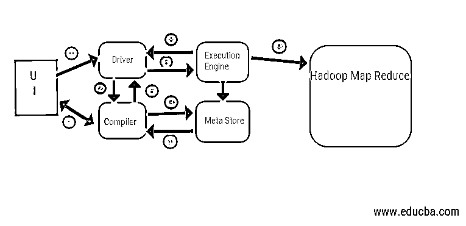

# 蜂巢建筑

> 原文：<https://www.educba.com/hive-architecture/>

## 蜂巢架构简介

hive 架构有助于确定 Hive 查询语言以及程序员和使用命令行的查询语言之间的交互，因为它是建立在 Hadoop 生态系统之上的，所以它与 Hadoop 有频繁的交互，因此可以处理域 SQL 数据库系统和 Map-reduce，其主要组件是 Hive 客户端(如 JDBC、节俭 API、ODBC 应用程序等)。)，配置单元服务器和配置单元存储也称为元存储。

### 蜂巢架构及其组件

Hive 在数据分析和商业智能集成中起着重要的作用，它支持文本文件、rc 文件等文件格式。Hive 使用分布式系统处理和执行查询，存储最终在磁盘上完成，最后使用 map-reduce 框架进行处理。它解决了在 map-reduce 和 hive 执行批处理作业下发现的优化问题，这些问题在工作流中有明确的解释。这里，元存储存储模式信息。一个叫做 Apache Tez 的框架是为实时查询性能而设计的。

<small>Hadoop、数据科学、统计学&其他</small>

蜂巢的主要组成部分如下:

1.  配置单元客户端
2.  蜂巢服务
3.  配置单元存储(元存储)

上图显示了配置单元的架构及其组件元素。

#### 配置单元客户端

它们包括执行简单 hive 命令的节俭应用程序，这些命令可用于 python、ruby、C++和驱动程序。这些客户端应用程序有利于在配置单元上执行查询。Hive 有三种类型的客户端分类:节俭客户端、JDBC 和 ODBC 客户端。

#### 蜂巢服务

为了处理所有的查询，hive 提供了各种服务。所有功能都由用户在 hive 中轻松定义。让我们简单看看所有这些服务:

*   **命令行界面**(用户界面):它支持用户和 hive(一个默认的 shell)之间的交互。它为执行 hive 命令行和 hive insight 提供了一个 GUI。我们还可以使用 web 界面(HWI)来提交查询并与 web 浏览器进行交互。
*   **Hive 驱动程序:**它接收来自不同来源和客户的查询，如 thrift server，并在自动连接到 Hive 的 [ODBC 和 JDBC 驱动程序](https://www.educba.com/jdbc-vs-odbc/)上进行存储和获取。该组件对来自 metastore 的表进行语义分析，解析查询。该驱动程序利用编译器的帮助，执行诸如解析器、规划器、执行 MapReduce 作业和优化器之类的功能。
*   **编译器:**查询的解析和语义过程由编译器完成。为了兼容性，它将查询转换成抽象语法树，然后再转换回 DAG。反过来，优化器分割可用的任务。执行器的工作是运行任务并监控任务的流水线调度。
*   **执行引擎:**所有的查询都由执行引擎处理。DAG 阶段计划由引擎执行，有助于管理可用阶段之间的依赖关系，并在正确的组件上执行它们。
*   **Metastore:** 它作为一个中央存储库来存储元数据的所有结构化信息，同时它也是 hive 的一个重要方面，因为它拥有表和分区细节等信息，以及 HDFS 文件的[存储](https://www.educba.com/what-is-hdfs/)。换句话说，我们应该说 metastore 充当了表的名称空间。Metastore 被认为是一个由其他组件共享的独立数据库。Metastore 有两部分，称为服务和积压存储。

hive 数据模型被构造成分区、桶、表。所有这些都可以被过滤，有分区键和评估查询。Hive 查询[在 Hadoop 框架](https://www.educba.com/hadoop-framework/)上工作，而不是在传统数据库上。Hive 服务器是远程客户端查询到 hive 之间的接口。执行引擎完全嵌入在配置单元服务器中。你可以在机器学习中找到蜂巢应用，在探测过程中找到商业智能。

### 蜂巢的工作流程

Hive 工作在两种模式下:交互模式和非交互模式。前一种模式允许所有配置单元命令直接进入配置单元外壳，而后一种模式在控制台模式下执行代码。数据被划分为分区，分区又进一步划分为存储桶。执行计划基于聚合和数据偏差。使用 hive 的另一个好处是它可以轻松处理大规模的信息，并且有更多的用户界面。

从上面的图表中，我们可以看到 Hadoop 系统中的数据流。

**步骤包括:**

1.  从用户界面执行查询
2.  从驱动任务 DAG 阶段获取计划
3.  从元存储中获取元数据请求
4.  从编译器发送元数据
5.  将计划发回给驾驶员
6.  在执行引擎中执行计划
7.  获取适当用户查询的结果
8.  双向发送结果
9.  HDFS 中的执行引擎处理，通过作业跟踪器创建的数据节点进行映射-还原和获取结果。它充当了 Hive 和 Hadoop 之间的连接器。

执行引擎的工作是与节点通信，以获取存储在表中的信息。在这里，执行像 create、drop、alter 这样的 SQL 操作来访问表。

### 结论

我们已经了解了 hive 架构及其工作流程，Hive 基本上执行 Pb 量的数据，因此它是 Hadoop 平台上的一个[数据仓库包](https://www.educba.com/what-is-data-warehouse/)。由于 hive 是处理大数据量的好选择，它有助于在 SQL 接口的指导下进行数据准备，以解决 MapReduce 问题。Apache hive 是一个处理结构化数据的 ETL 工具。了解 hive 架构的工作原理有助于公司人员理解 hive 的工作原理，并对 hive 编程有一个良好的开端。

### 推荐文章:

这是蜂巢建筑的指南。在这里，我们讨论了配置单元的架构、不同的组件和工作流程。你也可以看看下面的文章来了解更多-

1.  [Hadoop 架构](https://www.educba.com/hadoop-architecture/)
2.  [红宝石的用途](https://www.educba.com/uses-of-ruby/)
3.  [什么是 C++](https://www.educba.com/what-is-c-plus-plus/)
4.  [什么是 MySQL 数据库](https://www.educba.com/what-is-mysql-database/)

