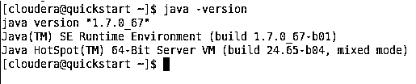
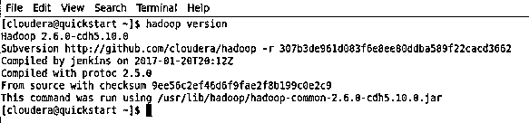
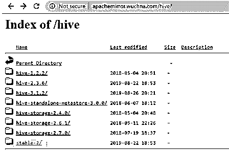
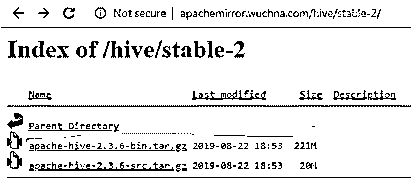
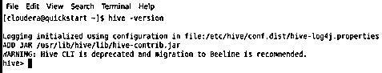

# 蜂巢装置

> 原文：<https://www.educba.com/hive-installation/>

## 配置单元安装简介

Hive 为用户提供了一个很好的界面来访问和操作表格形式的数据。它提供了很好的优化技术来提高性能。相信我，利用大数据提高查询速度是非常具有挑战性的，这在生产环境中非常重要。在后端，编译器将 HQL 查询转换为 map-reduce 作业，然后提交给 [Hadoop 框架](https://www.educba.com/hadoop-framework/)执行。 [Hadoop 组件](https://www.educba.com/hadoop-components/)如 Hive、Hbase、Pig 等。都支持 Linux 环境。因此，建议您的设备安装 Linux 操作系统。Apache Hadoop 是一个框架集合，允许处理分布在集群中的大数据。

As per Apache Hive 是一个建立在 Apache Hadoop 之上的数据仓库软件项目，用于提供数据查询和分析。Apache hive 提供了类似 SQL 的接口来查询和处理大量数据，称为 HQL (Hive query language)。Apache hive 运行在 [Hadoop 生态系统](https://www.educba.com/hadoop-ecosystem/)之上，以文件形式存储的数据意味着 Hadoop 分布式文件系统(HDFS)。如果不是这样，并且您想在系统上有 windows 的情况下在 hive 上练习。你可以做的是，在你的系统上安装 CDH 机器，并把它作为探索 Hadoop 的平台。这将需要你的系统至少有 4GB 的内存，或者你可以在你的 pen drive 中有一个 CDH 机器并使用它。

<small>Hadoop、数据科学、统计学&其他</small>

无论如何，你总能找到解决你问题的办法，也许迟早会有。

### Hive 和 SQL 的区别

Apache hive 与 SQL 非常相似，但正如我们所知，Hive 运行在 Hadoop 生态系统之上，并在内部将作业转换为 MR (Map Reduce Jobs)，这使得 Hive 和 SQL 有所不同。

对于那些需要快速响应的应用程序来说，hive 不是最好的方法，理解 Hive 更适合对大量不可变数据进行批处理是很重要的。我们应该注意到，hive 是一个常规的 RDBMS，最后但并非最不重要的是，apache hive 是读取方式上的模式(在将数据插入 Hive 表时，它不会担心数据类型不匹配，但在读取数据时，如果数据类型与特定列的数据类型不匹配，它将显示空值)。

### 先决条件

在任何计算机上安装 hive 都有一些先决条件:

1.  Java 安装
2.  Hadoop 安装

#### 第一步

*   验证是否安装了 Java。
*   打开终端并键入命令。

**Java 版本**

*   如果系统上安装了 java，它会给出版本，否则会出错。在我的例子中，已经安装了 Java，下面是命令的输出。

*   以防您的系统中没有安装 Java。你可以访问下面的链接，下载并安装 java。
*   [http://www . Oracle . com/tech network/Java/javase/downloads/JDK 7-downloads-](https://www.oracle.com/java/technologies/javase/upgrade.html)【1880260.html T2】。

**Java 安装**

1.  提取下载的。
2.  将其移动到“/usr/local/”。
3.  设置 PATH 和 JAVA_HOME 变量。

#### 第二步

*   验证是否安装了 Hadoop。
*   打开终端并键入命令。

**Hadoop 版本**

*   如果已经安装了 Hadoop，这个命令会给出版本，否则会出错。
*   在我的例子中，Hadoop 已经安装，因此有下面的输出。

*   您现在可以看到我正在使用 CDH5 机器。
*   如果没有安装 Hadoop，请从 Apache software foundation 下载 Hadoop。

**Hadoop 安装**

1.设置 Hadoop

2.配置 Hadoop

配置 Hadoop 需要编辑的文件有:

*   核心网站. xml
*   hdfs-site.xml
*   yarn-site.xml
*   mapred-site.xml

3.使用以下命令设置 Namenode:

`Hdfs namenode -format`

4.使用以下命令启动 dfs:

`start -dfs.sh`

5.使用以下命令启动纱线:

`Start -yarn.sh`

### 如何安装 Hive？

关于蜂箱安装的以下几点

*   我们需要做的第一件事是下载 hive 发布，可以通过点击下面的链接来执行:**https://apachemirror.wuchna.com/hive/**

 ***   上面的链接将给出您必须从中选择 stable-2 的链接，下面以黄色突出显示:

*   打开 stable-2 后，选择 bin 文件(截图中高亮显示的黄色)，右键点击“复制链接地址”。

### 安装配置单元的步骤

以下是配置单元安装的步骤:

**第一步:**下载 tar 文件。

http://apachemirror.wuchna.com/hive/stable-2/apache-hive-2.3.6-bin.tar.gz0

**第二步:**提取文件。

`sudo tar zxvf /Downloads/apache-hive-* -C  /usr/local`

**第三步:**将 apache 文件移动到/usr/local/hive 目录。

`sudo mv /usr/local/apache-hive-* /usr/local/hive`

**第 4 步:**通过在~/后面添加下面几行来设置 Hive 环境。bashrc 文件

`export HIVE_HOME=/usr/local/hive
export PATH=$PATH:$HIVE_HOME/bin
export CLASSPATH=$CLASSPATH:/usr/local/Hadoop/lib/*:.
export CLASSPATH=$CLASSPATH:/usr/local/hive/lib/*:.`

**第五步:**执行 bashrc 文件。

`$ source ~/.bashrc`

**步骤 6:** Hive 配置-编辑 hive-env.sh 文件以追加以下内容:

`export HADOOP_HOME=/usr/local/Hadoop`

**第 7 步:**使用以下命令进行编辑:

`$ cd $HIVE_HOME/conf
$ cp hive-env.sh.template hive-env.sh`

*   现在，要验证配置单元是否已安装，请使用命令 hive-version。
*   在这里，hive-version 进入 hive shell，这意味着安装了 hive。然而，在我的情况下，这是旧版本，因此给出警告。

### 结论

Hive 向许多人开放了大数据，因为它简单易用，并且与 SQL 类似，如查询语言和接口。Hive 构建在 Hadoop 核心之上，因为它使用 Mapreduce 来执行。检索数据和处理大数据要容易得多。

### 推荐文章

这是一个配置单元安装指南。在这里，我们学习了如何一步一步地安装 hive 以及一些先决条件，以便更好地理解。您也可以浏览我们的其他相关文章，了解更多信息——

1.  什么是蜂巢？
2.  [配置单元命令](https://www.educba.com/hive-command/)
3.  [什么是猪？](https://www.educba.com/what-is-pig/)
4.  [蜂巢内部连接](https://www.educba.com/hive-inner-join/)

**