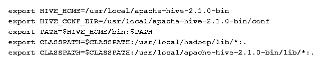
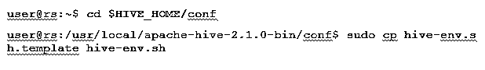

# 如何安装 Hive

> 原文：<https://www.educba.com/install-hive/>

## 如何安装 Hive？

**安装蜂箱的优先要求**

正如我前面所说，理解 Apache hive 运行在 Hadoop 生态系统之上非常重要，Hadoop 应该与所有恶魔一起运行。

<small>Hadoop、数据科学、统计学&其他</small>

一些基本的 Hadoop 恶魔如下:

*   名称节点
*   数据节点
*   资源管理程序
*   节点管理器

要检查 Hadoop 版本，下面是命令:

> 在命令提示符下输入 **→** **Hadoop 版本**，它会给出 Hadoop 的版本。
> 
> 要检查 Hadoop 集群报告触发器，请执行以下命令:
> 
> 在命令提示符下键入→**Hadoop DFS admin–report**如果您的服务器正在运行，它将为您提供整个集群的报告。

如果您的机器上没有安装 Hadoop，请按照 apache 说明[在您的系统](https://www.educba.com/install-hadoop/)上安装 Hadoop。

我希望 java 也已经安装在您的系统上了。要检查 java 版本，请参考下面的截图。

### **在 Ubuntu 上安装 Hive 的步骤**

下面是在 Ubuntu 上安装 Hive 的步骤如下:

**步骤 1** : **Hive tar** 我们可以在终端中使用下面的命令下载，也可以直接从终端下载。

**命令:**我们得到[http://archive . Apache . org/dist/hive/hive-2 . 1 . 0/Apache-hive-2 . 1 . 0-bin . tar . gz](http://archive.apache.org/dist/hive/hive-2.1.0/apache-hive-2.1.0-bin.tar.gz)

**第二步** : 提取 **tar** 文件；在终端使用 below 命令，我们可以直接提取下载的 tar hive tar 文件上面的 tar。

命令:tar-xzf apache-hive-2.1.0-bin.tar.gz

我建议你用 **ls** 命令来验证提取的 hive 文件。

**第三步:**编辑**。bashrc** 文件为用户更新环境变量。

命令: sudo the。bashrc

在文件末尾添加以下内容:

**#设置 HIVE_HOME**

执行下面给出的命令来完成当前终端中的更改工作。

**命令:**来源。巴沙尔

**第 5 步** : 我们需要在 HDFS 位置内创建 Hive 目录。这个目录“warehouse”将是存储配置单元表的元数据相关信息和与配置单元相关的数据的位置。

**命令**:

*   HDFS DFS-mkdir-p/用户/配置单元/仓库
*   hdfs dfs -mkdir /tmp

**步骤 6** : 要设置 hive 表的读写权限，执行下面的命令。

**命令:**

在以下命令中，向用户组提供写权限:

*   HDFS DFS-chmod g+w/用户/配置单元/仓库
*   hdfs dfs -chmod g+w /tmp

**配置 Hive:** 用 Hadoop 配置安装 Hive 的点很重要。我们需要编辑 hive-env.sh，该文件位于$HIVE_HOME/conf 目录中。以下命令重定向到 Hive conf 文件夹并复制模板文件:

**步骤 7** : 在**h**T8】ive-env . sh 中设置**一个 Hadoop** 路径

**通过追加以下行来编辑 hive-env.sh 文件:**

至此，我们几乎完成了这个过程，并且成功地完成了[配置单元安装](https://www.educba.com/what-is-a-hive/)。使用外部数据库服务器配置 Metastore 很重要，默认情况下，Apache 配置单元框架使用 Derby 数据库。通过使用下面的命令初始化 Derby 数据库。

命令:bin/schema tool-init schema-dbType derby

第八步:发射**蜂巢**。

**命令:** hive(在终端内键入 hive，第二个 hive 终端将打开。)

**使用 Hive:** 现在我们将看到 Hive 中的一些操作，以了解我们在默认数据库中有多少个表。请参考下面的截图。下面的截图没有显示任何表意味着我们在默认数据库中没有任何表。

**

** 

要在配置单元中创建表，引用所需的数据库非常重要，否则任何表都将在默认数据库下创建。

### Hive 中的重要命令

1:显示数据库(它将显示到目前为止已经创建的所有数据库)。

2:如果 mydb 不存在，则创建数据库(如果' **mydb'** 不存在，并且如果' **mydb** 已经存在，该命令将创建一个名为' **mydb'** 的数据库，也不会给出任何错误)

3:使用数据库每当我们必须在特定的数据库上使用一些 DDL 命令时，我们应该使用命令“使用数据库”,在我们的例子中，我们已经创建了“mydb ”,将使用 show 命令 **mydb。**

### 重要的配置单元 DDL 命令

**创建、删除、截断、显示、描述**。

*   **Create**:–创建用于创建数据库或在配置单元中创建表的语句。

例:hive> **创建**数据库公司；(数据库创建)

蜂巢>**使用**公司；

Hive> **创建**表 employee (id int，name String，salary String)；(这将在数据库 Company 下创建 employee 表，因为我们已经执行了命令 Use database。)

*   **Describe** 提供关于表的模式的信息。

Hive >描述员工；(这将在 details 中给出 employee 表的模式细节)

*   **TRUNCATE** 将删除表格中的数据。

Hive> truncate 表 employee

我们也可以将 Hive 安装在窗口上，但是为了更好地实践，我更喜欢使用 Ubuntu，它将提供更好的生产环境视图，并且您的数据将在未来增加，它将易于管理。

### 推荐文章

这是安装 Hive 的指南。这里我们讨论了安装配置单元、DDL 命令等的不同步骤。您也可以阅读以下文章了解更多信息:

1.  [如何安装 SQL Server](https://www.educba.com/install-sql-server/)
2.  [如何安装 MATLAB](https://www.educba.com/install-matlab/)
3.  [配置单元命令和特性](https://www.educba.com/hive-command/)
4.  [蜂箱安装](https://www.educba.com/hive-installation/)

