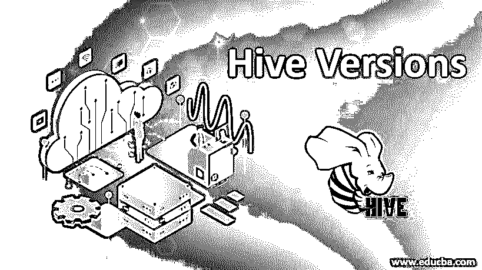

# 配置单元版本

> 原文：<https://www.educba.com/hive-versions/>

## Hive 版本介绍

Hive 是构建在 Hadoop 之上的数据仓库工具，用于大型数据集的数据处理。它发布于 2010 年，是最广泛使用的 ETL 和数据处理工具。发布之后，Hive 带来了大量的改进和 bug 修复，版本得到了升级。hive 的最新稳定版本于 2019 年 8 月发布，目前正在使用中。为 HIVE 发布了各种版本，使其更加耐用，功能得到增强。

### Hive 的前 7 个版本

下面描述了使用这些版本运行 Hive 的各种方式。

<small>Hadoop、数据科学、统计学&其他</small>

#### 1.版本 0.9.0

hive 0 . 9 . 0 版修复了 timestampWritable.java 导致数据损坏的错误。这是初始版本，发布日期为 2013 年 12 月 3 日。使用 Map Reduce 版本 2.x、3.x 引入了更多的功能，并解决了 bug。get schema()函数没有为解释查询返回正确的模式。Hdfs 是硬编码的，这成为了使用其他文件系统的障碍。所以在这个版本的蜂箱中引入了很多这种类型的虫子。

#### 2.版本 0.10.0

此版本的 hive 修复了几个已记录的问题，因为该版本在 0.9 版本之后很快发布。描述为语法的几个错误不被支持，内存泄漏是存在的，除了嵌套 UDF 的空指针，所以这些错误被解决，并引入了新版本的 Hive 0.10。

#### 3.版本 0.11.0

此版本的 hive 于 2014 年 8 月发布，修复了 0.10 版本发布时遇到的主要错误。每次执行不正确的查询时，服务器都会进入关闭状态，这是这个版本中引入的一个主要变化。映射连接没有给出正确的结果，在 java 7 hive 编译器下显示问题这些是在这个版本中处理的主要错误。

当混合 Avro 和 snappy 空值被返回时，这个 bug 也在这个版本中被解决。此外，在多个表中插入多次覆盖会在所有表中存储相同的结果，在此版本中也会处理这些结果。

#### 4.版本 0.12.0

此版本的 Hive 添加了一个新的数据类型 Date。这种数据类型使得日期很容易插入到配置单元列中。暂存目录中的内容现在已被清除。我们有能力用 HQL 来定义函数。在 Hive 版本中引入了 Exchange 分区。

Spark SQL 被引入来与 HIVE 一起工作；我们也可以用蜂巢对付 HBASE。Format_number 开始支持十进制数据类型。即使 Zookeeper 响应某个节点不存在，早期的 hive 也会不断重试删除锁，因此在此版本的 Hive 中解决了此错误，因为它不再尝试此作业。现在，在 Hive 中引入了 Varchar 数据类型，并且支持内存中的 PTF 事务。

#### 5.版本 0.13.0

Hive 在 2014 年中期进行了另一次更新，在 Hive 的功能上再次添加了一些额外的功能，使其更加强大。这个版本中引入了一些额外的特性，如 char 数据类型、子查询支持、永久 UDF、ORC 文件页脚、配置单元精度。创建或删除数据库时的权限被修改为相同，只能通过检查用户的权限来完成。在读取数据文件时，它开始跳过页眉和页脚行。引入了 UDF 来计算地理坐标之间的距离。

现在，parquet 文本数据是可读的，我们能够使用 HIVE API 或 CLI 来确定配置单元的版本。我们现在可以一次提交多个查询，用。根据输入文件大小调整映射器和缩减器的决定也可以从这个发布版本中获得。在配置单元元存储中启用了启动安全模式，并且启用了 Kerberos。正确处理了夏令时。

#### 6.版本 1.0.0

Hive 推出了一个新版本，对性能和其他功能进行了一些改进。我们可以使用 SASL·QOP 参数连接到 JDBC 的 hive 服务器。配置单元附带了(hive . optimize . insert . dest . volume = true)属性，该属性在与目标表相同的卷中创建配置单元临时目录。

身份验证支持处理得很好，因为当群集安全时，配置单元服务器接受 MAPR·SASL 和 PAM 进行入站身份验证，之后 PAM 被用作默认身份验证。此版本解决了插入/覆盖表格时的权限问题。基于成本引入了许多优化技术，使得 hive 查询处理对于大数据应用程序来说具有成本效益。现在，连接查询得到了明智的处理，它们不再产生不正确的数据。

#### 7.版本 1.2.1

Hive 上的这个版本是在 2015 年年中发布的，当时引入了 hive odbc 驱动程序。在开始后，蜂巢壳不再给出错误，所以这是这个版本的一个主要变化。配置单元元存储开始正确制作表，并且在运行查询时没有出现其他异常(如锁定异常)。这是 hive 的一个稳定版本，主要的错误都在这个版本中解决了。

### 结论

从上面的文章中，我们看到了 hive 是如何起源的，以及 Hive 中引入的各种版本，使它在大数据处理方面更加稳定和强大。hive 版本中引入的所有变化都是我们开始面对大数据处理的挑战。所有这些问题都得到了实质性的解决，使得 hive 在数据处理方面更加强大。

### 推荐文章

这是一个 Hive 版本的指南。在这里，我们讨论了简介和各种 hive 版本，这些版本使 hive 在大数据处理方面更加稳定和强大。您也可以阅读以下文章，了解更多信息——

1.  [在配置单元中存储|功能和示例](https://www.educba.com/bucketing-in-hive/)
2.  [新推出的 Spark 版本](https://www.educba.com/spark-versions/)
3.  [Apache Hadoop 版本有哪些？](https://www.educba.com/hadoop-versions/)
4.  [Java 有哪些不同的版本？](https://www.educba.com/versions-of-java/)
5.  [配置单元内部连接|版本|工作和示例](https://www.educba.com/hive-inner-join/)

