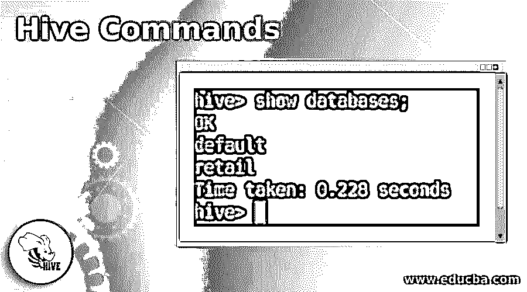
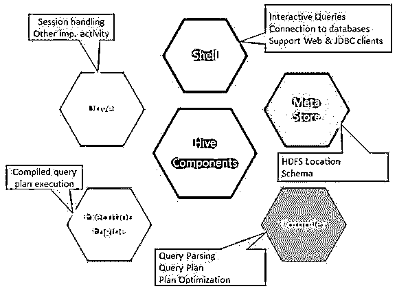
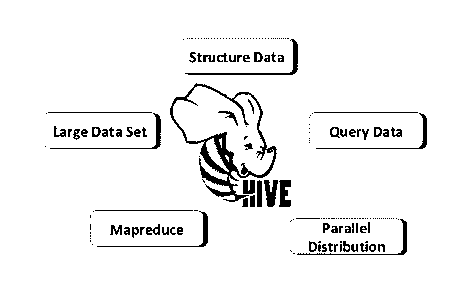
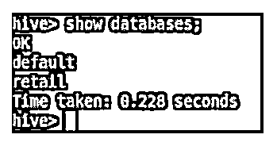
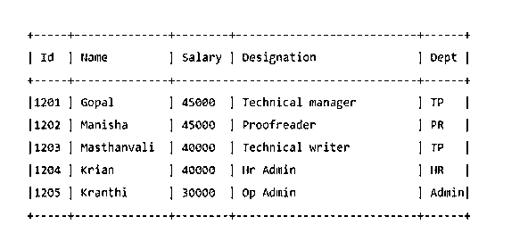
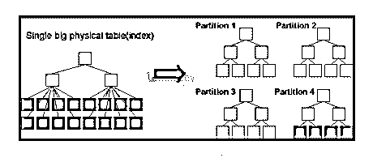
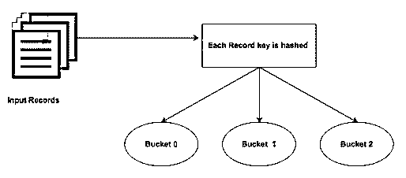

# 配置单元命令

> 原文：<https://www.educba.com/hive-command/>

## 配置单元命令简介

Hive command 是一个数据仓库基础设施工具，位于 Hadoop 之上，用于汇总大数据。它处理结构化数据。它使得数据查询和分析更加容易。Hive 命令也称为“读取模式”它不会在加载数据时验证数据，只有在发出查询时才会进行验证。Hive 的这一特性使得它在初始加载时速度很快。这就像在没有任何约束或检查的情况下复制或简单地移动文件一样。它最早是由脸书发明的。Apache Software Foundation 后来采用了它，并对它进行了进一步的开发。

### 配置单元命令的组件

hive 命令的组成如下所示:

<small>Hadoop、数据科学、统计学&其他</small>

图片来源:https://www.developer.com/

### 配置单元命令的功能

以下是讨论的一些功能:

1.  在 Hadoop 中，Hive 存储是原始的和经过处理的数据集。
2.  它是为在线事务处理(OLTP)而设计的。 [OLTP 是一种](https://www.educba.com/what-is-oltp/)系统，能够在非常短的时间内处理大量数据，不依赖于单个服务器。
3.  它快速、可扩展且可靠。
4.  这里提供的 SQL 类型查询语言称为 HiveQL 或 HQL。这使得 ETL 任务和其他分析更加容易。

图片来源:- [谷歌](https://www.google.co.in/search?rlz=1C1GCEU_enIN820IN820&biw=1280&bih=579&tbm=isch&sa=1&ei=h2oKXKLHLMmbgAaKxawg&q=hive+big+data&oq=hive+big+da&gs_l=img.3.0.0j0i8i30j0i24l5.6913.8076..9017...0.0..0.431.2937.4-7......1....1..gws-wiz-img.......0i67j0i5i30j0i10i24.B3OEm_cGamA#imgrc=Vt6-wy5sjahK2M:)

**Hive 命令也有一些限制，如下所示:**

1.  配置单元不支持子查询。
2.  Hive 当然支持重写，但遗憾的是不支持删除和更新。
3.  Hive 不是为 OLTP 设计的，而是为它而用的。

要进入蜂巢的交互式外壳:

`$HIVE_HOME/bin/hive`

### 基本配置单元命令

基本命令如下所述。

**1。Create:** 这将在配置单元中创建新的数据库。

**2。drop:**drop 将从配置单元中删除一个表

**3。Alter:** Alter 命令将帮助你重命名表或表列。

例如:

`ALTER TABLE employee RENAME TO employee1;`

**4。Show:** show 命令将显示驻留在配置单元中的所有数据库。

**5。Describe:** Describe 命令将帮助你获得关于表的模式的信息。

### 中间配置单元命令

Hive 根据列将一个表划分成不同的相关分区。使用这些分区，查询数据变得更加容易。这些分区被进一步划分为桶，以便高效地对数据运行查询。

换句话说，存储桶通过计算查询中提到的关键字的散列码将数据分布到集群集中。

#### 1.添加分区

添加分区可以通过改变表来完成。假设您有一个“EMP”表，其中包含 Id、姓名、薪水、部门、职务和 yoj 等字段。

`ALTER TABLE employee
ADD PARTITION (year=’2012’)
location '/2012/part2012';`

#### 2.重命名分区

`ALTER TABLE employee PARTITION (year=’1203’)
RENAME TO PARTITION (Yoj=’1203’);`

#### 3.删除分区

`ALTER TABLE employee DROP [IF EXISTS] PARTITION (year=’1203’);`

#### 4.关系运算符

关系运算符由一组特定的运算符组成，有助于获取相关信息。

例如:假设您的“EMP”表如下所示:

让我们执行一个 Hive 查询，它将获取工资高于 30000 的雇员。

`SELECT * FROM EMP WHERE Salary>=40000;`

#### 5.算术运算符

这些运算符有助于对操作数执行算术运算，并且总是返回数字类型。

例如:将两个数字相加，如 22 和 33

`SELECT 22+33 ADD FROM temp;`

#### 6.逻辑算子

这些操作符将执行逻辑运算，这些逻辑运算总是返回 True/False。

`SELECT * FROM EMP WHERE Salary>40000 && Dept=TP;`

### 高级配置单元命令

高级命令如下所述。

#### 1.视角

Hive 中的视图概念类似于 SQL。可以在执行 SELECT 语句时创建视图。

示例:

`CREATE VIEW EMP_30000 AS
SELECT * FROM EMP
WHERE salary>30000;`

#### 2.将数据加载到表中

`Load data local inpath 'https://cdn.educba.com/home/hduser/Desktop/AllStates.csv' into table States;`

这里的“States”是 Hive 中已经创建的表。

[https://www.tutorialspoint.com/hive/](https://www.tutorialspoint.com/hive/hive_partitioning.htm)

Hive 有一些内置的函数，可以帮助你以更好的方式获取结果。

像圆形，地板，BIGINT 等。

#### 3.加入

Join 子句有助于根据相同的列名连接两个表。

示例:

`SELECT c.ID, c.NAME, c.AGE, o.AMOUNT
FROM CUSTOMERS c JOIN ORDERS o
ON (c.ID = o.CUSTOMER_ID);`

Hive 支持各种[连接:左外连接、右外连接、全外连接。](https://www.educba.com/joins-in-hive/)

### 提示和技巧

Hive 使数据处理变得简单、直接和可扩展，用户不必太关注优化 Hive 查询。但是在编写 Hive query 时注意一些事情，肯定会在管理工作量和节省资金方面带来巨大的成功。以下是关于这方面的一些建议:

#### 1.分区和桶

它是一个大数据工具，可以对大型数据集进行查询。但是，在不了解域的情况下编写查询可能会在 Hive 中带来很大的分区。

如果用户知道数据集，那么相关的和频繁使用的列可以被分组到同一个分区中。这将有助于以更快、更低效率的方式运行查询。

最终，映射器和 I/O 操作的数量也会减少。

图:分区

图片来源:[谷歌图片](https://www.google.co.in/search?rlz=1C1GCEU_enIN820IN820&biw=1280&bih=530&tbm=isch&sa=1&ei=NKELXO-aMMmmaOHmoNgN&q=partition+and+bucketing+in+hive&oq=partition+and+b&gs_l=img.3.1.0i8i30j0i24l6.22127.25052..27733...0.0..0.437.6235.4-15......1....1..gws-wiz-img.......0j35i39j0i67j0i30.v_iuyG_IbXg#imgrc=PFuuqRVPXKPaHM:)

图:桶装

图片来源:- [谷歌图片](https://www.google.co.in/search?rlz=1C1GCEU_enIN820IN820&biw=1280&bih=530&tbm=isch&sa=1&ei=NKELXO-aMMmmaOHmoNgN&q=partition+and+bucketing+in+hive&oq=partition+and+b&gs_l=img.3.1.0i8i30j0i24l6.22127.25052..27733...0.0..0.437.6235.4-15......1....1..gws-wiz-img.......0j35i39j0i67j0i30.v_iuyG_IbXg#imgrc=b__CKDyCJ1K3BM:)

#### 2.并行执行

它分多个阶段运行查询。在某些情况下，这些阶段可能依赖于其他阶段，因此一旦前一阶段完成，就无法开始。但是，独立任务可以并行运行，以节省总体运行时间。要在配置单元中启用并行运行:

`set hive.exec.parallel=true;`

因此，这将提高集群利用率。

#### 3.分块抽样

对表中的数据进行采样将允许探索对数据的查询。

尽管存在偏差，但我们更希望对数据集进行更随机的采样。块采样带有各种强大的语法，有助于以各种方式对数据进行采样。

取样可用于寻找大约。来自数据集的信息，如起点和终点之间的平均距离。

查询 1%的大数据将会给出接近完美的答案。探索变得更加容易和有效。

### 结论

Hive 是在 HDFS 之上的更高层次的抽象，它提供了灵活的查询语言。它有助于以更简单的方式查询和处理数据。

它可以与其他大数据元素结合在一起，以成熟的方式利用其功能。

### 推荐文章

这是一个 Hive 命令的指南。在这里，我们讨论了 Hive 命令的组件、特性、基本、高级和中级以及提示和技巧。您也可以阅读以下文章，了解更多信息——

1.  [蜂巢面试问题](https://www.educba.com/hive-interview-questions/)
2.  [蜂巢与色调——六大有用对比](https://www.educba.com/hive-vs-hue/)
3.  [Tableau 命令](https://www.educba.com/tableau-commands/)
4.  [Adobe Photoshop 命令](https://www.educba.com/photoshop-commands/)
5.  [在配置单元中使用 ORDER BY 函数](https://www.educba.com/hive-group-by/)
6.  [逐步下载安装 Hive】](https://www.educba.com/hive-installation/)
7.  [在蜂箱中分桶|示例|功能](https://www.educba.com/bucketing-in-hive/)

