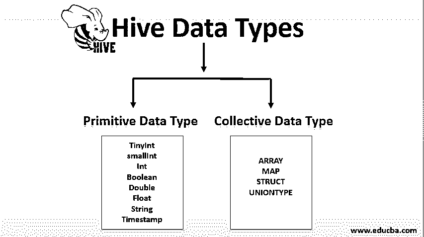
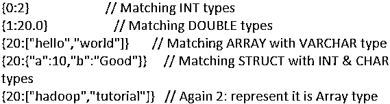

# 配置单元数据类型

> 原文：<https://www.educba.com/hive-data-types/>

## 什么是 Hive 数据类型？

在了解 hive 数据类型之前，我们先来学习一下 Hive。Hive 是 Hadoop 的一种数据仓库技术。Hadoop 是大数据平台的数据存储和处理部分。Hive 坚持其 sequel 数据处理技术的立场。像其他 sequel 环境一样，通过 sequel 查询可以到达 hive。hive 提供的主要服务是数据分析、即席查询和从延迟角度对存储数据的总结，并且查询量更大。

### 配置单元数据类型

数据类型分为两种类型:

<small>Hadoop、数据科学、统计学&其他</small>

*   原始数据类型
*   集体数据类型

#### 1.原始数据类型

原始手段古老而古老。所有列为原语的数据类型都是遗留数据类型。下面列出了重要的原始数据类型区域:

| **类型** | **大小(字节)** | **例子** |
| TinyInt | One | Twenty |
| 斯莫列特 | Two | Twenty |
| （同 Internationalorganizations）国际组织 | Four | Twenty |
| 比吉斯本 | Eight | Twenty |
| 布尔代数学体系的 | 布尔值真/假 | 错误的 |
| 两倍 | Eight | 10.2222 |
| 浮动 | Four | 10.2222 |
| 线 | 字符序列 | AcceleratedBusinessCollectionandDelivery（美国邮局采用的）加快收寄投递系统 |
| 时间戳 | 整数/浮点/字符串 | 2/3/2012 12:34:56:1234567 |
| 日期 | 整数/浮点/字符串 | 2/3/2019 |

配置单元数据类型是使用 JAVA 实现的

例如:Java Int 用于实现这里的 Int 数据类型。

*   配置单元中不支持字符数组。
*   Hive 依靠分隔符来分隔其字段，而 hive on 与 Hadoop 的协调允许提高写性能和读性能。
*   在[配置单元数据库](https://www.educba.com/hive-database/)中不需要指定每列的长度。
*   字符串可以用双引号(")或单引号(')括起来。
*   在 hive 的一个更新的[版本中，引入了 Varchar 类型，它们形成了一个 span 说明符(在 1 和 65535 之间)，所以对于一个字符串来说，这是它所能容纳的最大长度的值。当插入超过该长度的值时，该值最右边的元素将被截断。字符长度是一个分辨率，其码位数由字符串控制。](https://www.educba.com/hive-versions/)
*   所有的整数文字(TINYINT、SMALLINT、BIGINT)基本上都被认为是 INT 数据类型，只有长度超过实际的 INT 级别时，才会被转换为 BIGINT 或任何其他相应的类型。
*   与 DOUBLE 类型相比，Decimal 文字提供了定义的值和更好的浮点值集合。在这里，数值以精确的形式存储，但在 double 的情况下，它们并不精确地存储为数值。

**日期值转换过程**

| **进行铸造** | **结果** |
| cast(日期作为日期) | 相同的日期值 |
| 强制转换(时间戳作为日期) | 本地时区用于计算此处的年/月/日值，并打印在输出中。 |
| 强制转换(字符串作为日期) | 由于这种转换，将提示相应的日期值，但我们需要确保字符串的格式为“YYYY-MM-DD”。当字符串值无法进行有效匹配时，将返回 Null。 |
| cast(日期作为时间戳) | 根据当前的本地时区，将为此转换过程创建一个时间戳值 |
| 强制转换(字符串形式的日期) | YYYY-MM-DD 是年/月/日值的格式，输出将是字符串格式。 |

### 2.集合数据类型

配置单元中有四种集合数据类型；它们也被称为复杂数据类型。

*   排列
*   地图
*   结构
*   联合类型

**1。ARRAY:** 可以索引的常见类型的元素序列，索引值从零开始。

**代码:**

`array (‘anand’, ‘balaa’, ‘praveeen’);`

**2。MAP:** 这些是使用键值对声明和检索的元素。

**代码:**

`‘firstvalue’ -> ‘balakumaran’ , ‘lastvalue’ -> ‘pradeesh’ is represented as map(‘firstvalue’, ‘balakumaran’, ‘last’, ‘PG’). Now ‘balakumaran ‘ can be retrived with map[‘first’].`

**3。STRUCT:** 与 C 中一样，STRUCT 是一种数据类型，它累积了一组被标记的字段，并且可以是任何其他数据类型。

**代码:**

`For a column D of type STRUCT {Y INT; Z INT} the Y field can be retrieved by the expression D.Y`

**4。UNIONTYPE:** Union 可以保存任意一种指定的数据类型。

**代码:**

`CREATE TABLE test(col1 UNIONTYPE<INT, DOUBLE, ARRAY<VARCHAR>>)`

**输出:**

下面列出了复杂数据类型中使用的各种分隔符，

| **分隔符** | **代码** | **描述** |
| \n | \n | 记录或行分隔符 |
| ^A (Ctrl+A) | \001 | 字段定界符 |
| ^B  (Ctrl+B) | \002 | struts 和数组 |
| ^C (Ctrl+C) | \003 | 地图的 |

### 复杂数据类型示例

下面是复杂数据类型的示例:

**1。表格创建**

**代码:**

`create table store_complex_type (
emp_id int,
name string,
local_address STRUCT<street:string, city:string,country:string,zipcode:bigint>,
country_address MAP<STRING,STRING>,
job_history array<STRING>)
row format delimited fields terminated by ','
collection items terminated by ':'
map keys terminated by '_';`

**2。样表数据**

**代码:**

`100 , Shan , 4th : CHN : IND : 600101 , CHENNAI_INDIA , SI : CSC
101 , Jai ,1th : THA : IND : 600096 , THANJAVUR_INDIA , HCL : TM
102 , Karthik , 5th : AP : IND : 600089 , RENIKUNDA_INDIA ,CTS : HCL`

**3。加载数据**

**代码:**

`load data local inpath 'https://cdn.educba.com/home/cloudera/Desktop/Hive_New/complex_type.txt' overwrite into table store_complex_type;`

**4。查看数据**

**代码:**

`select emp_id, name, local_address.city, local_address.zipcode, country_address['CHENNAI'], job_history[0] from store_complex_type where emp_id='100';`

### 结论

作为一个关系数据库和一个后续连接，HIVE 以一种非常复杂的方式提供了普通 SQL 数据库的所有关键属性，使其成为 Hadoop 中更有效的结构化数据处理单元之一。

### 推荐文章

这是一个关于配置单元数据类型的指南。这里我们讨论两种类型的 hive 数据类型，并给出适当的例子。您也可以浏览我们的其他相关文章，了解更多信息——

1.  什么是蜂巢？
2.  [蜂巢替代品](https://www.educba.com/hive-alternatives/)
3.  [蜂巢面试问题](https://www.educba.com/hive-interview-questions/)
4.  [PL/SQL 数据类型](https://www.educba.com/pl-sql-data-types/)

