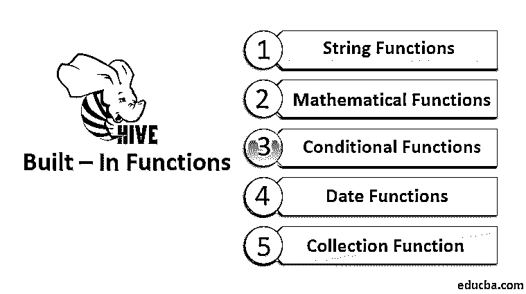

# 配置单元内置函数

> 原文：<https://www.educba.com/hive-built-in-functions/>

## Hive 内置函数简介

构建函数是为了在大型数据集和表上执行不同的分析要求和操作，如数学、逻辑、算术和关系。当我们不得不多次重复使用类似的操作时，就会用到函数。在这个先进的大数据世界中，要处理和处理巨大的数据集，编写 MapReduce 程序变得很困难。因此，2010 年 10 月，在 Apache Hadoop 之上引入了 Hive Query Language (HQL ),使用它我们可以轻松地运行查询，类似于 SQL。hql 进一步在内部转换[为 Mapreduce 程序](https://www.educba.com/what-is-mapreduce/)以产生输出。在这个主题中，我们将讨论 Hive 内置函数。

配置单元功能大致分为两类:

<small>Hadoop、数据科学、统计学&其他</small>

1.  内置函数
2.  用户定义的函数

### Hive 的内置函数

内置函数是预定义的，在 Hive 中随时可用。它们分类如下:

#### 1.字符串函数

用于字符串操作和转换。

| **功能名称** | **返回类型** | **描述** | **例子** |
| substr(string，int <pos>，int <len>)</len></pos> | 线 | 它返回从指定起始位置到指定长度的字符串 | substr('Hive query '，5，5)产生' query ' |
| rtrim(字符串 X) | 线 | 它返回一个没有右前导空格的字符串 | rtrim('Hello ')的结果是' Hello ' |
| ltrim(string X) | 线 | 它返回不带左前导空格的字符串 | ltrim(' Hello ')的结果是' Hello ' |
| 反向(字符串 X) | 线 | 它返回 X 的反向字符串 | 反向(“hello”)导致“olleh” |
| rpad(字符串 X，int <len>，字符串)</len> | 线 | 它返回一个右填充字符串，长度为 | rpad('Hello '，3，' hi ')的结果是' Hello hi hi hi ' |
| lpad(字符串 X，int <len>，字符串)</len> | 线 | 它返回一个长度为<len>的左填充字符串</len> | lpad('Hello '，3，' Hi ')的结果是' Hi Hi Hi Hello ' |
| split(字符串 X，字符串 pat) | 排列 | 在围绕指定模式拆分字符串后，它返回一个字符串数组 | split("A，B，C，D "，"，")产生['A '，B '，' C '，' D'] |
| 长度(字符串 X) | 整数 | 它返回字符串 X 的长度 | 长度(' Bigdata ')的结果是 7 |
| concat(string X,String Y) | 线 | 它返回 X 和 Y 的串联字符串 | concat('Hello '，' World ')结果为' HelloWorld ' |

#### 2.数学函数

用于应用数学运算，如舍入、天花板、地板等。而不是创建 UDF。

| **功能名称** | **返回类型** | **描述** | **例子** |
| 圆形(双 X) | 两倍 | 它返回 X 的舍入值 | 第一轮(29.5)的结果是 30 |
| round(双 X，整数 d) | 两倍 | 它返回 X 到 d 位小数的舍入值 | round(29.3456，2)得出 29.34 |
| 天花板(双 X) | 两倍 | 它返回一个等于或大于 X 的最小 BIGINT 值 | ceil(20.5555)得出 21 |
| 地板(双 X) | 两倍 | 它返回等于或大于 X 的最大 BIGINT 值 | ceil(20.5555)的结果是 20 |
| 兰德() | 两倍 | 它返回 0 到 9 之间的随机数 | rand()得出 rand(0-9) |
| abs(双 X) | 两倍 | 它返回数字 X 的绝对值 | abs(-25)导致 25 |
| pow(双 X，双 Y) | 两倍 | 它返回 X 值的 Y 次方 | pow(2，3)的结果是 8 |
| exp(双 X) | 两倍 | 它返回 X 的指数值 | exp(2)得出 7.389 |

#### 3.条件函数

用于检查表达式的真或假，并返回相应的结果。

| **功能名称** | **返回类型** | **描述** | **例子** |
| isnull(X) | 布尔代数学体系的 | 如果 X 为空，则返回 TRUE，否则返回 false | isnull('NULL ')返回 TRUE |
| isnotnull(X) | 布尔代数学体系的 | 如果 X 不为空，则返回 TRUE，否则返回 false | isnotnull('NULL ')返回 FALSE |
| nvl(arg X、arg Y) | 线 | 如果参数 X 为空，则返回参数 Y，否则返回参数 X | nvl('Null '，'值为 NULL ')导致'值为 NULL ' |
| if(布尔测试条件，T 值真，T 值假或空) | 英语字母表中第二十个字母 | 当测试条件为真时返回真，否则返回假或空 | if (2=2，“真”，“假”) |
| 合并(X，Y) | (任何) | 它从列表中返回第一个非空值{我对此有疑问—它会返回第一个值还是所有非空值？} | coalesce(null，null，null，1，5，null，null，6)得出 1 |

#### 4.日期函数

用于执行日期操作和日期类型转换。

| **功能名称** | **返回类型** | **描述** | **例子** |
| 当前日期 | 日期 | 它返回查询执行的当前日期 | current_date()返回今天的日期 |
| unix_timestamp() | 比吉斯本 | 它以秒为单位返回查询执行的当前 unix 时间戳 | unix_timestamp()返回当前 unix 时间戳 |
| 年份(字符串日期) | （同 Internationalorganizations）国际组织 | 它返回日期中的年份部分 | year('1994-11-24 ')返回 1994 年 |
| 季度(字符串日期) | （同 Internationalorganizations）国际组织 | 它返回日期中一年的第四个季度 | quarter('1994-11-24 ')得出 4 |
| 月份(字符串日期) | （同 Internationalorganizations）国际组织 | 它返回日期的月份部分 | month('1994-11-24 ')得出 11 |
| 小时(字符串日期) | （同 Internationalorganizations）国际组织 | 它返回时间戳的小时部分 | hour('1994-11-24 12:45:23 ')得出 12 |
| 分钟(字符串日期) | （同 Internationalorganizations）国际组织 | 它返回时间戳的分钟部分 | year('1994-11-24 12:45:23 ')得出 45 |
| 截止日期() | 线 | 它返回时间戳字符串的日期部分 | to_date()返回日期部分 |
| date_sub(字符串日期，整数天) | 线 | 它返回该日期减去的天数 | date_sub('1994-11-24 '，20)得出' 1994-11-04 ' |
| 月 _ 之间(日期 1，日期 2) | 两倍 | 它返回日期 1 和日期 2 之间的月数。} | months_between('1994-11-24 '，' 1994-11-04 ')得出 20 |

#### 5.收集功能

用于转换和检索集合类型的一部分，如映射、数组等。

| **功能名称** | **返回类型** | **描述** | **例子** |
| 大小(地图 | （同 Internationalorganizations）国际组织 | 它返回映射中的元素总数 | size(['a':2，' b':6])得出 2 |
| 大小(数组 | （同 Internationalorganizations）国际组织 | 它返回数组中元素的总数 | size([1，3，4，7])得出 4 |
| array_contains(数组 | 布尔代数学体系的 | 如果数组包含值，则返回 true | array_contains([1，3，9，8，5，4，7]，5)返回 TRUE |
| map_keys(map <k>)</k> | 数组 | 它返回一个无序的映射键数组 | map_keys(['a':2，' b':6，' c':1])返回['b '，' c '，' a'] |
| map_valuess(map <k>)</k> | 数组 | 它返回地图值的无序数组 | map_keys(['a':2，' b':6，' c':1])返回[1，6，2] |
| sort_array(数组 | 数组 | 它返回给定数组的排序数组 | sort_array([1，3，9，8，5，4，7])得出[1，3，4，5，7，8，9] |

### 结论

到目前为止，我们已经讨论了 Hive 中不同的内置函数。相比 MapReduce，Hive 更方便省时。任何一个有基本 SQL 知识的人都可以轻松编写 hql，而不是复杂的 MapReduce 程序进行数据处理。

### 推荐文章

这是一个 Hive 内置函数的指南。在这里，我们将讨论在 Hive 中预定义并随时可用的内置函数。您也可以阅读以下文章，了解更多信息——

1.  [Hive 字符串函数](https://www.educba.com/hive-string-function/)
2.  [配置单元命令](https://www.educba.com/hive-command/)
3.  [蜂巢架构](https://www.educba.com/hive-architecture/)
4.  [Hive Order By](https://www.educba.com/hive-order-by/)

