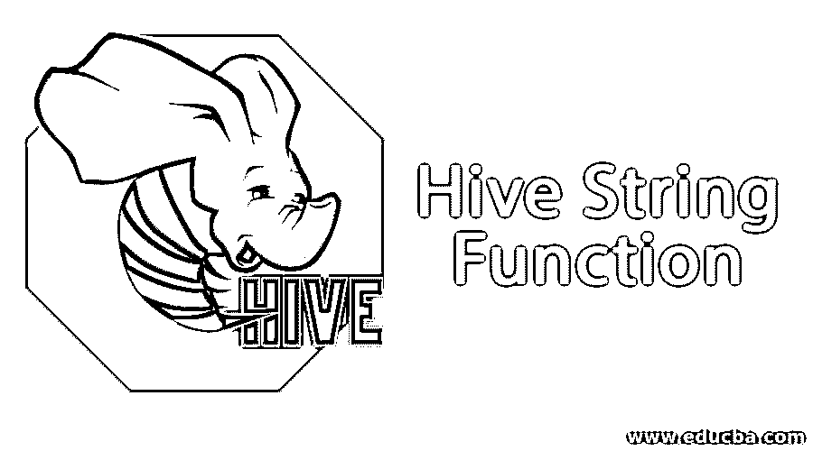
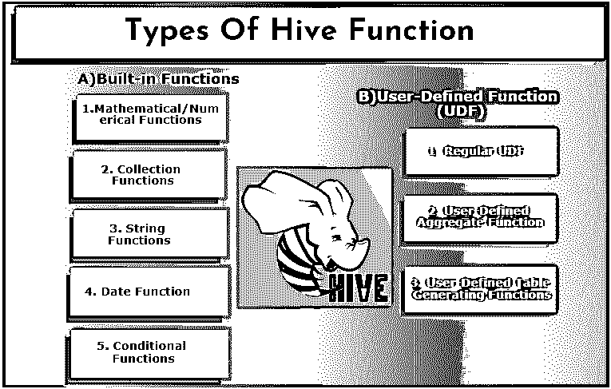

# 蜂巢功能

> 原文：<https://www.educba.com/hive-function/>

## 什么是蜂巢功能？

众所周知，如今 Hadoop 是大数据领域的通用技术之一。Hadoop 有能力处理大型数据集，但随着数据成比例增长，编写 map-reduce 程序变得很困难。为了执行 SQL 查询，HDFS 引入了一种这样的技术，叫做 apache Hive，由脸书创建。数据分析师高度使用 Hive。它们被部署用于三个功能，即:数据汇总、分布式文件上的数据分析和数据查询。Hive 提供类似 SQL 的查询，称为 SQL 高级查询语言支持 DML，用户定义的函数。Hive compiler 在内部将该查询转换为 map-reduce 作业，这简化了 Hadoop 编写复杂程序的工作。我们可以在数据仓库、数据可视化和特别分析等应用中找到一个蜂巢。主要优势是他们利用了 SQL 知识，这是数据科学家和软件专业人员的基本技能。

### 详细介绍不同的蜂箱功能

Hive 支持其他数据库系统中没有的不同数据类型。它包括映射、数组和结构。Hive 有一些内置函数来执行一些特殊用途的数学和算术函数。配置单元中的功能可以分为以下几类。它们是内置函数和用户定义函数。

<small>Hadoop、数据科学、统计学&其他</small>

#### a)内置函数

这些函数从配置单元表中提取数据并处理计算。一些内置函数包括:

##### 1.数学/数字函数

这些函数主要用于数学计算。这些函数在 SQL 查询中使用。

| **功能名称** | **例子** | **描述** |
| **ABS** (双 x) | Hive >从 tmp 中选择 ABS(-200)； | 它将返回一个数字的绝对值。 |
| **天花板**(双 x) | Hive >从 tmp 中选择 cell(8.5)； | 它将获取大于或等于值 x 的最小整数。 |
| **Rand()，rand** (int seed) | Hive > select Rand () from tmp;兰特(0-9) | 它返回一个随机数，取决于种子值，生成的随机数将是确定的。 |
| **功率**(双 x，双 y) | Hive >从 tmp 中选择 Pow (5，2)； | 它返回 x 值的 y 次方。 |
| **楼层**(双 y) | Hive >从 tmp 中选择楼层(11.8)； | 它返回小于或等于给定值 y 的最大整数。 |
| **EXP** (双 a) | hive > select Exp(30)from tmp； | 它将返回指数值 30。自然算法值。 |
| **PMOD** (int a，int b) | Hive >从 tmp 中选择 PMOD (2，4)； | 它给出了数的正模数。 |

##### 2.集合函数

将所有元素一起转储并返回单个元素取决于包含的数据类型。

| **功能名称** | **例子** | **描述** |
| **地图 _ 数值**(地图< K.V >) | Hive >选择映射值(' hi '，45) | 它获取无序的数组元素。 |
| **大小**(地图< K.V >) | 配置单元>选择大小(地图) | 返回数据类型映射中的元素数量。 |
| **数组 _ 包含**(数组 b) | 配置单元>选择数组包含(a [10]) | 如果数组包含值，则返回 TRUE。 |
| **排序 _ 数组**(数组 a) | Hive>select sort_array ({10，3，6，1，7}) | 根据数组元素的自然顺序对输入数组进行升序排序，并返回值。 |

##### 3.字符串函数

使用字符串函数可以出色地进行数据分析。

| **分割**(弦 s，弦 pat) | Hive > select split(' educba ~ hive ~ Hadoop，' ~ ')输出:["educba "，" hive "，" Hadoop"] | 它拆分 pat 表达式周围的字符串并返回一个数组。 |
| **加载**(字符串 s，整数长度，字符串填充) | Hive >选择加载(' EDUCBA '，6，' H ') | 它返回以字符串长度进行右填充的字符串。(填充字符)。 |
| **长度**(字符串 str) | 配置单元>选择长度(' educba ') | 这个函数返回字符串的长度。 |
| **Rtrim** (字符串 a) | Hive > select rtrim(‘TOPIC’);输出:“主题” | 它通过从右端修剪空格来返回结果。 |
| **Concat** (字符串 m，字符串 n) | Hive > select concat ('data '，' ware ')结果:数据件 | 它通过连接两个字符串来产生字符串；这可以接受任意数量的输入。 |
| **反转**(字符串 s) | 配置单元>选择反向(“移动”) | 返回反向字符串的结果。 |

##### 4.日期函数

有必要在配置单元中设置数据格式，以防止输出中出现空错误。有必要具备日期兼容性，以便与 hive 引入的日期函数一起使用。

| **Unix_timestamp** (字符串日期，字符串模式) | hive > select Unix _ timestamp(' 2019-06-08 '，' yyyy-mm-DD ')；结果:124576 400 用时:0.146 秒 | 该函数将日期返回为特定格式，并返回日期和 Unix 时间之间的秒数。 |
| **Unix_timestamp** (字符串日期) | hive > select Unix _ timestamp(' 2019-06-08 09:20:10 '，' yyyy-mm-DD ')； | 它将“yyyy-MM-dd HH:mm: ss”格式的日期返回到 Unix 时间戳中。 |
| **小时**(字符串日期) | Hive >选择小时(' 2019-06-08 09:20:10 ')；结果:09 小时 | 它返回时间戳小时。 |

##### 5.条件函数

| **If** (布尔测试，T 值为真，T 为假) | Hive>select IF(1=1，'真'，'假')
as IF _ CONDITION _ TEST； | 它检查条件值是否为 true 返回 1，false 返回 0。 |
| **不为空** (b) | Hive >Select 不为空(null)； | 这将提取 not null 语句。如果 null 返回 false。 |
| **合并**(值 1，值 2) | 示例:hive > select coalesce (null，Null，4，Null，6)。它返回 4。 | 它首先从值列表中获取非空值。 |

#### b)用户定义的函数(UDF)

Hive 根据客户端需求使用用户特定的函数，它是用 [java 编程](https://www.educba.com/java-programming-language-features/)编写的。它由两个接口实现，即简单 API 和复杂 API。它们是从配置单元查询中调用的。三种类型的 UDF:

**1。常规 UDF:** 它在只有一行的表上工作。它是通过创建一个 java 类，然后将它们打包成一个. jar 文件来创建的；下一步是用配置单元类路径进行验证。然后最终在 hive 查询中执行它们。

**2。用户自定义聚合函数:**他们通过实现五个方法 init()、iterate()、partial()、merge()、terminate()来使用 avg/ mean 这样的聚合函数。

**3。用户自定义表生成函数:**对表中的单行起作用，结果为多行。

### 结论

总之，通过本文，我们已经详细了解了如何在带有内置函数和用户定义函数的 hive 平台中工作。大多数组织都有程序员和 SQL 开发人员来处理服务器端流程，但是 apache hive 是一个强大的工具，可以帮助他们[使用 Hadoop 框架](https://www.educba.com/hadoop-framework/)，而无需事先了解程序和 map-reduce。Hive 帮助新用户无障碍地开始和探索数据分析。

### 推荐文章

这是一个关于 Hive 函数的指南。这里我们讨论基本概念，两种不同类型的功能和 Hive 中的子功能。您也可以浏览我们推荐的其他文章，了解更多信息——

1.  [配置单元中的顶级字符串函数](https://www.educba.com/hive-string-function/)
2.  [蜂巢面试问题](https://www.educba.com/hive-interview-questions/)
3.  [蜂巢架构简介](https://www.educba.com/hive-architecture/)
4.  [Hive Order By](https://www.educba.com/hive-order-by/)

