# 蜂箱投放表

> 原文：<https://www.educba.com/hive-drop-table/>

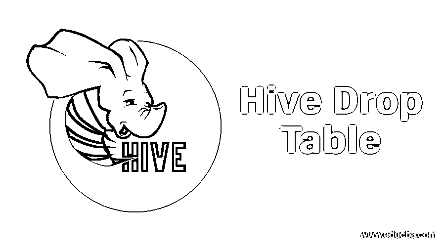

## 蜂箱投放台简介

关键词“DROP”是指删除。对于数据的删除，我们要求数据存在于配置单元中。

在 Hadoop 中，我们有两个功能:

<small>Hadoop、数据科学、统计学&其他</small>

1.  数据存储
2.  数据处理

对于数据存储，HDFS (Hadoop 分布式文件系统)开始出现。现在，当我们说我们在 hive 表中有数据时，它意味着两件事:

1.  数据在 HDFS
2.  我们在 HDFS 文件上创建了一个配置单元表，并将 HDFS 文件的数据加载到配置单元表中。

基本上，为了让 hive drop 表拥有数据，数据文件是一个先决条件。在本文中，我们将看到如何在配置单元中删除表，删除表时会发生什么，以及与在配置单元中删除表相关的所有事情。

### 配置单元中删除表的类型

在配置单元中，有两种类型的表:

1.  内部表或托管表
2.  外部表或非托管表

#### 托管表/内部表

1.  在 Hive 中， **"** 用户/Hive/仓库 **"** 为默认目录。默认情况下，内部表存储在该目录中。创建表时，我们不必手动提供位置。
2.  “删除表”命令永久删除数据。
3.  Hive 管理托管表的所有安全性。

“用户/配置单元/仓库”目录中已经有一个名为“代码”的表。

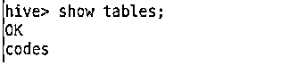

要检查现有的表是托管的还是非托管的，我们可以使用下面的命令:

**命令语法:**

描述格式化的 table _ name

**输出:**

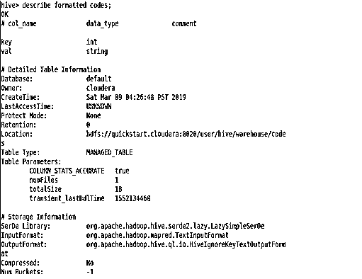

让我们看看“代码”表中的数据。

首先，使用 hive 命令-

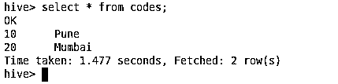

第二，使用 Hue (Hadoop 用户体验一个 Web UI)

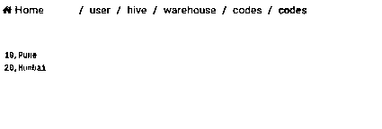

**删除命令:**删除表格 table _ name

**输出:**

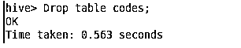

现在，如果我想从“代码”中选择数据，它会给我一个错误，因为该表已被删除。

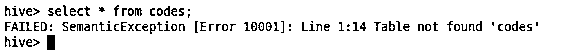

此外，它将无法在默认目录中看到该表

"用户/配置单元/仓库。"

观察这里，

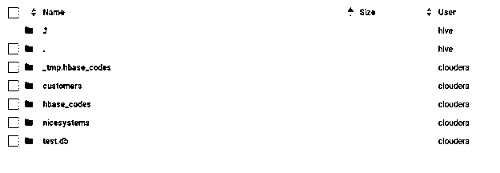

#### 非托管表/外部表

1.  外部表，我们需要在 create table 命令中使用关键字“location”来提供存储该表的路径。

**例如:**

创建外部表 stg_s2_json.products

(产品编号字符串、产品名称字符串、描述字符串、有效字符串、创建日期字符串、更新日期字符串)行格式分隔字段以'，'结尾

LOCATION '/user/data/hive/stg _ S2 _ JSON . db/products '；

1.  配置单元仅删除元数据。数据是永久的。
2.  有权访问 HDFS 的任何人都可以使用这些表，因此他们需要在文件夹级别管理安全性。

为了理解[外部表](https://www.educba.com/external-table-in-hive/)的删除，我们将使用“产品”表。

让我们检查一下这个表是内部的还是外部的。再次使用“描述格式化的表名”命令。

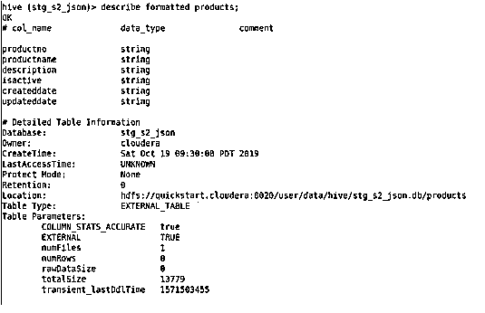

观察选择命令中的“极限 10”。表产品包含以下数据:

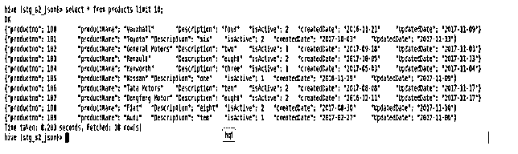

用色相来检查，看起来是这样的:

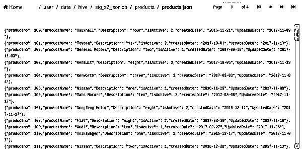

让我们看看当我们删除这个表时会发生什么:

**语法:**

`Drop table table_name;`

**输出:**

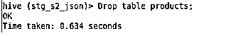

现在，如果试图检索表的数据，它会抛出一个错误。

首先，在终端上使用“select”命令，它将向我抛出一个错误，这意味着外部表的元数据被删除。

**在此观察错误:**

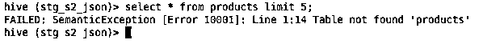

其次，检查数据的状态，文件“products.json”仍然存在于 HDFS，这意味着数据是永久的。

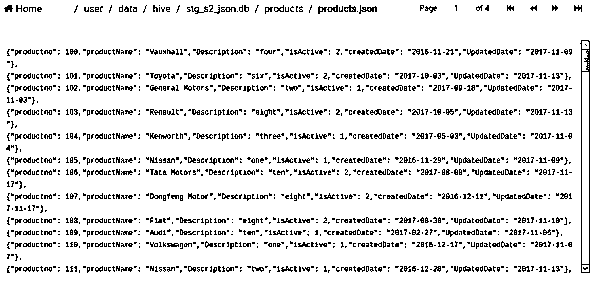

### 结论

我将使它变得简单，并为您提供两种表格的要点。你决定哪种类型适合你的要求。

| **内部表** | **外部表** |
| 也称为“托管表” | 也称为“非托管表” |
| 不需要提供位置，配置单元默认目录管理这些数据。 | 需要提供位置 |
| 删除表的元数据以及(数据是临时的) | Hive 将保持数据不变(数据是永久的) |
| hive 本身控制着表的安全性。 | 需要在文件夹级别管理安全性 |

### 推荐文章

这是一个蜂巢下降表的指南。在这里，我们分别讨论 Hive 中的 Drop Table 类型以及语法的简要概述。您也可以浏览我们推荐的其他文章，了解更多信息——

1.  [蜂巢架构](https://www.educba.com/hive-architecture/)
2.  [在配置单元中使用 Order By 函数](https://www.educba.com/hive-order-by/)
3.  [逐步下载和安装 Hive 的指南](https://www.educba.com/hive-installation/)
4.  [蜂房分区完整指南](https://www.educba.com/partitioning-in-hive/)
5.  [前 7 个配置单元版本](https://www.educba.com/hive-versions/)

