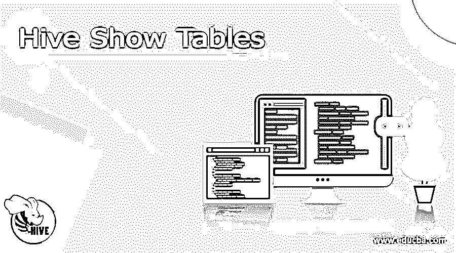
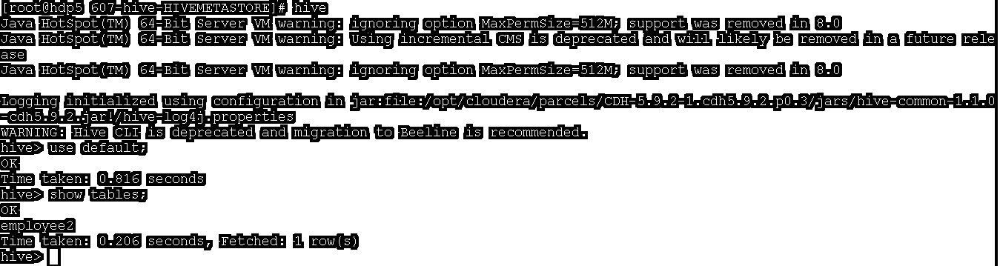
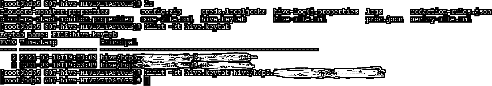
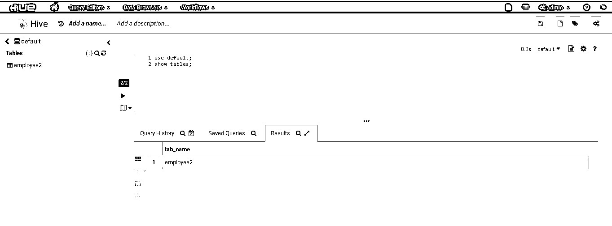
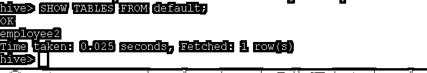

# 配置单元显示表

> 原文：<https://www.educba.com/hive-show-tables/>

## 蜂巢展示表简介

Hive 是 Hadoop 堆栈中非常重要的组件或服务。它将能够处理大量的数据，例如 TB 等。数据将存储在分布式管理器上。在 hive 中，实际数据将存储在 HDFS 层。它在 HDFS 数据的基础上提供 MySQL 解决方案。hive show tables 将打印与当前数据库相关的表的列表。但我们不能直接触发母舰上的命令。有一个特定的方式或与特定的客户端，我们可以触发命令。我们可以使用 JDBC 连接(JDBC 客户端)或 ODBC 连接(ODBC 客户端)。

### Useradd 命令的语法

useradd 命令的语法如下所示:

<small>Hadoop、数据科学、统计学&其他</small>

`show tables;`

*   **注意:**在运行 show table 命令之前，我们需要选择任何一个数据库，我们需要在这个数据库下找到表的列表。要在配置单元中选择数据库，我们需要使用或选择数据库。为此，我们需要使用命令，即“使用<数据库名称>
*   **show** :在 hive 服务中，我们需要使用一个不同的兼容关键字来访问特定的数据库或表，即 show。这将有助于获得有关 hive 环境中打印或显示相关操作的详细信息。在 show 关键字的帮助下，我们需要再提供一个关键字，即 tables。但是在触发 show tables 命令之前，我们需要选择数据库。(注意，我们已经更新了它的必要信息)。
*   **tables**:tables 也是一个与 show 关键字一起使用的关键字。这将有助于在屏幕上获得表格相关信息的列表。但是在运行之前，我们需要选择特定的数据库。

### 如何在 Hive 中显示表格？

在使用 hive 时，我们可以直接触发 hive 命令从 hive 中获取数据。配置单元仅存储元数据信息。但实际数据是在 HDFS 层面上出现的。HDFS 将以分布式格式管理实际的蜂箱数据。当我们需要在屏幕上打印配置单元表时。首先，我们需要启动与 hive 服务的连接。连接类型将是 JDBC 或 ODBC 类型。一旦连接建立，我们需要手动或其他方式触发命令。配置单元编译器将通过检查语法、元数据信息可用性等来检查触发器配置单元查询状态。如果查询是正确的，那么它将进一步处理，或者查询是不正确的，那么它将通过一个异常。一旦查询正确，它就会转换成逻辑格式。逻辑格式被称为 dag。dag 将被进一步分配给执行引擎。在 hive 中，我们使用不同的执行引擎。根据需求和性能类型，我们需要选择执行引擎。在 hive 中，我们可以使用 Tez 执行引擎或 MapReduce 执行引擎。与 MapReduce 执行引擎相比，Tez 执行引擎速度更快。这里，就映射器和执行器而言，Tez 执行引擎的工作方式与 MapReduce 执行引擎不同。一旦 dag 被分配给执行引擎，我们就需要资源来运行特定的 Dag。为此，我们需要请求纱线调度程序来分配资源。一旦纱线调度程序分配了资源，我们就可以在特定的 datanode 上运行必要的 Dag。完整的应用程序执行将由节点管理器处理。一旦查询被执行，我们就可以在显示屏上获得必要的数据。

### Hive Show Tables 命令的示例

下面给出了理解 hive show tables 命令的示例:

#### 1.Hive Show Tables:简单的 Hive 命令

在 hive 环境中，我们能够获得 hive 数据库下可用的表的列表。在列出表之前，我们需要首先选择数据库，然后只有我们可以列出必要的表。

**命令:**

`show tables;`

**说明:**根据上面的命令，我们可以得到 hive 表的列表，即 employee2 表。但是正如我们已经讨论过的，我们需要首先选择数据库。这里，我们选择了默认数据库。

**输出:**

#### 2.配置单元显示表:使用 Kerberos

在 Hadoop 环境中，我们有不同的安全级别，如 Kerberos、TLS、SSL 等。根据安全级别，我们需要采取相应的行动。

**命令:**

`kinit -kt hive.keytab <hive Kerberos principal name>`

**解释:**按照上面的命令，我们使用各自的 keytab 和主体对 hive 用户进行身份验证。一旦您使用 keytab 和 principal 进行了身份验证，您将能够生成 Kerberos 票证并能够触发 hive 查询。

**输出:**

#### 3.配置单元显示表:带色调

在 hive 服务中，我们也能够从 hue 中触发 show table 命令。

**命令:**

使用默认值；

显示表格；

**说明:**根据上述命令，我们在 hue UI 中触发该命令。它将给出一个图形视图。我们可以在 UI 上获得显示表的细节。

**输出:**

#### 4.配置单元显示表:通过选择数据库获取表详细资料

在 hive 服务中，我们可以在不选择 hive 数据库的情况下获得表的列表

**命令:**

`SHOW TABLES FROM DEFAULT;`

**说明:**根据上面的命令，我们正在获取默认数据库下的表列表。这里，我们首先选择数据库。我们直接触发上面的命令从数据库中获取表格。

**输出:**

### 结论

我们已经看到了“Hive show tables”的完整概念，带有适当的示例、解释和带有不同输出的命令。默认情况下，当我们需要获取表的列表时。我们需要首先选择数据库。我们已经看到了获取表信息的不同方法，如 CLI、hue 等。

### 推荐文章

这是一个蜂房展示表的指南。这里我们也讨论一下 hive 中的介绍和如何显示表格？并附有示例。您也可以看看以下文章，了解更多信息–

1.  [蜂巢表](https://www.educba.com/hive-table/)
2.  [可撤销的取消归档](https://www.educba.com/ansible-unarchive/)
3.  [蜂巢版本](https://www.educba.com/hive-versions/)
4.  [蜂巢时间戳](https://www.educba.com/hive-timestamp/)

