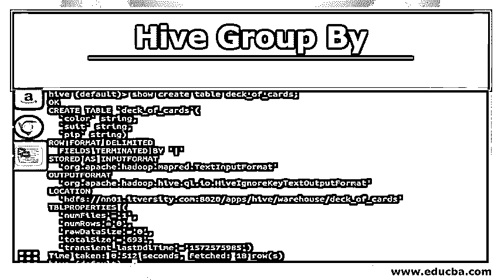
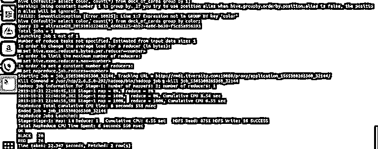
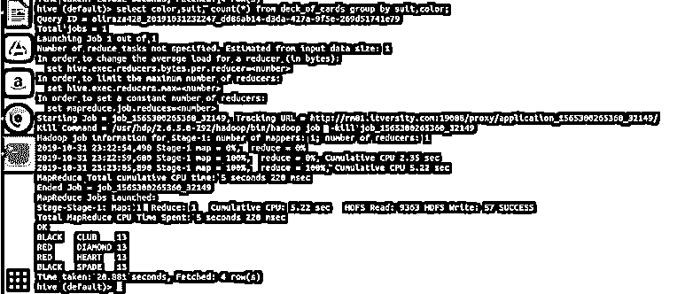
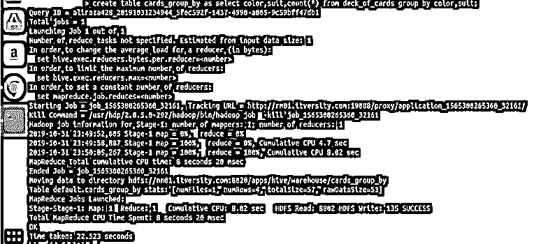
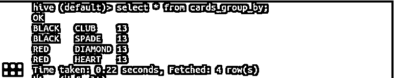
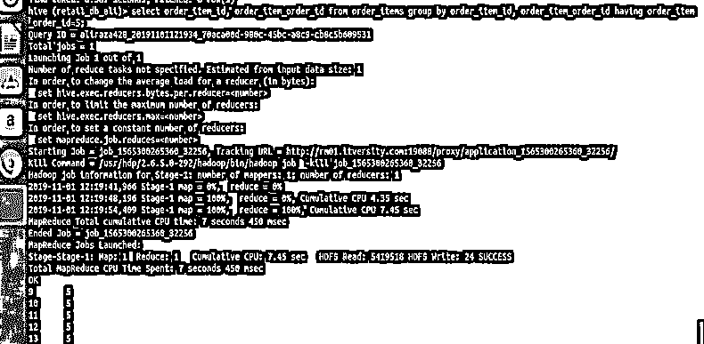
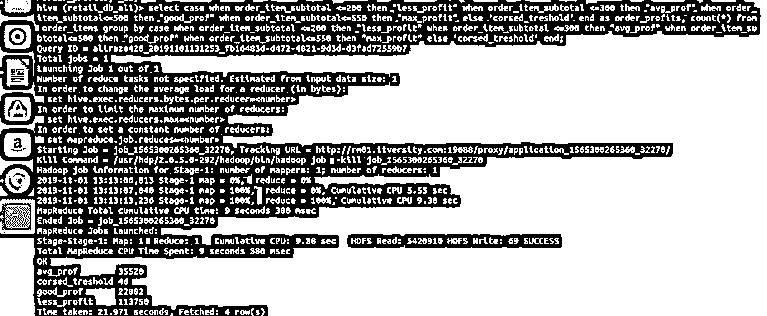

# 配置单元分组依据

> 原文：<https://www.educba.com/hive-group-by/>

## Hive Group 简介由

Group By 顾名思义，它会对满足特定条件的记录进行分组。在本文中，我们将按 HIVE 来看组。在遗留的 RDBMS 中，如 MySQL、SQL 等。group by 是使用最久的子句之一。现在，它以类似的方式在基于文件的数据存储中找到了自己的位置，这种存储方式就是著名的 HIVE。

我们知道，Hive 在处理大量数据方面已经超越了许多传统的 RDBMS，而没有花费供应商一分钱来维护数据库和服务器。我们需要配置 HDFS 来处理 hive。一般来说，我们转向表，因为最终用户可以从它的结构中进行解释，并且可以在文件对他们来说很笨拙的情况下进行查询。但是我们不得不付钱给供应商，让他们提供服务器并以表格的形式维护我们的数据。因此，hive 提供了一种具有成本效益的机制，它利用了基于文件的系统(Hive 保存数据的方式)和表(供最终用户查询的表结构)。

<small>Hadoop、数据科学、统计学&其他</small>

**分组依据**

Group by 使用配置单元表中定义的列对数据进行分组。假设您有一个包含所有州的每个城市的人口普查数据的表，其中城市名和州名是列。现在，在查询中，如果我们按州分组，那么来自某个特定州的不同城市的所有数据将被分组在一起，在应用 group by 方法之前，人们现在可以很容易地更好地可视化数据。

### Hive Group By 的语法

group by 子句的一般语法如下:

`SELECT [ALL | DISTINCT] select_expr, select_expr, ...
FROM table_reference
[WHERE where_condition] [GROUP BY col_list] [HAVING having_condition] [ORDER BY col_list]] [LIMIT number];`

或者对于更简单的查询，

`<Select Clause> <rferenced Columns> from <table_name> Group By <The columns on which we want to group the data>`

`Select department, count(*) from the university.college Group By department;`

这里的 department 指的是大学表中的一个列，它存在于大学数据库中，其值在艺术、数学、工程等系中是不同的。现在让我们看一些例子来演示分组方式。

我已经创建了一个示例桌面卡片组来演示分组方式。它的 create table 语句如下:

你可以从上面看到，它有三个字符串列颜色，西装，和匹普。让我编写一个查询，按照颜色对数据进行分组，并获得其计数。

`select color, count(*)  from deck_of_cards group by color;`

Hive 基本上是通过生成相应的 java 代码和 jar 文件，把上面的查询转换成 map-reduce 程序，然后执行。这个过程可能需要一点时间，但与传统的 RDBMS 相比，它绝对可以处理大数据。请参见下面的截图，其中包含执行上述查询的详细日志。

你可以看到黑色是 26，红色是 26。

让我们将分组应用于两列(颜色和套装以及获得分组数),并查看下面的结果。

`Select color, suit, count(*) from  deck_of_cards group by color, suit`

基本上，在梅花、黑桃和红心上面有四个不同的组，黑桃是黑色和菱形，红心是红色。

#### 将按原因分组的结果存储在另一个表中

Hive 也像其他 RDBMS 一样，提供了用 create table 语句插入数据的功能。让我们看看如何使用 group by 将 select 表达式的结果存储到另一个表中。让我使用上面的查询本身，我在 group by 中使用了两列。

`create table cards_group_by
as
select color,suit,count(*) from deck_of_cards
group by color,suit;`

现在让我们对创建的表进行查询，以查看和验证数据。

现在让我们使用 having 子句来限制组的结果。如通用语法所示，我们可以通过使用 having 对组进行限制。这里我使用的是 ordser_items 表，它的结构如下所示。

`hive (retail_db_ali)> describe order_items;
OK
order_item_id    int
order_item_order_id   int
order_item_product_id   int
order_item_quantity   tinyint
order_item_subtotal   float
order_item_product_price   float
Time taken: 0.387 seconds, Fetched: 6 row(s)`

`select order_item_id, order_item_order_id from order_items group by order_item_id, order_item_order_id having order_item_order_id=5;`

从结果截图可以看出，我们只有 order_item_order_id 值为 5 的记录。

#### Group by 和 Case 语句

现在让我们看一下涉及带有 group by 的 CASE 语句的有点复杂的查询。我们将把它应用到 order_items 表中。我们将在下面看到，我们可以对不能直接应用 group by 子句的非聚合列进行分类。

`Select
case
when order_item_subtotal <=200 then "less_profit"
when order_item_subtotal <=300 then "avg_prof"
when order_item_subtotal<=500 then "good_prof"
when order_item_subtotal<=550 then "max_profit"
else 'corsed_treshold'
end
as order_profits,
count(*) from order_items
group by
case
when order_item_subtotal <=200 then "less_profit"
when order_item_subtotal <=300 then "avg_prof"
when order_item_subtotal<=500 then "good_prof"
when order_item_subtotal<=550 then "max_profit"
else 'corsed_treshold'
end;`

让我们在配置单元中执行它以获得结果

### 结论

我们可以看到，我们已经将 order_item_subtotal 分组为四个不同的类别(如果您注意到 order_item_subtotal 是一个非聚合列，不能对其应用直接分组依据)。我们将它们分组在一起，并获得满足 select 表达式中定义的范围的值的计数。如果列是非聚合的，下面是一个简单的规则。我们的选择表达式是复杂的，那么无论它们在选择表达式中是什么，也应该出现在 group by 子句表达式中。所以我们已经看到了一个著名的子句 RDBMS 子句组也可以不受任何限制地应用于 Hive。它可以应用于简单的选择表达式。聚合和过滤表达式、连接表达式以及复杂情况表达式。

### 推荐文章

这是一个蜂巢群的指南。这里我们详细讨论 group by、语法、不同条件下的 hive group by 的例子和实现。您也可以阅读以下文章，了解更多信息——

1.  什么是蜂巢？
2.  [蜂巢架构](https://www.educba.com/hive-architecture/)
3.  [蜂巢功能](https://www.educba.com/hive-function/)
4.  [Hive Order By](https://www.educba.com/hive-order-by/)
5.  [蜂箱安装](https://www.educba.com/hive-installation/)

