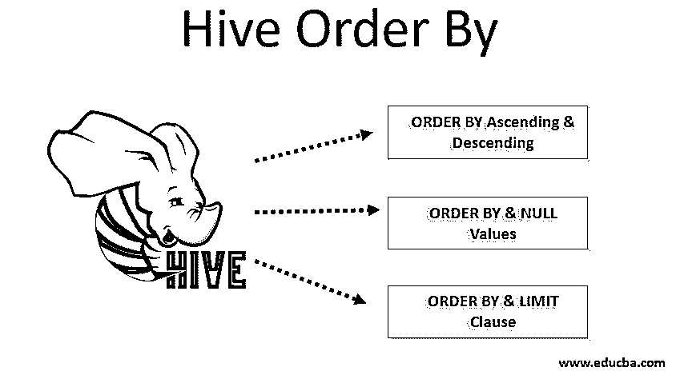
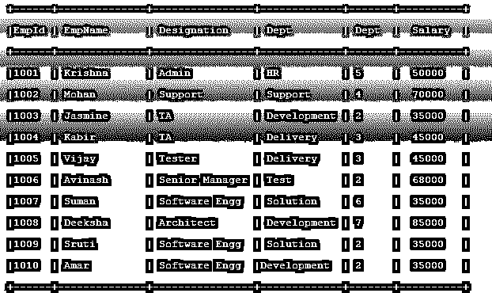
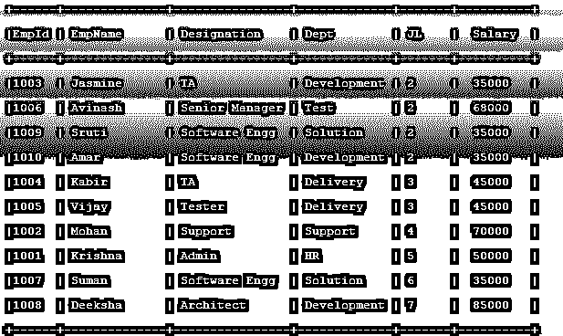
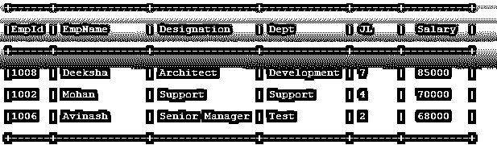
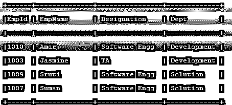

# 配置单元排序依据

> 原文：<https://www.educba.com/hive-order-by/>

## 对配置单元顺序的介绍

Hive 是 Apache 提供的数据仓库设施。Hive 构建在 Hadoop 分布式文件系统(HDFS)之上，用于写入、读取、查询和管理 HDFS 等分布式存储系统中的大型结构化或半结构化数据。每个 HiveQL 都将在后端转换为 MapReduce 作业。Hive 提供了 Hive Query Language (HiveQL ),类似于 RDBMS 中的普通 SQL。与 SQL 一样， [HiveQL 也提供了](https://www.educba.com/hiveql/)ORDER BY 子句，可以与 SELECT 子句一起使用。ORDER BY 函数用于按照用户指定的列对数据进行升序或降序排序。

### 按配置单元顺序排列的语法

以下是按配置单元顺序排列的语法:

<small>Hadoop、数据科学、统计学&其他</small>

**基本语法:**

`SELECT <column name1>,<column name2> FROM <table name> ORDER BY <column name>;`

**ORDER BY 子句连同所有其他子句:**

`SELECT DISTINCT <column name1>, <column name2>, <column name3> FROM <table name> WHERE <where condition> GROUP BY <column names…> HAVING <having conditions> ORDER BY <column names> <ASC / DESC> LIMIT <limiting number>;`

您还可以指定 ORDER BY 1 或 ORDER BY 2，其中 1 和 2 代表列号，而不是使用 ORDER BY <column names="">。ORDER BY <column number="">只能在 SELECT 子句中指定列名时使用，而不能在 SELECT *子句中指定。</column></column>

### 如何在 Hive 中使用 ORDER BY Function？

下面的解释说明了如何在配置单元中使用 order by 函数:

#### 1.按升序和降序排序

*   默认情况下，排序顺序将是升序，即在结果的开头显示最小值，在结尾显示最大值，即使您没有显式指定。
*   还可以[指定 ORDER BY](https://www.educba.com/order-by-in-mysql/) <列名> ASC 为升序，ORDER BY <列名> DESC 为降序或指定列排序结果。
*   ODER BY 升序的 HiveQL 语法如下所示:

`SELECT <column name1>,<column name2> FROM <table name> ORDER BY <column name> ASC;`

*   ODER BY 降序的 HiveQL 语法可以表示如下:

`SELECT <column name1>,<column name2> FROM <table name> ORDER BY <column name> DESC;`

*   升序和降序子句可以同时用于 ORDER BY 子句中的多个列，如下所示:

`SELECT <column name1>,<column name2> FROM <table name> ORDER BY <column name1> ASC <column name2> DESC;`

#### 2.排序依据和空值

*   配置单元的最新版本[也支持空值的排序顺序。](https://www.educba.com/hive-versions/)
*   默认情况下，ORDER BY <column name="">ASC 的空值排序顺序是空值优先。它将所有空值排序到排序结果的开头。</column>
*   类似地，对于 ORDER BY <column names="">DESC，空值的排序顺序默认为空值最后。它将所有空值排序到排序结果的末尾。</column>
*   您也可以指定空值在前，空值在后，并根据您的需求方便地按 <column name="">ASC 排序或按 <column name="">DESC 排序。</column></column>
*   NULLS FIRST 子句的语法以及升序:

`SELECT <column name1>,<column name2> FROM <table name> ORDER BY <column name> ASC NULLS LAST;`

*   NULLS 最后一个子句的语法以及 ORDER BY descending:

`SELECT <column name1>,<column name2> FROM <table name> ORDER BY <column name> DESC NULLS FIRST;`

#### 3.ORDER BY 和 LIMIT 子句

*   LIMIT 子句在 ORDER BY 子句中是可选的。
*   LIMIT 子句可以用来提高性能。LIMIT 子句可用于避免不必要的数据处理。
*   LIMIT 子句将仅从结果中选择有限数量的值用于验证目的。
*   带有 ORDER By 子句的 LIMIT 子句可以显示如下:

`SELECT <column name1>,<column name2> FROM <table name> ORDER BY <column name> ASC LIMIT 10;`

*   ORDER BY 子句还可以与 OFFSET 子句和 LIMIT 子句结合使用，以减少结果的数量。相同的语法可以表示为:

`SELECT <column name1>,<column name2> FROM <table name> ORDER BY <column name> ASC LIMIT 10 OFFSET 10;`

### 按配置单元顺序排列的示例

考虑下面的示例表 Employee，它包含雇员 Id(EmpID)、雇员姓名(EmpName)、职务、部门(Dept)、职务级别(JL)和薪水。

#### 示例#1

**代码:**

`SELECT * FROM Employee ORDER BY JL ASC;`

**输出:**

#### 实施例 2

**代码:**

`SELECT * FROM Employee ORDER BY Salary DESC LIMIT 3;`

**输出:**

#### 实施例 3

**代码:**

`SELECT EmpId, EmpName, Designation, Dept FROM Employee where Salary < 50000 ORDER BY EmpName ASC JL ASC;`

**输出:**

### 结论

Hive 中的 ORDER BY 允许您按升序或降序对数据进行排序。ORDER BY 可以与其他子句结合使用，以获得排序后的数据。ORDER BY 不同于 SORT BY，因为 SORT BY 对 reducer 中的数据进行排序，但 ORDER BY 对整个数据进行排序。

### 推荐文章

这是一个蜂巢订购指南。这里我们讨论如何在配置单元中使用 order by function，以及代码和输出的不同例子。您也可以浏览我们的其他相关文章，了解更多信息——

1.  [Hive 内置函数](https://www.educba.com/hive-built-in-functions/)
2.  什么是蜂巢？
3.  [如何安装 Hive](https://www.educba.com/hive-installation/)
4.  [蜂巢功能](https://www.educba.com/hive-function/)
5.  [Tableau 版本](https://www.educba.com/tableau-versions/)
6.  [蜂箱安装](//www.educba.com/hive-installation/)
7.  [Python 内置函数的例子](https://www.educba.com/python-built-in-functions/)
8.  [蜂巢分区综合指南](https://www.educba.com/partitioning-in-hive/)
9.  [如何在 Oracle 中按顺序工作？](https://www.educba.com/order-by-in-oracle/)

