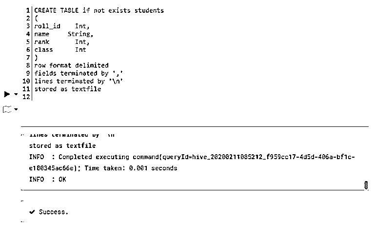
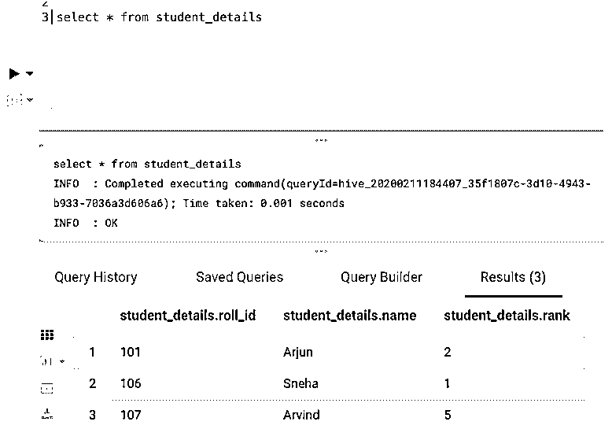
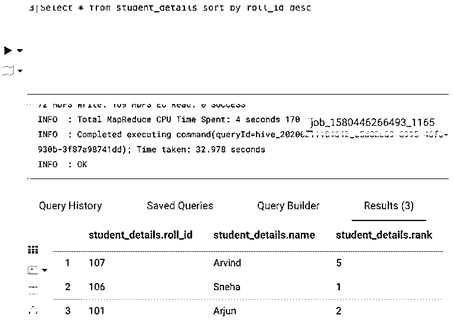
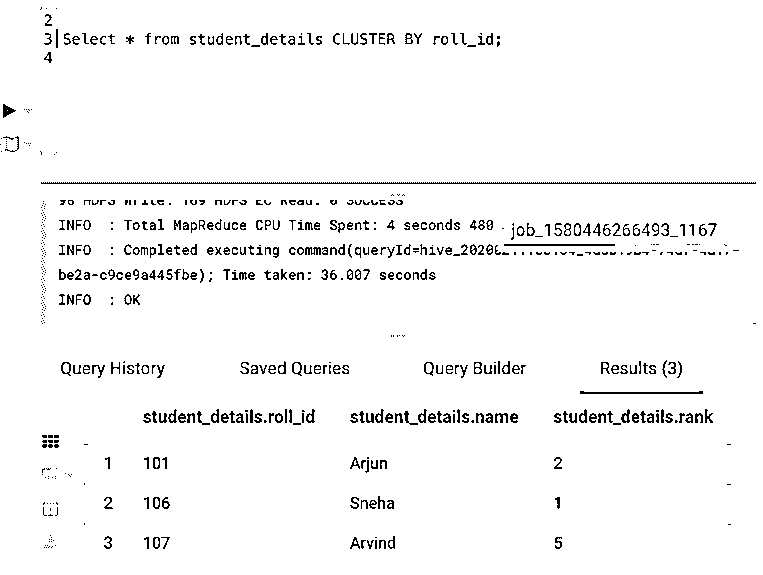

# 配置单元群集依据

> 原文：<https://www.educba.com/hive-cluster-by/>

## 通过以下方式介绍配置单元集群

CLUSTER BY 是在 Hive 查询中使用的子句或命令 4，用于执行 DISTRIBUTE BY 和 SORT BY 操作。此命令确保所有输出数据文件的整体排序或分类。将 BY 子句函数分配给 3。

映射如何在 MapReduce 作业中的减速器之间划分输出。DISTRIBUTE BY 与 GROUP BY 子句有类似的工作，因为它管理 reducer 如何接收数据或行进行处理。但是，SORT BY 命令有助于在每个 reducer 输出中实现排序。

<small>Hadoop、数据科学、统计学&其他</small>

### 蜂巢集群的工作方式

*   按 x 分类:确保 N 个归约者中的每一个都得到不重叠的集合，然后按这些范围对归约者进行排序。它给你一个通用的排序，和 do 一样(按 x 排序，按 x 分配)。您最终会在 N 个或更多排序文件上得到不重叠的范围。
*   Cluster By 通常用于 Map-Reduce 脚本。它还被广泛用于对查询结果进行排序或分区，例如在表上的 SELECT 语句中。
*   CLUSTER BY 的分区数量将决定将生成多少文件，这些文件将根据 CLUSTER BY 中列出的列组合值的散列分布在内存中。将这些文件写入磁盘将导致基于“分类依据”中列出的列值组合的哈希进行重新分配。

### 何时使用配置单元集群？

1.  **数据歪斜时:**如果大部分行放在少数分区上，则数据帧歪斜，而大部分分区保持为空。像那样的情况确实应该避免。为什么？为了什么？这使得计划实际上不是同时进行的——大部分时间你都在等待完成一项任务。更糟糕的是，在某些情况下，您可能会在某些执行器上耗尽内存，或者导致不必要的数据溢出到磁盘。如果数据分布不均匀，所有这些都可能发生。选择一个您知道可以为表达式均匀分布数据的东西来进行分区。您可以使用 CLUSTER BY 对数据进行重新分区，以处理不对称问题。

2.  **在多个连接中排序:**如果连接两个数据帧，Hive 将使用连接表达式对它们进行重新分区。这意味着，如果多次输入相同的数据帧(每次都使用相同的表达式)，Hive 每次都必须对其数据帧进行重新分区。在 Hive 中，CLUSTER BY 将通过连接表达式帮助重新分区，并在分区内对它们进行排序。

### 蜂巢集群示例

让我们考虑一个例子来更好地理解“CLUSTER BY”子句的工作原理。

#### 示例#1

让我们创建一个 Hive 表，然后使用 create 和 load 命令在其中加载一些数据。这是一个包含学生详细信息的表格，如姓名、编号、班级和学生等级。

**代码:**

`CREATE TABLE if not exists students
(
roll_id    Int,
name     String,
rank       Int,
class      Int
)
row format delimited
fields terminated by ‘,’
lines terminated by ‘\n’
stored as textfile`

**输出:**

在创建了表的模式之后，让我们也将一些数据行装载到表中。

`select * from students_details;`

将数据加载到表 students 后的输出是:

**输出:**

#### 实施例 2

让我们在这个表上执行一些数据操作。我们可以对学生的表执行 SORT BY 子句，以降序对学生的 roll ids 进行排序。

**代码:**

`Select * from student_details sort by roll_id desc;`

**输出:**

#### 实施例 3

此外，我们可以使用下面的查询对表进行排序，首先获得排名最高的学生:

**代码:**

`Select * from student_details sort by rank desc limit 1;`

默认情况下，如果没有明确指定，排序将按升序进行。对于数字数据类型的列类型，排序按数字顺序进行。但是，如果列类型是字符串，则应用字典顺序排序。

SORT BY 不同于 ORDER BY，因为它执行局部排序或对每个 reducer 中的数据进行排序，而 ORDER BY 确保对整个数据集进行完整排序。ORDER BY 可能会导致很长的执行运行时间。因此，hive 属性 hive.mapred.mode 被设置为严格限制如此长的执行时间。默认情况下，该属性设置为非严格。

在 Hive 2.1.0 以后的版本中，对于“order by”子句，首先为 ASC 排序技术保留空值，最后为 DESC 排序技术保留空值。

对于 Hive 3.0.0 以后的版本，表或查询的限制由优化器在“sort by”子句中删除。使用这个配置单元配置属性 hive . remove . order by . in . subquery 作为 false，我们可以通过优化器停止它。

#### 实施例 4

此外，我们可以在 Hive 中对表 students 执行 DISTRIBUTE BY 操作。这个子句有明确的功能要执行。它专门用于根据“DISTRIBUTE BY”后面提到的列在 reducers 之间分配行。这不会对每个缩减器中的输出进行排序。

**代码:**

`Select * from student_details CLUSTER BY roll_id;`

色调编辑器的输出为:

### 结论

这些是类似 SQL 的命令或子句，有助于在 Hadoop 生态系统中进行 ETL，如提取、转换、加载或汇总数据。我们也可以说，CLUSTER BY 是 DISTRIBUTE BY 和 SORT BY 组合的替代方法。这些数据操作语言(DML)查询可以轻松地处理表、数据库或视图。CLUSTER BY 可以实现表数据的完全排序。用户可以指定 Distribute By 和 Sort By，而不是指定 Cluster By，这样分区的列和排序的列可以不同。

### 推荐文章

这是一个蜂巢集群的指南。在这里，我们讨论了 Hive 集群的工作方式以及何时使用它，并给出了相应的例子。您也可以参考我们的其他相关文章，了解更多信息——

1.  [配置单元数据类型](https://www.educba.com/hive-data-types/)
2.  [Hive Order By](https://www.educba.com/hive-order-by/)
3.  [蜂巢下降表](https://www.educba.com/hive-drop-table/)
4.  什么是蜂巢？
5.  [配置单元内部连接|示例](https://www.educba.com/hive-inner-join/)

