# 加入配置单元

> 原文：<https://www.educba.com/joins-in-hive/>

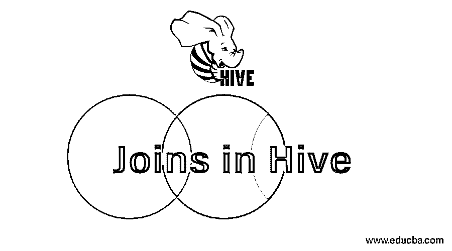

## Hive 中的联接简介

通过基于特定的列对多个表进行组合，联接用于检索使用多个表的各种输出。现在，对于 Hive 中的表，我们需要创建表并加载每个表中的数据。为了理解目的，我们将使用两个表(客户和产品)。

### 不同的命令

以下是创建和加载这些表中的数据的命令:

<small>Hadoop、数据科学、统计学&其他</small>

#### 对于客户表 **:** 6 行

**创建命令**

如果不存在，则创建外部表客户(id 字符串、名称字符串、城市字符串)
行格式分隔的
字段以“
位置”/用户/配置单元/仓库/test . db/客户”
TBL properties(" skip . header . line . count " = " 1 ")终止；

**加载命令**

将路径“/home/cloud era/Customer _ neha . txt”中的本地数据加载到表 Customer 中；

**客户表数据**

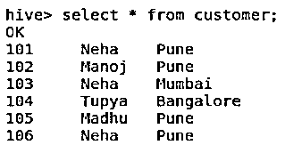

#### 对于产品表 **:** 6 行

**创建命令**

如果不存在，则创建外部表 product(Cust_Id 字符串，
Product 字符串，Price 字符串)
行格式分隔的
字段以“
location”/user/hive/warehouse/test . db/Product”
TBL properties(" skip . header . line . count " = " 1 ")；

**加载命令**

将数据本地路径“/home/cloud era/Product _ neha . txt”加载到表 Product 中；

#### 产品表数据

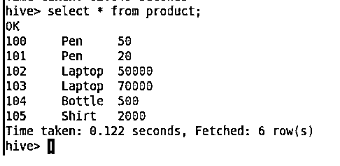

**Note**: I am using “properties (“skip.header.line.count”=”1”)” to skip the first line of my data which is a header to me.

要检查表模式，请使用命令“desc 表名

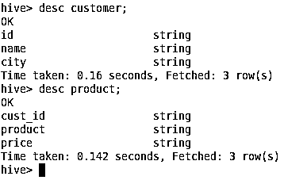

Now, we have data in tables, Let’s play with it 😉

### 配置单元中的联接类型

**Join-** 这将给出两个表的数据的叉积作为输出。如您所见，每个表中有 6 行。因此 Join 的输出将是 36 行。映射器的数量-1。但是，没有使用归算符。

**命令**

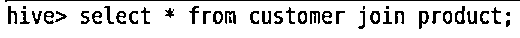

**输出:**

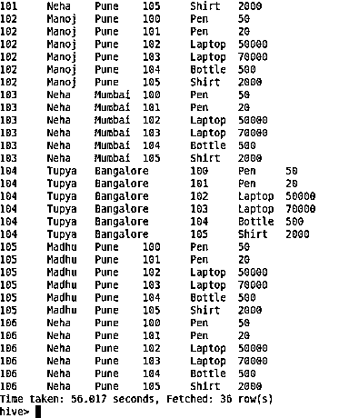

#### 1.完全连接

没有匹配条件的完全连接将给出两个表的叉积。

制图者人数-2 人

减压器数量-1

这也可以使用“Join”来实现，但使用的映射器和缩减器数量较少。

**符合匹配条件的完全连接**

两个表中的所有行将被联接。如果另一个表中的行不匹配，那么输出中将填充 NULL(注意 Id-100，106)。没有跳过任何行。

制图者人数-2 人

减压器数量-1

**命令**

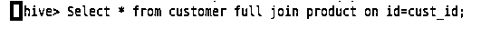

**输出:**

**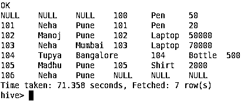

** 

#### 2.内部连接

如果在没有“on”子句的情况下使用[内部连接](https://www.educba.com/inner-join-in-oracle/)，它将给出叉积作为输出。但是，我们需要使用特定的列，在此基础上可以执行连接。customer 表中的 Id 列和 product 表中的 Cust_id 列是我的特定列。输出包含 Id 和 Cust_Id 匹配的行。您可以观察到，Id-106 和 Cust_Id-100 的行在输出中被跳过，因为它们没有出现在另一个表中。

**命令**

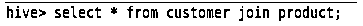

**输出:**

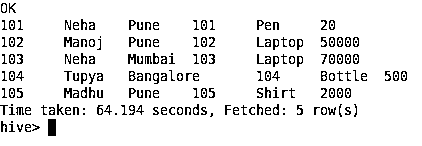

#### 3.左连接

左表中的所有行都与右表中匹配的行相联接。如果右表中的行的 Id 不在左表中，那么这些行将被跳过(注意输出中的 Cust_Id-100)。如果右表中没有左表中具有 Id 的行，那么输出中将填充 NULL(注意输出中的 Id-106)。

映射器数量-1

减压器数量-0

**命令**

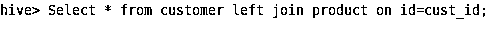

**输出:**

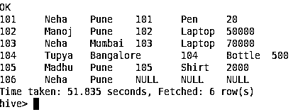

#### 4.右连接

右表中的所有行都与左表中的行匹配。如果左边的表没有任何行，那么将填充 NULL(观察 Id 100)。如果在右表中没有找到匹配，左表中的行将被跳过(观察 Id 106)。

映射器数量-1

减压器数量-0

**命令**

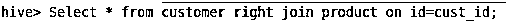

**输出:**

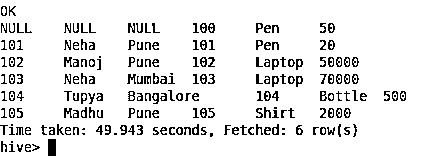

### 结论

" Join "顾名思义，可以连接数据库中的两个或多个表。这类似于 SQL 中的连接。通过基于特定的列对多个表进行组合，联接用于检索使用多个表的各种输出。根据需求，可以决定哪种加入方式适合您。例如，如果您想检查哪些 id 出现在左边的表中而没有出现在右边的表中，您可以简单地使用 left join。根据复杂性，可以在配置单元连接中执行各种优化。一些示例包括重新分区连接、复制连接和半连接。

### 推荐文章

这是一个 Hive 中的连接指南。在这里，我们讨论的基本概念，类型的连接，如完全连接，内部连接，左连接和右连接在配置单元及其命令和输出。您也可以阅读以下文章，了解更多信息——

1.  [配置单元命令](https://www.educba.com/hive-command/)
2.  [配置单元中的外部表|示例](https://www.educba.com/external-table-in-hive/)
3.  [蜂巢替代品的特点](https://www.educba.com/hive-alternatives/)
4.  [在配置单元中使用 ORDER BY 函数](https://www.educba.com/hive-order-by/)

