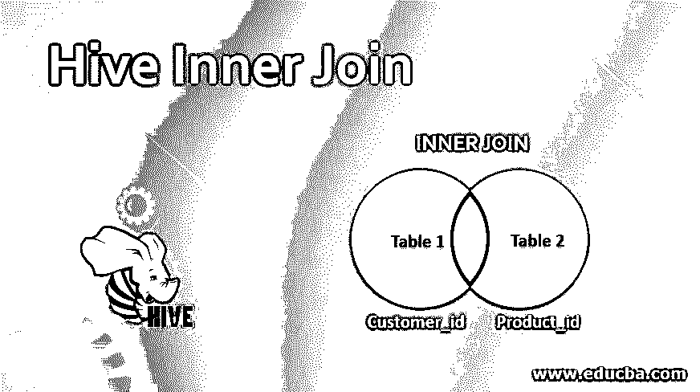
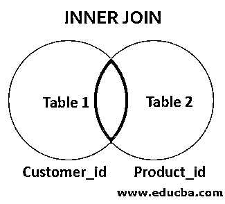
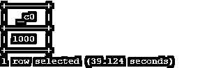
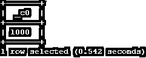
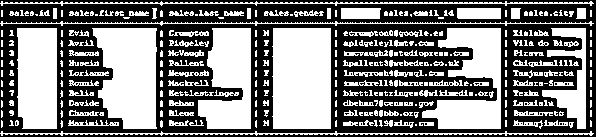
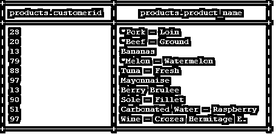
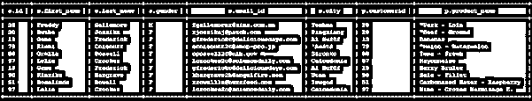
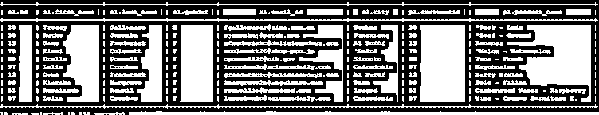

# 配置单元内部连接

> 原文：<https://www.educba.com/hive-inner-join/>

## 配置单元内部联接简介

我们将从两个或更多不同的配置单元表中获得适当的记录或数据，并在配置单元内部连接中获得新的配置单元表。但是连接条件中的选定列具有公共值或相同的数据类型。在内部连接中，我们可以考虑来自两个不同表的两个公共列(具有相同的数据类型或相同的值),并使用连接条件。我们可以连接或合并两个表的记录，并获得新的连接配置单元表。如果我们在连接查询中编写简单的“连接”,那么它只是“内部连接”。

**语法:**

<small>Hadoop、数据科学、统计学&其他</small>

`Hive_join_table:
table_reference [INNER] JOIN table_factor [join_condition] | table_reference {LEFT|RIGHT|FULL} [OUTER] JOIN table_referencejoin_condition
| table_reference LEFT SEMI JOIN table_referencejoin_condition
| table_reference CROSS JOIN table_reference [join_condition]`

### Hive 中的内部连接是如何工作的？

在配置单元中，我们将得到两个配置单元表的合并结果，这两个表在连接条件中具有相同的列值。

如上图所示，我们有两个配置单元表“table1”和“table2”。表 1 包含带有“客户标识”的不同列。表 2 包含带有“产品 id”的不同列。这里，“客户标识”和“产品标识”具有相同的值(如 1，2，3..等等。)或相同的数据类型。在内部联接中，结果将是 customer_id 和 product_id 的匹配 id 的组合。如果值与“customer_id”和“product_id”这两个表列都匹配，则只会出现或显示结果/记录。否则，如果值出现在“customer_id”中，但相同的 id 不出现在“product_id”中，则结果输出将不会出现，反之亦然。

### 配置单元版本 0.13.0

hive 版本 0.13.0，它允许“FROM”子句用逗号分隔来连接多个表。此外，我们可以在查询中省略“join”关键字。

**代码:**

`SELECT * FROM table1 t1, table2 t2 WHERE t1.customer_id = t2.product_id;`

在最新版本的 hive 中，我们可以使用“JOIN”关键字。

*   **注意#1:** 在 Hive 中，查询将转换多个表上的连接，我们希望运行单个 map/reduce 作业。那么必须在 join 子句中使用相同的列。
*   **注意#2:** 如果我们在同一个 join 子句中使用不同的多个列，那么查询将执行多个 map / reduce 作业。
*   **注意#3:** 在 hive 中，join 查询的每个 map / reduce 阶段。序列中的最后一个表，它通过 reducers 进行流式传输，而其他表则被缓冲。

### 说明

我们在 hive 的“company”数据库中有两个表(表名:-sales 和 products)。

以下是“销售”表中的字段/列列表:

*   ID(数据类型“int”)
*   名字(数据类型“字符串”)
*   姓氏(数据类型“字符串”)
*   性别(数据类型“字符串”)
*   Email_ID(数据类型“字符串”)
*   城市(数据类型“字符串”)

以下是“产品”表中的字段/列列表:

*   customer_id(数据类型“int”)
*   产品名称(数据类型“字符串”)

#### 1.“销售”表的 DDL 代码

**代码:**

`create external table company.sales
(
id int,
first_name string,
last_name string,
gender string,
email_id string,
city string
)
ROW FORMAT DELIMITED
FIELDS TERMINATED BY ','
lines terminated by '\n'
tblproperties ("skip.header.line.count"="1");`

**输出:**我们在“销售”表中有 1000 条记录(手动加载数据)。

#### 2.“产品”表的 DDL 代码

**代码:**

`create external table company.products
(
customerid int,
product_name string
)
ROW FORMAT DELIMITED
FIELDS TERMINATED BY ','
lines terminated by '\n'
tblproperties ("skip.header.line.count"="1");`

“产品”表中有 1000 条记录(手动加载数据)。

示例“销售”表视图

示例“产品”表视图

### 实现配置单元内部连接的示例

在 hive 中，我们有“公司”数据库。它包含两个不同的表，即上面两个销售和产品表中的销售表和产品表。我们已经看到两列具有相同的数据类型和相同的值。在销售表中显示“id ”,在产品表中显示“customerid”。这两列相互引用。在销售和产品表的帮助下，我们将从那些购买产品的用户那里获得信息。现在我们需要那些用户购买了哪些产品的完整记录或数据。

#### 使用“JOIN 子句”的 SQL 查询

下面是 SQL 查询

**代码#1**

`SELECT * FROM sales s JOIN products p ON (s.id = p.customerid) limit 10;`

**输出:**

**代码#2**

`SELECT s.id, s.first_name, s.last_name, p.customerid, p.product_name FROM sales s JOIN products p ON (s.id = p.customerid) limit 10;`

**输出:**

**Note:** In query 1 and query 2, we will get the same output. But in query 1, we have added “*” to get the complete fields or data. But in query 2, we have customized the query and keep the necessary or required fields.

#### 不使用“JOIN 子句”的 SQL 查询

**代码:**

`select * from sales s1, products p1 where s1.id = p1.customerid  limit 10;`

**输出:**

**Note:** We Are Using Hive Version 3.1

### 使用配置单元内部连接的优势

*   hive join 的主要优点是在单个查询中获得不同的表数据。
*   不需要在表中添加相同或公共的列字段。
*   更快得到结果。
*   不可分表中存储的数据较少
*   在配置单元中，映射器和 reduces 用于执行连接查询。这将最大限度地降低处理和存储数据的成本。
*   地图端连接有助于提高作业、查询或应用程序的性能，并且执行时间更短。

### 结论

我们已经看到了“Hive Inner Join”的完整概念，以及适当的示例、解释、语法和代码。借助于“连接”条件，我们可以从两个或多个不同的列中获取数据或记录。无需在多个表中保存或添加相同的文件。我们需要保留单独的表，并用公共连接值或数据类型连接必要的表。

### 推荐文章

这是一个关于 Hive 内部连接的指南。在这里，我们讨论内部连接是如何工作的，hive 版本 0.13.0 提供了解释和实现示例。您也可以浏览我们的其他相关文章，了解更多信息——

1.  [配置单元中的索引](https://www.educba.com/indexes-in-hive/)
2.  [在蜂箱里装桶](https://www.educba.com/bucketing-in-hive/)
3.  [蜂巢集群由](https://www.educba.com/hive-cluster-by/)
4.  [配置单元中的日期函数](https://www.educba.com/date-functions-in-hive/)

