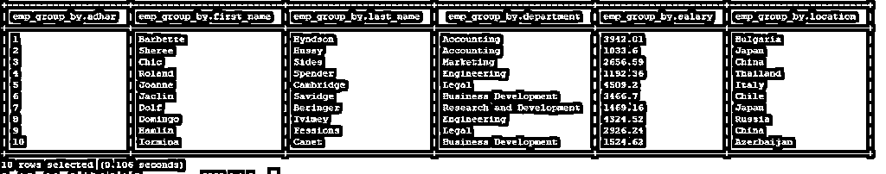
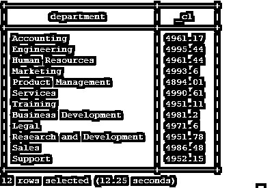
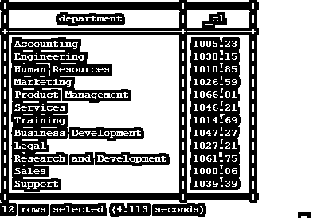
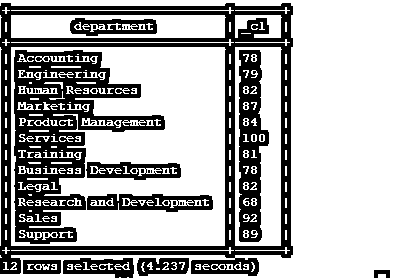
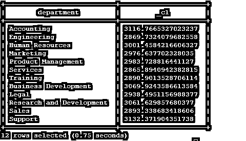
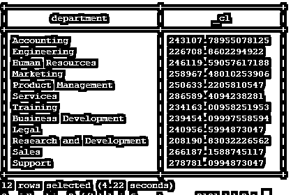

# HiveQL 分组依据

> 原文：<https://www.educba.com/hiveql-group-by/>

## HiveQL 集团简介

HiveQL Group By 对 hive group by 子句中提到的特定 hive 表列值进行分组，并以组格式显示输出值，而不是以单个/单独的格式显示值。它只是对表中的值进行分组，并以分组格式展示/显示输出。配置单元组仅在配置单元列级别上工作，但是我们可以使用同一个 select 查询添加不同的和数量的聚合函数。

### 聚合函数的类型

在 HiveQL Group By 中，必须在 select 语句中添加聚合函数。下面是我们可以在 select 语句的组中使用的 5 种不同类型的聚合函数。

<small>Hadoop、数据科学、统计学&其他</small>

*   最大值
*   最小值
*   计数(计数)
*   平均值(AVG)
*   加法(总和)

**hive QL Group By 的语法:**

`SELECT [ALL | DISTINCT | Hive Column] select_expr1, select_expr2,….., select_expr_n
FROM table_name
[WHERE where_condition] [GROUP BY column_list] [HAVING having_condition] [ORDER BY column_list]] [LIMIT number];`

### HiveQL Group By Query 如何工作？

在 HiveQL 中，Group by 仅使用聚合函数。当我们使用 group by 命令输入 select 语句时，它将聚合 Hive 列输出。根据 select 查询中提供的聚合函数(最大值、最小值、计数、AVG、总和)。该查询将聚合给定配置单元列的输出，并以组格式提供结果。如果我们在 SQL select 语句中不提供聚合函数，那么 group by 查询将不起作用。

### 实施 HiveQL Group 的示例

以下是 HiveQL Group By 的示例:

**说明:**

我们在配置单元的“emp”数据库中有一个配置单元表(表名:–EMP _ group _ by)。以下是“员工分组依据”表中的字段/列列表。

*   阿德哈尔数
*   西方人名的第一个字
*   姓
*   部门
*   薪水
*   位置

从 1000 条记录中，我们得到了表中的雇员数据。我们看到了“分组依据”的不同情况，以及不同的 aggrade 函数、SQL 查询和输出。

**表**的“雇员分组依据”的 DDL 代码

**代码:**

`create external table emp_group_by
(
adhar_no int,
first_name string,
last_name string,
department string,
salary float,
location string
)
ROW FORMAT DELIMITED
FIELDS TERMINATED BY ','
lines terminated by '\n'
tblproperties ("skip.header.line.count"="1")`

**输出:**

上表中有 1000 条记录(手动加载数据)。

**示例“雇员分组依据”表格视图**

**代码:**

`select * from  emp_group_by ;`

**输出:**

#### 1.使用聚合函数“MAX”进行分组

我们在“emp_group_by”表中有 1000 条记录；我们需要“emp_group_by”表中各个部门的合计最高工资。我们在 select SQL 查询中使用聚合函数“MAX”。从下面的 SQL 查询中，我们选择了“department”列，并对“emp_group_by”表的 salary 列应用了“MAX”聚合函数。对于“group by”子句，我们使用部门列。因此，我们将从“emp_group_by”表中获得各个部门的合计最高工资。

**查询:**

`select department,MAX(salary) from emp_group_by group by department;`

**输出:**

#### 2.Group By 使用聚合函数“MIN”

我们有“雇员分组依据”表中的记录数；我们需要“emp_group_by”表中各个部门的最低工资。我们在 select SQL 查询中使用聚合函数“MIN”。

从下面的 SQL 查询中，我们选择了“department”列，并对“emp_group_by”表的 salary 列应用了“MIN”聚合函数。对于“group by”子句，我们使用部门列。因此，我们将从“emp_group_by”表中获得各个部门的合计最低工资。

**查询:**

`select department,MIN(salary) from emp_group_by group by department;`

**输出:**

#### 3.使用聚合函数“COUNT”进行分组

我们在表“emp_group_by”中有 1000 条记录；我们需要“emp_group_by”表中各个部门的雇员或人数。我们在 select SQL 查询中使用聚合函数“COUNT”。

在下面的 SQL 查询中，我们选择了“department”列，并在“emp_group_by”表中应用了聚合函数“*”。对于“group by”子句，我们使用部门列。因此，我们将获得“emp_group_by”表中各个部门的员工总数。

**查询:**

`select department,COUNT(*) from emp_group_by group by department;`

**输出:**

#### 4.使用聚合函数“AVG”进行分组

我们在“emp_group_by”表中有记录数。我们需要“emp_group_by”表中各个部门的平均工资。我们在 select SQL 查询中使用聚合函数“AVG”。

从下面的 SQL 查询中，我们选择了“部门”列，并对“雇员 _ 组 _ 按”表的“薪金”列应用了“AVG”聚合函数。对于“group by”子句，我们使用部门列。因此，我们将从“emp_group_by”表中获得各个部门支付的合计平均工资。

**查询:**

`select department,AVG(salary) from emp_group_by group by department;`

**输出:**

#### 5.使用聚合函数“SUM”进行分组

我们在“员工分组”表中有 1000 条记录，我们需要“员工分组”表中各个部门支付的工资总额。我们在 select SQL 查询中使用聚合函数“SUM”。

从下面的 SQL 查询中，我们选择了“department”列，并对“emp_group_by”表的 salary 列应用了“SUM”聚合函数。对于“group by”子句，我们使用部门列。因此，我们将从“emp_group_by”表中获得支付给单个部门的单个部门的合计总工资。

**SQL 查询**

`select department,SUM(salary) from emp_group_by group by department;`

**输出:**

### 结论

我们已经看到了 HiveQL Group by 的完整概念，以及适当的示例、解释、语法和代码。当我们需要一个聚合格式的 hive 查询输出时，我们可以将“group by”与不同的聚合函数一起使用，结果将会是组合或聚合格式。在单个 select 语句中使用单个聚合函数并不是强制性的。我们可以在一个查询中使用多个聚合函数和不同的子句，比如 group by、having、order by。

### 推荐文章

这是 HiveQL 集团的指南。在这里，我们讨论 HiveQL Group By 的介绍，以及查询如何与其示例一起工作。您也可以浏览我们的相关文章，了解更多信息——

1.  [什么是 Hive 数据类型？](https://www.educba.com/hive-data-types/)
2.  [蜂巢替代品|了解特性](https://www.educba.com/hive-alternatives/)
3.  [Hive 命令的顶层组件](https://www.educba.com/hive-command/)
4.  [十大蜂巢面试问题](https://www.educba.com/hive-interview-questions/)

