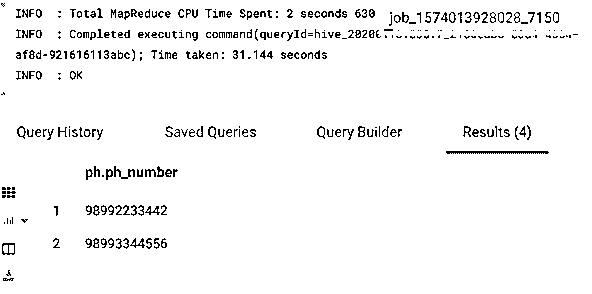
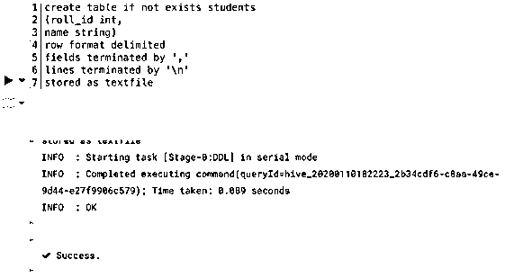
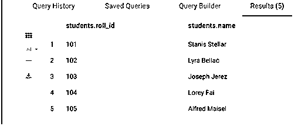
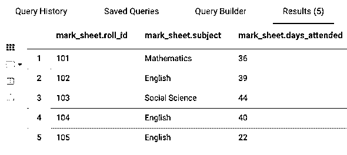
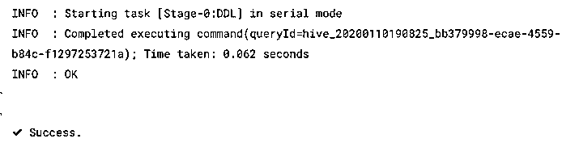
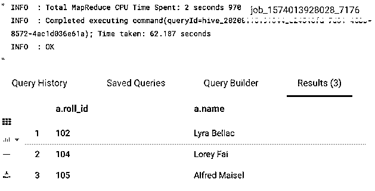

# 蜂箱中的视图

> 原文：<https://www.educba.com/views-in-hive/>

## Apache Hive 中的视图介绍

Apache Hive 支持视图的特性，视图是逻辑结构，与表一样对待。它使得保存查询成为可能，所有的 DML(数据操作语言)命令都可以在其上执行。它类似于 SQL 中的视图；然而，视图是基于用户需求创建的。在 Hive 中，首先执行引用视图的查询，然后在查询的其余部分使用获得的结果。此外，Hive 的查询计划器有助于执行计划。

由于 Apache Hive 支持数组类型和其他原始数据类型，所以也可以创建横向视图。这种视图的主要用途是使用 EXPLODE 或 INLINE 函数将数组转换或扩展为行。让我们举一个创建侧视图的例子。

<small>Hadoop、数据科学、统计学&其他</small>

**代码:**

`SELECT ph.* FROM (SELECT 0) b
LATERAL VIEW explode ( array(98992233442, 98993344556)) ph as ph_number`

在色调编辑器上执行该查询的输出是:

### 为什么我们需要蜂巢视图？

让我们知道我们需要蜂巢视图的原因:

1.  使用它的主要原因之一是降低查询的复杂性。很多时候，由于嵌套查询太多，长而复杂的查询变得难以管理或开发。通过将嵌套查询转换成视图，最终用户可以封装查询的复杂性并创建可重用的部分。这个概念类似于任何编程语言中的函数或软件中的分层设计概念。
2.  视图也广泛用于根据一个或多个列的值过滤或限制表中的数据。受限数据的用例是我们不希望最终用户看到所有的基表信息。因此，我们通过在表上使用“where”子句来限制数据，并将其存储为视图。基础表的更改不会反映在视图中；但是，基础表必须存在；否则，视图将失败。
3.  除了原始数据类型，Hive 还支持像 map、arrays 和 struct 这样的数据类型。这使得 Hive 能够将一个字段视为一个映射，而不是固定的列。因此，通过使用它，可以将一个基表分成多个逻辑结构或表。
4.  从概念上讲，很明显，Hive 首先执行视图，然后使用其结果来评估或执行查询。这可以用一个例子来更好地解释:如果视图和查询都有一个 LIMIT 子句，其中视图说 LIMIT 200，查询说 LIMIT 400，那么我们最多会得到 200 个结果。
5.  即使基础表没有分区，它也有助于创建分区视图。ALTER VIEW students ADD/DROP PARTITION[如果不存在] partition_spec 是一种方式。然而，对于创建分区视图，使用的命令是 CREATE VIEW…PARTITION ON，而对于创建分区表，使用的命令是 CREATE TABLE…PARTITION BY。Metastore 不存储分区位置或分区列存储描述符，因为没有为配置单元视图分区存储任何数据。

### 在配置单元中创建视图的示例

让我们以创建一个视图为例，该视图引入参加“英语”课的大学生的详细信息。首先，我们将创建一个学生表，如下所示:

#### 1.创建表学生

**代码:**

`Select * from students`

**输出:**

**代码:**

`Select * from mark_sheet`

**输出:**

#### 2.创建视图 English_class

**代码:**

`CREATE VIEW IF NOT EXISTS English_class AS
SELECT * FROM students AS a
INNER JOIN mark_sheet AS b
ON a.roll_id = b.roll_id
WHERE upper(b.subject) = “ENGLISH”;`

**输出:**

**代码:**

`Select * from English_class;`

**输出:**

这个视图可以用来解决更复杂的问题，即返回参加过“英语”课程的学生的大学排名。

**代码:**

`SELECT * FROM university_rnklist AS rank
JOIN English_class AS b
ON rank.roll_id = b.roll_id
WHERE rank <=100;`

可以像在表上一样在视图上使用的子句有

1.  IF NOT EXISTS 和 COMMENT 子句的用法与表中的用法相同。视图的名称必须是唯一的，并且不能与任何表、数据库或视图的名称相同。
2.  CREATE TABLE…LIKE 子句可用于将视图复制到另一个视图中。
    像 English_class 一样创建表格 English_class2
3.  SHOW TABLES 用于显示表和视图。没有什么比在 Hive 中显示视图更好的了。
4.  DESCRIBE 和 DESCRIBE EXTENDED 语句可用于表等视图，但是，对于 DESCRIBE EXTENDED，详细的表信息有一个名为 typeable 的变量，该变量的值为视图的“虚拟视图”。
5.  外部和位置子句也适用于视图。
6.  WHERE、ORDER BY、SORT BY 和 LIMIT 子句可用于视图。
7.  ALTER VIEW 对视图进行操作，以改变视图的元数据。处于只读状态时，INSERT INTO 或 LOAD INTO 对视图不起作用。

#### 3.删除视图

要删除您创建的视图，请使用下面的命令。

**代码:**

`DROP VIEW IF EXISTS English_class;`

如果 EXISTS 子句同样适用于表，则 DROP TABLE 命令不能用于删除视图。

### 视图的优势

下面给出了所表达的优点。

*   它有助于降低查询的复杂性。例如，如果我们只需要一个 50 列的表中的 5 列，我们可以创建一个视图。
*   它还有助于创建可用于进一步创建查询的临时表或中间表。
*   视图是只读的，因此 INSERT 或 LOAD INTO 等命令不能用于视图；因此，它有助于维护基表的完整性。

### 结论

视图是一个标准的关系数据库管理概念，类似于 SQL 中的视图。它不支持物化视图，但是这种视图像 Apache Hive 的其他特性一样具有优势。视图和表的主要区别在于视图不存储数据；这只是一个逻辑结构。视图具有降低 Hive 中嵌套查询复杂性的优点，被广泛使用。

### 推荐文章

这是 Hive 中的视图指南。在这里，我们讨论基本概念和为什么我们需要它，以及在配置单元中创建视图的优点和例子。您也可以看看以下文章，了解更多信息–

1.  [如何在 MySQL 中创建视图？](https://www.educba.com/views-in-mysql/)
2.  [将数据创建到配置单元表中](https://www.educba.com/partitioning-in-hive/)
3.  [蜂箱中桶的特征](https://www.educba.com/bucketing-in-hive/)
4.  [hive QL 的特点和局限性](https://www.educba.com/hiveql/)
5.  [配置单元内部连接|版本和示例](https://www.educba.com/hive-inner-join/)

