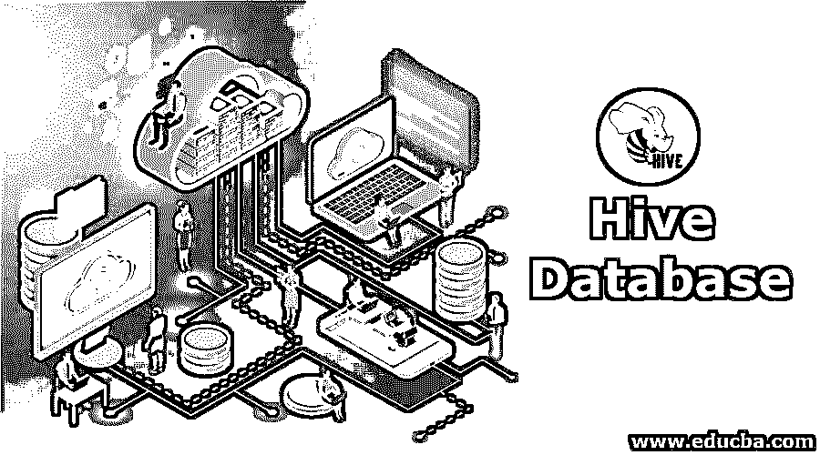
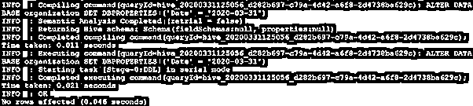
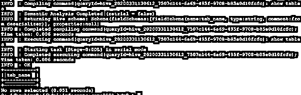
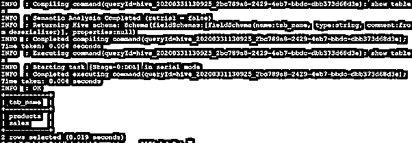
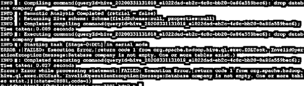
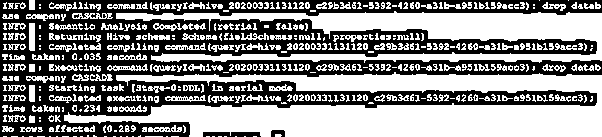

# 蜂巢数据库

> 原文：<https://www.educba.com/hive-database/>

## 蜂巢数据库简介

Hive Databases 提供了在分布式 Hadoop 平台上存储和管理大量记录或数据集的工具。它具有存储结构化和半结构化数据的能力。在 JDBC 驱动程序的帮助下，最终用户可以连接到 Hive 数据库，并在 SQL 查询的支持下获取数据/记录。在 Hive 中，数据库框架由脸书开发，用于分析结构化数据或半结构化数据。数据库框架支持所有常规命令，如创建、删除、更改、使用数据库。

我们还可以将数据库层与 Hbase、Kafka、spark、不同的流工具等不同的 Hadoop 组件一起使用。

<small>Hadoop、数据科学、统计学&其他</small>

**Note:** The Hive server or service is containing the default database. The default database name is “default”. While creating the table, we forget to specify which hive database we need to create the database. Then by default, the tables will create in the “default” database.

**语法:**

`CREATE (DATABASE|SCHEMA) [IF NOT EXISTS] database name
[COMMENT ‘database information | database comment’ ] [LOCATION ‘ HDFS Path’ ] [WITH DATABASE PROPERTIES (property name= property value, ...)];`

### 如何在 Hive 中创建数据库？

我们可以创建类似于 SQL 的数据库。但是最重要的是表是以内部表格式还是外部表格式创建的。如果所有表都是以内部表格式创建的，则该数据库也称为内部数据库。如果所有表都是以外部表格式创建的，则该数据库也称为外部数据库。在数据库中，数据以表格形式存储。配置单元数据库的默认存储位置因配置单元版本而异。从 HDP 3.0 开始，我们使用的是 3.0 及更高版本。默认数据库位置已更改。外部配置单元数据库的位置是“/warehouse/tablespace/external/hive/”，管理数据库的位置是“/warehouse/tablespace/managed/hive”。

在旧版本的配置单元中，配置单元数据库的默认存储位置是“/apps/hive/warehouse/”。

#### 创建数据库的查询

**查询:**

`create database organization;`

**输出:**

当您需要访问 hive DB 时，我们需要在 hive 客户端和 hive 服务器之间建立连接。为了建立连接，我们需要在配置单元客户端配置配置单元 JDBC / ODBC 连接字符串，并建立配置单元服务器的连接。在 Hive view、Hive CLI、beeline(交互式和非交互式)或不同的第三方客户端软件的帮助下，我们可以连接数据库。

**注:**

1.  JDBC 和 ODBC 是与 Hive 连接的两种不同方式。很少有像 MSTR 这样的应用程序只支持 ODCB 连接。我们需要配置 MSTR 的“ini”文件。很少有像 Zeppelin、squirrel client 这样的应用程序支持 JDBC 连接。
2.  在 Knox 网关的帮助下，我们可以连接数据库。
3.  配置单元视图仅在 Ambari 2.6 或更低版本中可用。从版本 2.7 和更高版本开始，配置单元视图不可用。

### 如何修改或更改数据库？

我们有设施来改变或修改现有的数据库。我们还可以更改现有的数据库注释、数据库属性等。数据库的。

我们也可以改变数据库如下。

#### 1.更改数据库属性

**举例:**

`ALTER ( DATABASE | SCHEMA ) database name SET database properties  ( property name = property value, ...);`

#### 2.改变所有者

**举例:**

`ALTER (DATABASE| SCHEMA) database name SET OWNER [USER|ROLE ] user or role`；

#### 3.改变 HDFS 的位置

**举例:**

`ALTER (DATABASE|SCHEMA ) database name SET LOCATION HDFS Path;`

#### 变更数据库的配置单元查询

**查询:**

`ALTER DATABASE organization SET DBPROPERTIES ('Date' = '2020-03-31');`

**输出:**

### 如何在 Hive 中删除数据库？

在 hive 中，我们可以从 hive 系统中删除数据库表单。默认情况下，对 drop database 命令有限制。我们无法删除主题为的现有数据库，因为该数据库为空。如果数据库为空，那么只有我们可以删除数据库。如果我们在数据库中有这些表，那么对删除就有限制。有两种方法可以删除包含表的数据库。

*   第一种方法:我们需要删除当前数据库中的所有表。然后我们可以删除当前的蜂巢数据库。
*   **第二种方式:**如果我们想删除 hive 数据库，而不删除当前的数据库表。然后我们可以在 drop 查询中使用“CASCADE”关键字。在“CASCADE”的帮助下，我们可以在不接触数据库内部表的情况下删除 hive 数据库。

#### 数据库为空的配置单元删除查询

**查询:**

`drop database organization;`

**输出:**

截图 1

在上面的截图 1 中，我们可以看到 hive 数据库“organization”是空的。我们可以使用 hive 查询轻松删除数据库。

#### 具有表容器的配置单元删除查询

**查询:**

`drop database company CASCADE;`

**输出:**

截图 2

根据上面的截图，我们可以看到“公司”数据库有两个表。(表 1:产品，表 2:销售)。
假设我们将直接使用 drop 命令“drop database company 放弃公司数据库。那么该命令将不起作用，因为其中存在表。请参考截图 3

截图三

当我们在查询中使用“CASCADE”关键字时，我们可以删除数据库。请参考截图 4。

截图 4

### 结论

我们已经看到了“Hive 数据库”的完整概念，以及适当的示例、解释、语法和不同截图的 SQL 查询。这个框架位于 Hadoop 之上。它将汇总庞大的数据集/记录，并对其进行查询。有助于在其上进行简单的分析。如果数据集增加，我们可以在不影响性能的情况下增加机器数量。

### 推荐文章

这是一个蜂巢数据库的指南。在这里，我们讨论介绍和如何创建一个配置单元数据库和实际的例子和不同的子查询表达式。您也可以浏览我们的相关文章，了解更多信息——

1.  [什么是 Hive 数据类型？](https://www.educba.com/hive-data-types/)
2.  [蜂巢替代品|了解特性](https://www.educba.com/hive-alternatives/)
3.  [Hive 命令的顶层组件](https://www.educba.com/hive-command/)
4.  [十大蜂巢面试问题](https://www.educba.com/hive-interview-questions/)

