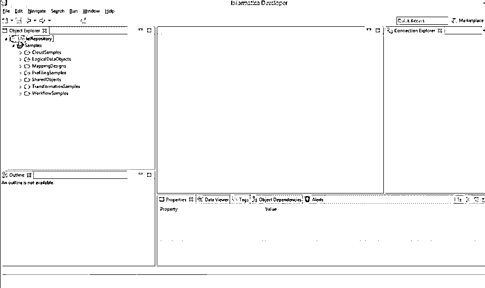
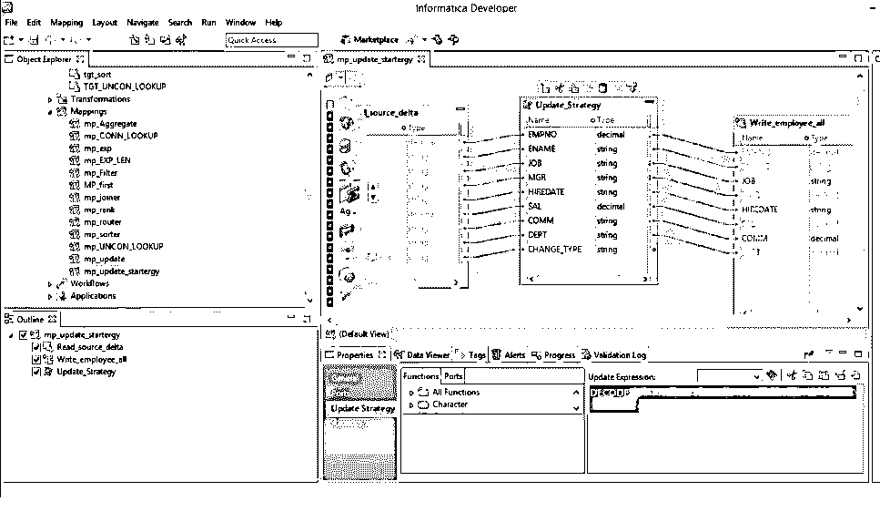
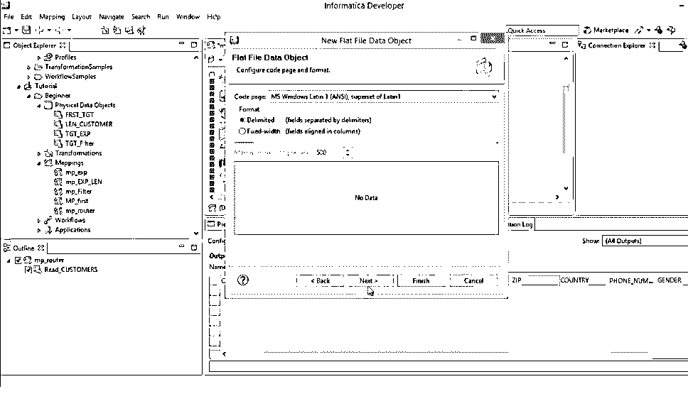

# 信息开发工具

> 原文：<https://www.educba.com/all-about-informatica-developer-tool/>

## Informatica 开发人员简介

**Informatica 开发者工具-** Informatica 公司在 1993 年开发了信息学开发者。这家公司以其数据集成产品 Power Centre 而闻名。Informatics Developer 是开发数据质量计划或地图的工具。它是一个软件开发工具包(SDK ),带有一组 API 来扩展 power center 平台的功能。Informatica tool 包含了所有与数据质量相关的 power center 的转换。

### Informatica 是做什么用的？

数据集成就是你使用 Informatica 工具所做的一切。使用这个工具，你可以比市场上的任何人都做得更好。

<small>Hadoop、数据科学、统计学&其他</small>

[Informatica tool](https://www.informatica.com/#fbid=w4uMn8hROWY "Informatica tool") 通常被称为 Informatics PowerCenter。该工具支持数据的所有提取、转换和加载过程。Informatica 为以下数据集成领域提供应用。

*   数据迁移
*   数据同步
*   数据库
*   数据中心
*   数据集市
*   主数据管理(MDM)
*   商业智能报告
*   业务活动监控(BAM)

### 信息开发工具

Informatica developer tool 是一个基于 eclipse 的开发环境，可以提高数据质量开发人员的生产力。它帮助架构师和开发人员找到和访问数据源，而不管源数据位于何处。它还有助于改进分析、剖析、验证和清理数据的过程。

### 信息的目标

Informatica developer 取代了传统的 Informatica 数据质量。

*   它帮助您创建和理解基本映射(从输入和输出移动数据)、基本对象和导出过程
*   有助于观察加载过程和分析结果，以了解成功率
*   满足从不同来源获取数据的连接要求
*   它可以帮助您分析数据、创建记分卡和地址验证

### 信息特征

*   **开放式系统**

Informatica 是一个支持多平台和多数据管理环境的开放式系统。

*   **元数据存储库**

Informatica 会话可以根据工作流和工作流程安排在文件夹中。这就产生了一个易于维护、易于分析和增强的环境。

*   **与数据源的通用连接**

该工具支持在企业内部或合作伙伴的系统或云或 Hadoop 中以任何模式轻松访问和清理任何来源的任何数据。

*   **灵活性**

Informatica 是解决客户问题的独立参与者。没有要保护的专有系统，也没有要强加的标准集。它为您提供了选择最适合您的环境的选项。

*   **作业监控和恢复**

Informatica 让您可以使用 Informatica 工作流监视器轻松监控作业。它还允许您从特定的行或步骤重新启动失败的作业。Informatica 还允许您发现和恢复失败的作业。

*   **计算机市场场所**

Informatica marketplace 包含许多工具和加速器来改进应用程序支持。

*   **支持各种平台**

Informatica 充当各种数据库的连接器，包括 Teradata Load、tPump、FastLoad 和 Parallel Transporter。

还有一些连接器你需要额外投资。这种来源的一个例子是社交媒体网站，如脸书、Twitter 等。

*   **可共享的书签和笔记**

Informatica 使其团队成员和企业能够通过书签轻松共享数据档案和质量卡，并在备注部分提供评论。

*   **市场领导者**

Informatica 是市场领先的数据集成平台。它为客户提供他们想要的东西和数据集成解决方案，可以在最短的时间和最少的工作量内集成来自不同来源的更多数据。

*   **创新**

Informatica 以创新著称。其数据集成平台是为满足具有挑战性的数据集成需求而开发的。它有一个架构方法和向客户交付可靠技术的一致记录。因此它吸引了许多顾客。

*   **行业领先的支持**

Informatica 建立了一个提供优质服务的支持组织。支持团队制定了一套清晰的规则和程序来处理问题并找到解决方案。支持系统有一个集中的呼叫记录和跟踪系统，可以根据问题的优先级和严重性帮助安排问题。

### 信息化的优势

*   Informatica 是一个工具，作为数据质量的单一平台。
*   它有助于改进数据分析、剖析、验证和清理数据。
*   该工具通过其 IT 协作工具和数据质量开发环境提高了企业的生产力。
*   它帮助您与分布广泛的所有数据源建立联系。
*   它降低了许可和维护成本。
*   支持多个项目和项目类型
*   该工具帮助您开发地址标准化、异常处理和数据屏蔽。它还将所有这些与 PowerCenter 集成，以将其用作组件或 map plets。
*   它有助于识别、解决和预防数据质量问题。
*   它支持数据集成项目的每一个角色，比如数据管理员、数据分析师、架构师和开发人员。
*   Informatica 提供有效的数据分析和分享业务成果的有效方法。
*   通过这个工具，数据变得更加可信。
*   Informatica 包含所有应用程序的集中数据质量规则。
*   所有参考数据都可以再次用于所有类型的数据集成项目，比如数据迁移、数据整合和 MDM
*   它满足了客户的四个基本需求——需要全面、需要开放、需要统一和需要经济。
*   它提供了您需要的与数据集成相关的任何东西，如数据质量、数据迁移、数据存档、数据整合、数据同步等等。
*   Informatica 与您现有的系统、应用程序和技术标准一起工作。
*   维护成本更低，运营更稳定，对业务状况的响应更快
*   实现更好的业务成果并最大化数据回报

### Informatica 开发平台的安装和配置

### 安装 Informatica 开发工具的先决条件

*   创建模型库服务
*   创建数据集成服务
*   从 Informatica 社区网站下载并安装与您的 PowerCenter 版本相匹配的 Informatica 开发人员平台的适当版本。

### 创建模型库服务的步骤

如果您单独安装了 Informatica 服务和 Informatica 客户端，那么您应该在第一次安装开发工具时添加域和模型库。

1.  在开发人员的工具菜单中，单击文件à连接到存储库。
2.  将出现“连接到存储库”对话框。
3.  单击配置域
4.  将出现首选项对话框。
5.  单击添加。将出现“新建域”对话框。
6.  输入域的域名、主机名和端口号
7.  单击“测试连接”以测试连接，以及连接是否成功。
8.  单击完成
9.  域名出现在“可用域”面板中，如下所示。
10.  单击确定
11.  将出现“连接到存储库”对话框。
12.  选择浏览。这将导致选择一个服务对话框。
13.  展开域并选择模型库，如下图所示
14.  单击确定，然后单击下一步。出现登录窗口。输入用户名和密码。
15.  单击完成。开发人员工具通过一个示例项目连接到模型库。

### 创建数据集成服务的步骤

*   登录 Informatica 管理员
*   选择您想要使用的域
*   转到操作
*   选择创建新的数据集成服务
*   命名数据集成，并提供适当的细节，如端口号、数据库凭证等。
*   单击完成

**下图显示了所选择的默认数据集成服务。**

现在，您可以连接到模型库，并按照以下步骤开始工作。

*   通过文件à连接创建连接
*   通过提供主机名、域名和端口来配置域
*   成功配置后，您将看到模型库名称。
*   双击它并提供用户凭证。
*   现在您已经准备好使用这个工具来处理您的项目了。

如果 Informatica developer 工具安装在本地计算机上，请使用 Windows“开始”菜单启动该工具。如果该工具安装在远程计算机上，请使用命令行启动该工具。

### 在本地机器上启动开发者工具

*   进入所有程序àInformatica power center Expressà启动 Informatica Developer。
*   选择工作台

### 在远程机器上启动开发者工具

*   打开命令提示符。
*   输入命令启动该工具。您可以使用默认的本地工作区目录，也可以覆盖默认目录。
*   单击工作台

### 信息开发者用户界面

Informatica 开发人员工作台包括一个编辑器和视图。在编辑器部分，您可以编辑映射等对象。“视图”部分显示如下视图

*   **大纲视图**–出现在工具的左下角，显示依赖于对象资源管理器视图中所选对象的对象
*   **Object Explorer 视图**–该视图出现在工具的左上角区域，显示项目、文件夹以及其中的对象。
*   **连接资源管理器视图**–它出现在开发者工具的右上角区域，显示与关系数据库的连接。
*   **属性视图**–该视图出现在工具的底部区域，显示编辑器关注的对象的属性。

也有很多其他的观点。

*   备忘单视图
*   数据查看器视图
*   帮助视图
*   进度视图
*   搜索视图
*   标签视图
*   验证日志视图

### Informatica 开发者欢迎页面

该工具的欢迎页面显示以下选项。

*   **概述**–包括开始使用 PowerCenter Express 的步骤。
*   **教程**–这将引导您查看数据集成任务的备忘单。
*   **网络资源**–链接到您可以在网上访问的信息资源

备忘单是帮助您完成开发人员工具中的任务的逐步指南。

### 信息偏好

“首选项”对话框包含开发人员工具和 Eclipse 平台的设置。要转到 Informatica 首选项，请单击窗口首选项。Informatica 仅支持 Informatica 首选项。

### 计算机市场场所

Informatica Marketplace 提供了扩展或增强数据集成实现的解决方案。您应该在首次登录市场之前注册为用户。

登录后，您可以找到预构建的解决方案，如映射、映射对象、配置文件或工作流，您可以在开发人员工具中使用它们。

### Informatica 开发人员中的对象

可以在开发工具中创建以下模型库对象。

*   应用
*   文件夹
*   逻辑数据对象
*   逻辑数据对象映射
*   逻辑数据对象模型
*   绘图
*   小程式
*   物理数据对象
*   轮廓
*   规则
*   转换
*   工作流程

### 项目

项目是一个顶级容器，您可以在其中存储开发人员工具中的文件夹和对象。您可以在对象资源管理器视图中管理和查看项目。创建的项目存储在模型库中。下面列出了项目中执行的任务。

*   管理项目
*   筛选项目
*   管理文件夹
*   管理对象
*   搜索对象
*   分配权限

### 如何创建项目

*   新建到项目
*   输入项目的名称
*   点击下一步，出现项目权限页面。
*   选择用户或组并分配权限
*   选择完成

### 如何创建文件夹

*   新建到文件夹
*   输入文件夹的名称
*   单击完成

### 工作区编辑器

编辑器用于查看或编辑模型库模型中的对象。

您可以在编辑器中配置以下选项。

*   全部与网格对齐
*   全部排列
*   排列所有图标
*   图标化视图
*   最大化活动视图或编辑器
*   最小化活动视图或编辑器
*   标准视图
*   重置视角
*   调整大小

### 验证首选项

您始终可以通过验证日志视图来限制错误消息的数量。还可以根据对象或对象类型对错误消息进行分组。

### 分组错误消息

**对错误信息进行分组**

*   选择菜单à分组à选择-对象或对象类型

**删除错误消息组。**

*   选择菜单à分组方式à无

**限制错误信息**

*   单击窗口à首选项
*   选择信息验证
*   设置错误限制并配置出现的项目数
*   默认值为 100。要恢复，请单击恢复默认值
*   按一下「套用至确定」

### 复制

您可以将项目中的对象复制到不同的项目或项目中的文件夹或不同项目中的文件夹。您也可以用不同的名称保存对象的副本。

**复制**

*   选择一个对象
*   选择编辑à复制
*   选择目标项目或文件夹
*   单击编辑à粘贴

**保存对象的副本。**

*   在编辑器中打开一个对象。
*   选择文件à另存为副本为
*   输入一个名称
*   单击“浏览”选择目标项目或文件夹
*   单击完成

### 标签

标签是基于业务用途定义对象的元数据。您可以创建标签、关联标签、移除关联、搜索标签以及显示所有标签的词汇表。

您可以使用对象的首选项对话框或标签视图来创建标签。

### 结论

我希望这篇文章能够帮助您了解 Informatica Developer 工具的基础知识以及如何入门。如果轮到你选择，那么现在就是选择 Informatica 的时候了。

