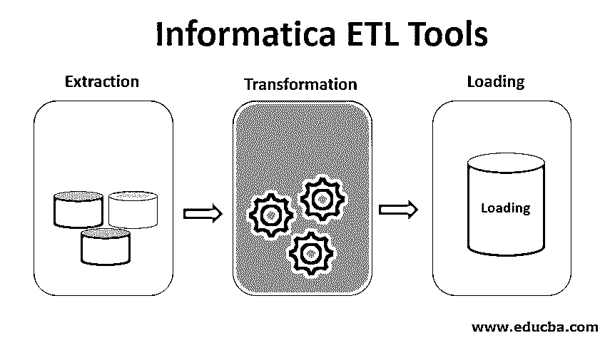

# 计算机科学和 ETL 工具

> 原文：<https://www.educba.com/informatica-etl-tools/>

## 信息 ETL 工具简介

Informatica ETL 工具是 Informatica 公司生产的工具，用于促进数据仓库系统的 ETL 处理。ETL 代表 Extract，Transform & Load，它包括从多个数据源中提取数据，将提取的数据转换成一种通用格式，并将格式化的数据加载到数据仓库中所需的目的地。Informatica Power Center 是大多数组织使用的著名 ETL 工具，它具有高性能、易维护、错误处理选项等优点。

### ETL 如何与 Informatica 一起工作？

让我们转到 ETL 的各个过程。

<small>Hadoop、数据科学、统计学&其他</small>

#### 1.提取，血统

*   [Informatica](https://www.educba.com/what-is-informatica/) Power Center 首先从数据库或文件的单个或多个表中彻底读取数据。
*   这个数据库现在被称为源。
*   这个源的整体结构保存在一个源定义对象中。

#### 2.转换

*   power Center 现在将行转换成目标可以使用的特定格式。
*   这个转换的逻辑是在转换对象中定义的。

#### 3.装货

*   现在 Informatica Power Center 将数据完全写入数据库或文件中的一个或多个表中。
*   这个数据库或文件现在被称为目标。
*   目标的结构现在保存在目标定义对象中。

### 信息动力中心的主要特征

现在让我们了解 Informatica Power Center 的主要特性:

*   Informatica 是满足所有行政和管理需求的基本单位。
*   电力中心是关系数据库下的储存库；这些表用于提取、转换和加载数据。
*   Informatica Administrator 是一个用于保护信息和管理域的 web 应用程序。
*   域的所有配置信息都存储在域配置下。
*   Power Center 集成服务帮助阅读和管理集成的工作流，最终根据业务需求创建多个集成。
*   Web 服务有助于向客户提供产品的主要功能。
*   SAP BW 服务有助于从多个来源提取数据，并将提取的所有数据加载到 SAP Netweaver BI。

现在让我们来理解 Informatica ETL 工具在当前市场上成功的原因:

*   ETL 工具成功的原因之一是它允许精益企业的能力。任何生产公司最常见的目标是避免浪费，这可以通过超薄制造来实现，Informatica 利用了相同类型的集成产品。
*   Informatica 声称有效执行的最佳比率，接近 100%。
*   指令和软件可访问性远比其他 ETL 过程更容易。它有利于任何组织减少培训成本，甚至很容易为这个软件增加新员工。
*   Informatica 领先于它的竞争对手，因为它不太昂贵，甚至它提供给客户的易用性也使它成为一个优秀的 ETL 工具。

### 信息 ETL 的好处

现在，让我们看看 Informatica 给用户带来了什么好处:

#### 1.综合

Informatica 是最好的数据集成平台之一。与任何其他 ETL 工具相比，可以在更短的时间内对来自多个来源的大量数据进行数据集成。Informatica 的数据集成工具可以在最广泛的系统和平台上工作。正如本文前面所讨论的，Informatica 还支持精益集成的能力。

#### 2.高性能

Informatica 使用最好的技术之一来提高质量和速度。此外，它还有助于优化成本，最终帮助组织通过自动化、可重用性和调试来转变业务。Informatica 还创造了一个对分析师非常友好的环境，帮助他们进行快速有效的分析。它还平衡了数据库和 ETL 服务器之间的负载，这有助于在困难的情况下执行任务。

#### 3.支持不同数据类型的不同数据库

Informatica 为多个数据库提供持续支持，如 TPump、Teradata MLoad、Parallel Transporter Fastload 等。它还支持各种数据类型，这有助于提取更多企业数据的灵活性。

#### 4.易于维护

使用 Informatica Workflow Monitor 监控工作流程非常容易。Informatica Workflow Monitor 简化了识别失败或运行缓慢的作业并从中恢复的过程。它有很强的从中断或故障中重新启动的能力。它有几个特性，如自动作业日志和运行时监控，使它非常适合 BI 托管服务。

#### 5.错误处理

Informatica 有一个集中的错误记录系统，它记录错误并将数据拒绝到关系表中，这有助于技术团队纠正错误。从上面的讨论中，我们了解到 Informatica Power Centre 是一个强大的数据提取、数据转换和数据加载工具，由于其独特的关键特性，它被广泛应用于数据仓库，这本身就是一项伟大的数据存储技术。

### 推荐文章

This is a guide to Informatica ETL Tools. Here we discuss Introduction to Informatica ETL Tools along with Key Features and benefits. You can also go through our other suggested articles to learn more –

1.  什么是信息架构？
2.  [ETL 面试问题|前 12 名](https://www.educba.com/etl-interview-questions/)
3.  [ETL 测试工具概述](https://www.educba.com/etl-testing-tool/)
4.  [ETL 测试面试问题|前 10 名](https://www.educba.com/etl-testing-interview-questions/)
5.  [在信息中查找](https://www.educba.com/lookup-in-informatica/)

