# 信息学中的规格化变换

> 原文：<https://www.educba.com/normalizer-transformation-in-informatica/>

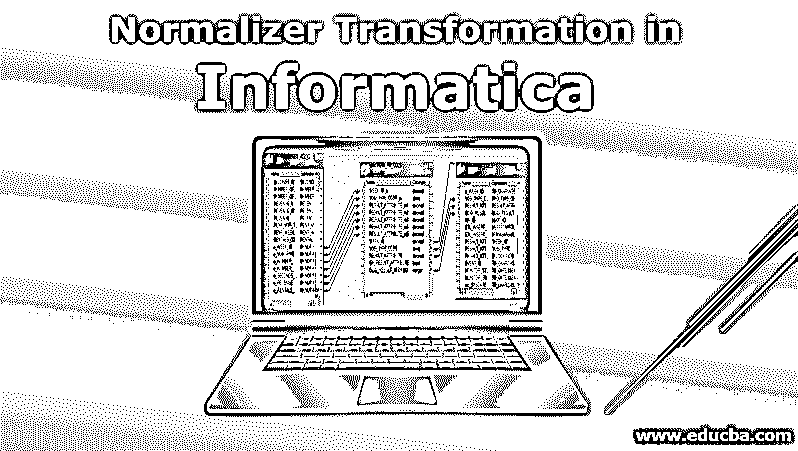

## 什么是信息学中的规格化变换？

Informatica 中的规范化转换是一种流行的转换技术，用于在转换阶段将输入数据规范化为更简化的数据。这是信息科学中活跃的转变之一。规范化器转换从一行生成多行，以便在 Informatica 中为目标系统创建更多规范化的数据存储。信息科学中的规格化变换主要用于管理冗余数据和将无序数据分离成多个数据集。这是一种连接式的转换。大多数 Cobol 数据源都是通过 Informatica 中的规范化转换来实现的。

### 如何在 Informatica 中创建规格化变换？

下面是在映射中创建规格化变换的一步一步的过程

<small>Hadoop、数据科学、统计学&其他</small>

**步骤 1:** 用您需要的列和结构创建一个源表和目标表。

**步骤 2:** 创建源和目标后，转到“Mappings”选项卡，然后单击“Create”。完成后，您可以根据自己的选择来命名这个映射。

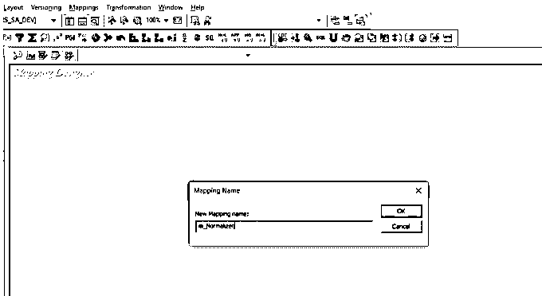

将您已经创建的源和目标拖放到这个新创建的映射中。将为您的来源创建来源限定词。

**步骤 3:** 一旦映射准备好了，下一步就是创建转换。转到“转换”选项卡，然后单击“创建”。

为此转换提供一个唯一的名称，并单击 create 按钮。一旦你点击创建规格化变换将出现在你的贴图上。

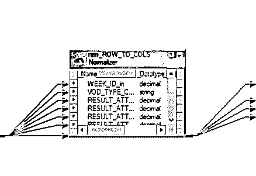

**步骤 4:** 现在双击转换，您可以在其中进行必要的修改。您可以对其进行适当的描述，并解释转换在做什么。

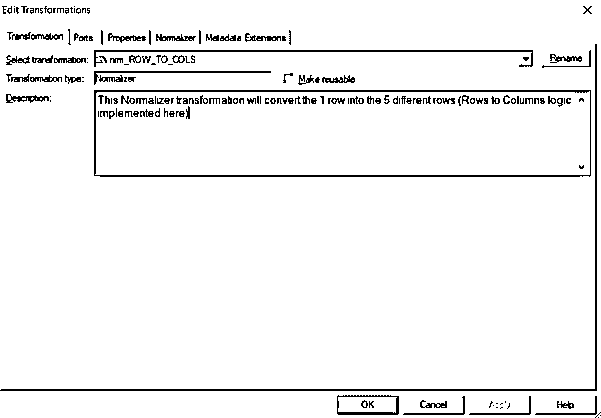

**第 5 步:**ports 选项卡将为转换定义输入和输出端口。

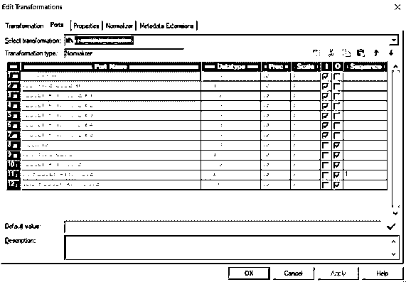

**步骤 6:** 现在转到 normalizer 选项卡，使用 New field 选项向转换添加新字段。在下面的屏幕截图中，您可以看到使用 New port 按钮的三个新列。数据类型和精度应该与输入和输出字段相匹配。

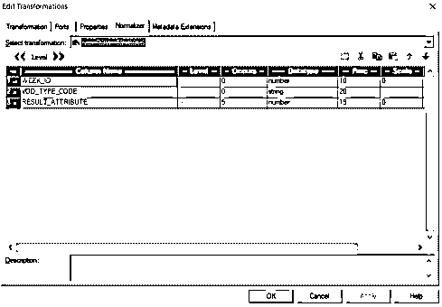

**步骤 7:** 之后，您可以选择一个特定的列来表示 Week_ID，并通过选择 level 按钮的右移来创建下一个级别。

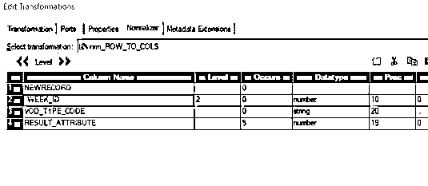

这将创建一个新列，并将 WEEK_ID 列移到级别 2。同样，其他两个柱也可以创建它们的 Level 2。因为有 5 个结果，所以该字段的出现次数变为 5。这个数字可以根据需要改变。

**第 8 步:**一旦完成，如果您返回并检查端口，您将观察到结果属性的端口已经自动增加。

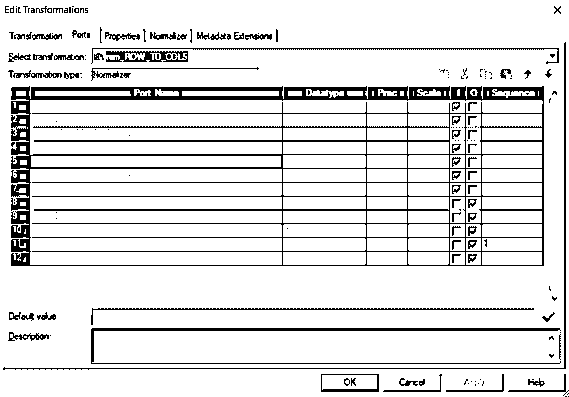

当您现在检查规格化器转换时，您将能够看到所有的结果属性都出现在转换中。

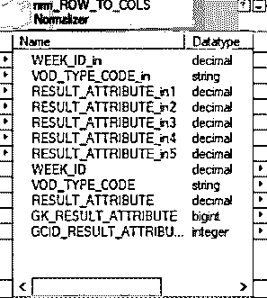

您可以检查先前的转换是否连接到带有新创建端口的规格化器转换。

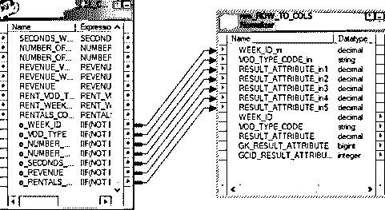

**步骤 9:** 一旦完成，您就可以将规格化器转换端口连接到目标端口或目标转换。如果您使用自动链接选项来连接它们，将会有所帮助。一旦形成了这个连接，您必须在继续创建其工作流之前验证映射。

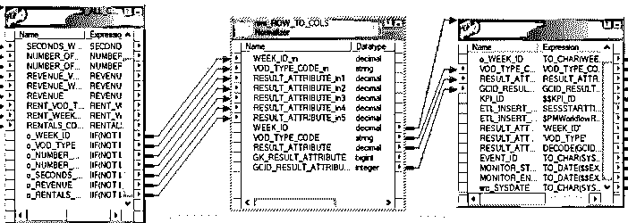

### 创建信息规范化转换的工作流

**步骤 1:** 一旦创建了映射，还应该创建一个工作流来运行映射。此工作流可以手动创建，也可以使用工作流向导创建。要创建工作流，请手动导航至工作流，然后单击创建。

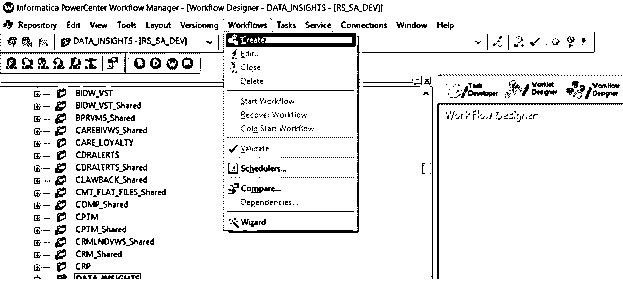

将打开一个新窗口，如下图所示，其中应提供工作流的唯一名称。

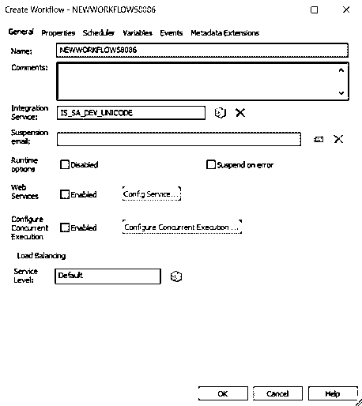

一旦创建了这个新的工作流，下一个任务就是创建一个会话任务。

**第二步:**在 Informatica 中有两种类型的会话。它们可以是 Informatica 中的不可重用会话，也可以是 Informatica 中的可重用会话。对于本例，我们可以创建一个不可重用的会话。导航到任务菜单，然后选择创建选项。

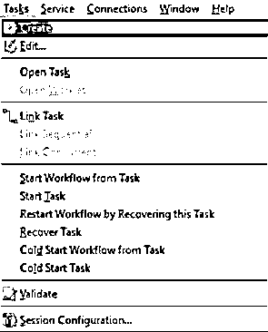

**步骤 3:** 为该任务提供一个唯一的名称。这里我们提供了 m_Normalizer 这个名字。单击“Create”后，将创建会话，您可以选择与您的映射相对应的会话。

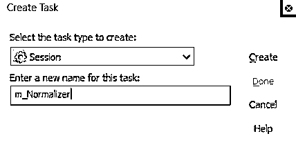

**步骤 4:** 完成后，将开始任务与创建的会话链接起来。

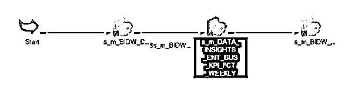

**步骤 5:** 您可以双击会话任务，然后单击属性选项卡。

所有源和目标连接都可以在$Source_Connection_Value 和$Target_Connection_Value 中提及。您可以选择目标，甚至是定义的参数，并将它们链接到该属性。

**步骤 6** :在映射选项卡中，我们可以配置源、目标和连接。可以通过单击需要路径的特定源来配置源和目标。同样，也可以配置目标。完成所有这些配置后，转到“工作流”菜单，选择“验证”选项来验证工作流。

**步骤 7:** 一旦工作流准备好会话任务，则启动工作流选项将被打开，并且工作流监视器将被打开，在那里可以监视工作流。提取的所有行和会话日志都将显示在工作流监视器中。如果映射成功，则此映射的状态将为“成功”,并将显示所有行。

### 结论

规格化转换通常用于规格化反规格化的数据。它可以将列方式的数据转换为行方式的数据。因此，它的工作方式类似于 transpose。除了将行转换为列，Normalizer 还为每个转换后的行生成一个索引。这是一个主动的连接转换，允许用户从不同的 Cobol 文件中读取数据。每个 Cobol 源定义都将与规范化转换相关联。当单个输入记录需要转换成多个输出记录时，也使用规范化器。规范化器转换还可以用于处理多次出现的列和多条记录。这些可以通过使用上面解释的重新定义来创建。

### 推荐文章

这是一个信息规范转换指南。在这里，我们讨论如何在 Informatica 中创建规格化转换，以及在 Informatica 中创建规格化转换工作流的步骤。您也可以阅读以下文章，了解更多信息——

1.  [信息转换](https://www.educba.com/transformations-in-informatica/)
2.  [信息中的路由器改造](https://www.educba.com/router-transformation-in-informatica/)
3.  [信息领域的职业](https://www.educba.com/careers-in-informatica/)
4.  [基于信息场景的面试问题](https://www.educba.com/informatica-scenario-based-interview-questions/)
5.  [计算机化 ETL 工具](https://www.educba.com/informatica-etl-tools/)
6.  [信息学与数据阶段](https://www.educba.com/informatica-vs-datastage/)
7.  [什么是路由器？](https://www.educba.com/what-is-router/)
8.  [COBOL 不同数据类型指南](https://www.educba.com/cobol-data-types/)

