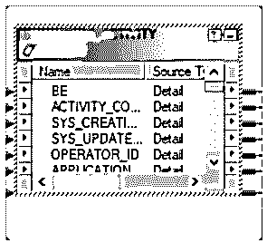
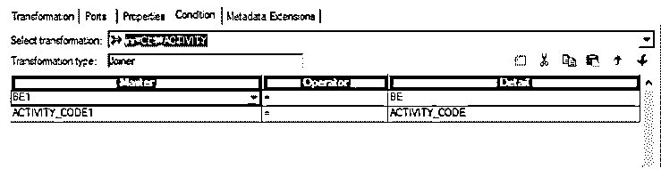
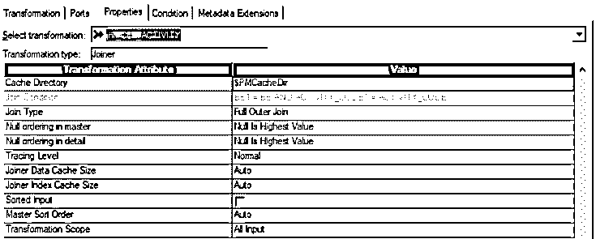
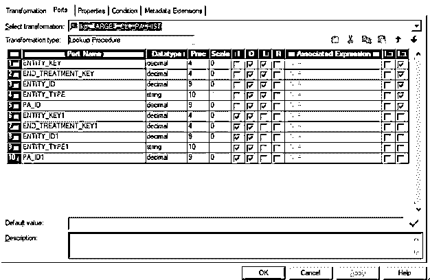
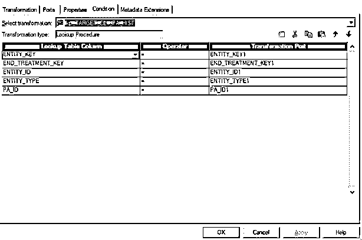
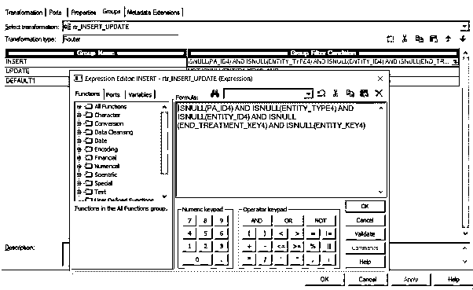
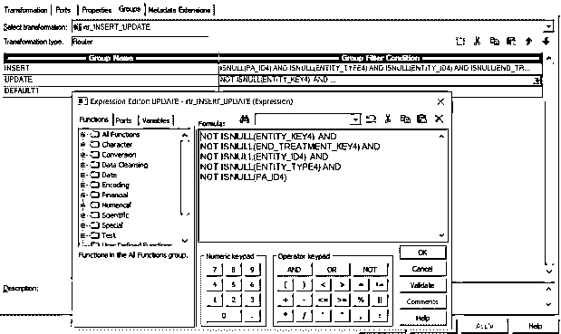
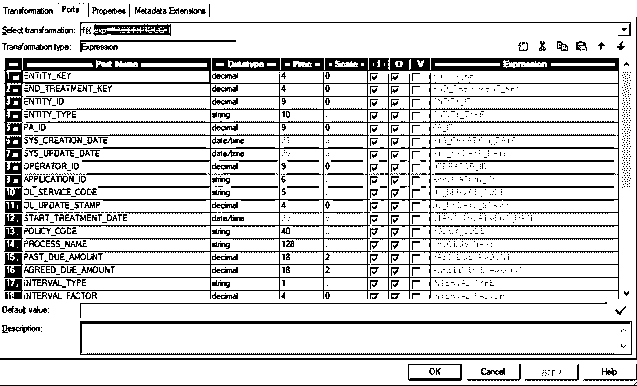
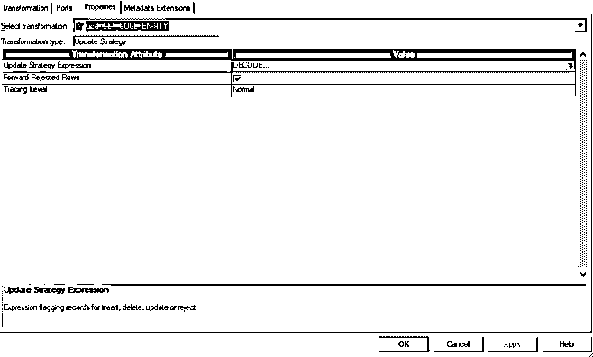

# 信息转换

> 原文：<https://www.educba.com/transformations-in-informatica/>

## 信息转换导论

Informatica 中的转换是 Informatica 产品(如 Informatica PowerCenter)的内置特性，用于转换和验证源数据，作为 ETL 流程的一部分。信息中的转换主要有两类，即主动转换和被动转换。有几个业务场景，比如过滤输入数据、路由数据或缩短 Informatica mappings 的输入数据，以开发业务需求。此外，作为产品的一部分，Informatica 支持连接和非连接类型的转换功能。Informatica 中一些常见的转换是源限定符；Informatica 开发人员广泛使用路由器、联接器和聚合器转换。

### 信息转换的类型

转换主要有两种类型。它们可以连接，也可以不连接。连接到其他转换的转换称为连接转换，而不连接到任何其他转换的转换称为未连接转换。类似地，可以有主动转换或被动转换。活动转换是那些修改数据行和传递给它的输入的转换。另一方面，被动转换不改变行数。输入和输出行保持不变，仅在行级别修改数据。

<small>Hadoop、数据科学、统计学&其他</small>

让我们看看 Informatica 提供的不同转换。它们列举如下:

*   源限定符转换
*   聚合器转换
*   路由器转换
*   [细木工改造](https://www.educba.com/joiner-transformation-in-informatica/)
*   [等级转换](https://www.educba.com/rank-transformation-in-informatica/)
*   序列生成器变换
*   事务控制转换
*   查找和可重用转换
*   [规格化器转换](https://www.educba.com/normalizer-transformation-in-informatica/)
*   转型的性能调整
*   外部转换
*   表达式转换

我们将在下面详细地看一下其中的一些。

#### 1.乔伊纳变换

这种转变是积极的，有联系的。当两个源在特定条件下被连接时，就使用这种转换。这些可以是任意两个关系源，一个关系源和一个平面文件，一个关系源，[和一个 XML 文件或](https://www.educba.com/what-is-xml/)两个平面文件。这两个源之间应该至少有一个公共端口。连接这两个源时，必须指定一个条件。一次可能是主人，另一次可能是细节。

**joiner 变换的例子:**

这是一个连接，条件应用于以下端口:

主端口是 BE 和 Activity_code。这两种来源都有。根据上述条件过滤和连接数据。这些连接的其他属性可以在 properties 选项卡中找到，如下所示:

联接器可以有以下联接。

*   **普通连接:**该连接将删除所有不符合连接条件的记录。
*   **主外部联接:**这将丢弃主源中所有不匹配的记录，并且来自明细源的所有行将被纳入输出。
*   **明细外部连接:**在该连接中，将考虑主源中的所有记录，而只考虑明细源中的匹配行。
*   **完全外部连接:**这将保留主表和细节表中的所有行。

#### 2.查找转换

这种转换用于在关系源中查找数据。数据可以在源或目标中查找。这些转换可以是连接的，也可以是不连接的。连接查找将从任何映射中间接获取输入。同时，unconnected 将从查找表达式或其他转换中接收输入。连接的查找将返回多列，而未连接的查找将只从每行返回一列。

下面的转换用于检查目标表 CL1_PA_HIST 中的现有记录。

正在查找的端口在 L 列中给出。被检查的在目标中被查找。这些端口上的条件也可以在条件选项卡中指定。这可以如下进行。

#### 3.路由器转换

路由器转换处于活动状态并已连接。路由器转换类似于过滤器转换。它将考虑捕获条件不匹配的数据的数据。在筛选条件中，考虑与条件匹配的数据。另一方面，路由器存储了与条件不匹配的数据。检查多个条件很有用。以下转换可用于插入和更新记录。这个[路由器用于](https://www.educba.com/what-is-router/)根据 lookup 的返回值对记录进行分组，如果返回值不为空，则将其标记为 update else insert。

过滤条件可以应用于组。这些可以通过转到“组”选项卡来完成，如下所示:

这里的条件应用于四列，数据在这些条件下向前遍历，因为也可以指定多个条件。更新条件也在这个转换中指定。

数据可以很容易地被分离出来，并路由到下一个转换。还有一个默认组可以包含不满足条件的记录集。

#### 4.表达式转换

此转换可用于在传递给目标之前计算单行中的值。该转换还可以用于将数据从一个转换传递到另一个转换。表达式可以由用户定义，也可以由每个用户指定。

下面的例子是表达式转换，它将数据发送到下一个转换。所有端口都按原样发送。

#### 5.更新战略转型

该转换用于更新目标表中的数据。这可能包括维护数据的历史记录或关于最近所做更改的数据。还可以指定要处理哪些行来更新源行。

下面的转换根据 GG_OP_TYPE 标记要更新或插入的记录。

更新策略表达式中提到了该策略。

### 结论

Informatica 有许多转换，可以根据用户需要帮助提取、转换和加载数据到目标。该界面提供了易于使用，并与 SQL 数据的基本知识可以转换和在各种报告和分析中使用。Informatica 是一个广泛使用的工具，因为它提供了各种各样的转换。所有的转换都是有益的，可以根据用户的需要来使用。

### 推荐文章

这是信息转换的指南。在这里，我们讨论了信息转换的介绍和不同类型的例子。您也可以浏览我们推荐的其他文章，了解更多信息——

1.  什么是 Informatica | Examples ？
2.  [信息职业教育](https://www.educba.com/careers-in-informatica/)
3.  [基于信息场景的面试问题](https://www.educba.com/informatica-scenario-based-interview-questions/)
4.  [信息学与数据阶段](https://www.educba.com/informatica-vs-datastage/)

