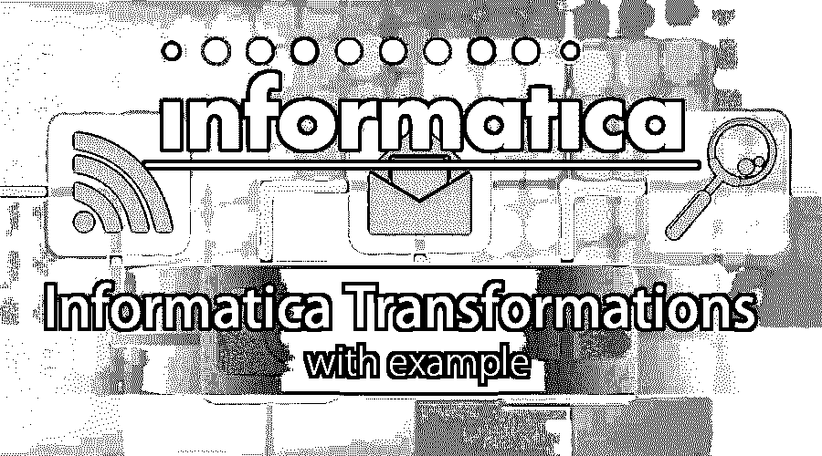

# 信息学中的变换及实例

> 原文：<https://www.educba.com/transformations-in-informatica-with-example/>

## 信息转换概述及实例

Informatica 中的转换是创建。修改数据或将数据传递给定义的目标。源数据可以根据目标系统的要求进行修改。信息学中的这些变换分为连通变换和非连通变换。当一个转换连接到其他转换时，它是连接的，而当它是一个独立的转换时，它是不连接的。在 [Informatica 中有两种类型的转换，即](https://www.educba.com/what-is-informatica/)主动和被动。让我们用例子来看看这些。

### 信息转换及实例

在 Informatica 中，主动转换修改行和输入行数，而被动转换不改变几个输入行，也不创建新行或删除现有行。

<small>Hadoop、数据科学、统计学&其他</small>

以下是主动转换的类型:

*   源限定符转换
*   聚合器转换
*   路由器转换
*   [细木工改造](https://www.educba.com/joiner-transformation-in-informatica/)
*   [等级转换](https://www.educba.com/rank-transformation-in-informatica/)
*   序列生成器变换
*   事务控制转换
*   查找和可重用转换
*   [规格化器转换](https://www.educba.com/normalizer-transformation-in-informatica/)
*   转型的性能调整
*   外部转换
*   表达式转换

#### 1.源限定符转换

这种转变是积极的，有联系的。它用于表示读取集成服务的行。当这时涉及到平面文件或关系数据源时，限定符转换就成了问题。通过这种转换，可以定义获取和覆盖数据的方式。

**示例**:修改源限定符映射‘m _ student _ target’以仅返回选定的列。

**步骤#1** :在映射设计器中打开映射‘m _ student _ target’。

**步骤#2** :双击源限定符转换“SQ_STUD”。它将为其打开“编辑转换属性”窗口。然后

1.  单击属性选项卡。
2.  点击 SQL 查询修改选项；这将打开一个 SQL 编辑器窗口。

**步骤#3** :在 SQL 编辑器窗口中输入以下查询-

从 STUD 中选择 ROLLNO、STUDNAME、DEPT、HOD，然后单击 OK。

**步骤#4** :进入“编辑转换”窗口，

从菜单中选择端口选项卡

在端口选项卡下，您将看到所有端口。仅保留端口 ROLLNO、STUDNAME、DEPT、HOD，删除其他端口。删除这些端口后，单击确定。

**步骤#5** :再次进入编辑转换，您将能够确认所选择的数据是正确的，并且可以加载。

#### 2.聚合器转换

当用户想要执行聚合函数(如求和、求平均值等)时，会使用这种转换。

**例**:计算学生在系里的平均分。

**步骤#1:** 创建一个新的数据库目标表，比如说“avg_mks_deptwise”

**步骤#2** :创建一个新的映射“m_ avg_mks_deptwise”。

为了创建一个新的映射，我们需要一个源表(STUD)和一个目标表(avg_mks_deptwise ),这两个表都在映射设计器中，我们需要

1.  在映射中导入目标表“avg_mks_deptwise”。
2.  导入源表“STUD”

**步骤#3:** 在映射中，删除除标记和部门以外的所有列。现在，使用工具箱菜单创建一个新的聚合器转换。单击聚合器图标，将会创建一个新的转换。

**步骤#4** :将标记& deptno 列从源限定符(SQ_STUD)拖放到聚合器转换中

**步骤#5** :双击聚合器转换，打开它的属性，然后

1.  在转换中添加一个新端口。
2.  将端口名称重命名为 AVG_MKS
3.  将这个新端口的数据类型更改为 double。
4.  通过选中输出端口的复选框，将此端口设置为输出端口。
5.  单击表达式选项。

**步骤#6** :在表达式窗口中

1.  添加表达式-平均值(MKS)
2.  选择确定按钮；这将返回编辑转换窗口。

**步骤#7** :在编辑转换窗口中，通过选中 deptno 列的复选框来选择“GroupBy”选项，然后单击 Ok。使用聚合器转换链接 deptno 和 avg_mks。

#### 3.路由器转换

[路由器转换用于](https://www.educba.com/router-transformation-in-informatica/)过滤源数据。它还允许在映射中包含丢弃的数据。除了这些多个过滤器之外，还可以将条件应用于多个数据集。

**举例**:

**步骤#1** :创建一个具有源“STUD”和目标“STUD_TARGET”的映射

**步骤#2** :创建一个新的转换，并在创建窗口中执行以下操作:

1.  选择路由器转换
2.  输入转换的名称“rtr_deptno_10”
3.  选择创建选项

将在映射中创建路由器转换。

**步骤#3:** 将所有列从源限定符拖放到路由器转换中。

**第四步:**双击路由器转换，然后在它的转换属性中。

1.  选择“组”选项卡，输入组名“deptno_20 ”,然后单击过滤器。
2.  转到表达式编辑器并过滤 deptno_20，然后选择确定。

**步骤#5:** 将路由器转换的组 deptno_20 的端口连接到目标表端口

#### 4.乔伊纳变换

当您想要创建连接时，可以使用这种转换。这些连接的主要优点是可以使用异构数据库来创建这些连接。可以创建主外部联接、详细外部联接、完全外部联接和普通联接等联接。

**例**:连接 Stud 表和 Dept 表。

**步骤#1:** 创建新的映射并导入源表 Stud 和 Dept 以及目标表。

**步骤#2:** 进入转换菜单，选择创建选项。输入转换名称' stud_jn_dept '并选择创建一个选项。

**步骤#3:** 将所有列从两个源限定符拖放到 joiner 转换中

**步骤#4:** 双击 joiner 转换并选择 condition 选项卡。单击添加新条件图标，然后在主列和明细列列表中选择 deptno。

**步骤#5** :现在转到属性选项卡，选择普通连接，然后单击确定。

**步骤#6** :完成后，转到 ports 选项卡，选择任意列作为特定的源，然后选择 OK——链接 joiner 转换中的所有列。

#### 5.事务控制转换

这种转换允许在任何映射的执行过程中提交和回滚事务。有五个变量来处理这些操作。它们是 TC_CONTINUE_TRANSACTION、TC_COMMIT_BEFORE、TC_COMMIT_AFTER、TC_ROLLBACK_BEFORE 和 TC_ROLLBACK_AFTER。

**示例**:提交 20 号部门的数据

**步骤#1** :新建一个转换，然后选择交易控制。输入有效名称，如“tc_commit_dept20”并创建。

**步骤#2** :将所有列从源限定符拖放到事务控制转换，然后将所有列从事务控制转换链接到目标表。

**第三步**:选择属性页签，点击交易控制。输入表达式如下:

**"** iif(deptno=20，tc_commit_before，tc_continue_transaction)"并选择确定。

完成后，保存映射。

### 结论——信息转换及实例

因此，Informatica 中的转换有助于数据转换和处理变得更加容易。提供如此多的转换选项，Informatica 将帮助您以最佳方式处理数据。

### 推荐文章

这是一个带有例子的信息转换指南。这里我们已经讨论了 Informatica 中的概念和转换，如聚合、连接、路由器、源限定符等。您也可以阅读以下文章，了解更多信息——

1.  [基于信息场景的面试问题](https://www.educba.com/informatica-scenario-based-interview-questions/)
2.  [演讲 Vs 信息学 PowerCenter](https://www.educba.com/talend-vs-informatica-powercenter/)
3.  [关于 Informatica 开发者工具的所有重要事情](https://www.educba.com/all-about-informatica-developer-tool/)
4.  什么是信息架构？
5.  [信息转换介绍](https://www.educba.com/transformations-in-informatica/)
6.  [计算机化 ETL 工具](https://www.educba.com/informatica-etl-tools/)
7.  [Talend 工具](https://www.educba.com/talend-tools/)

